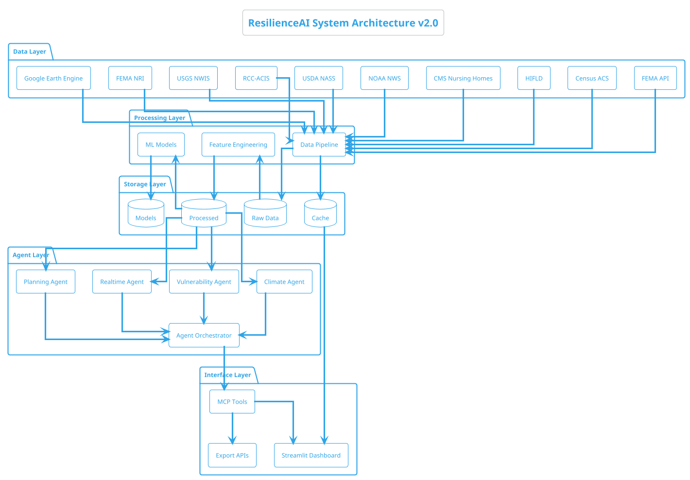
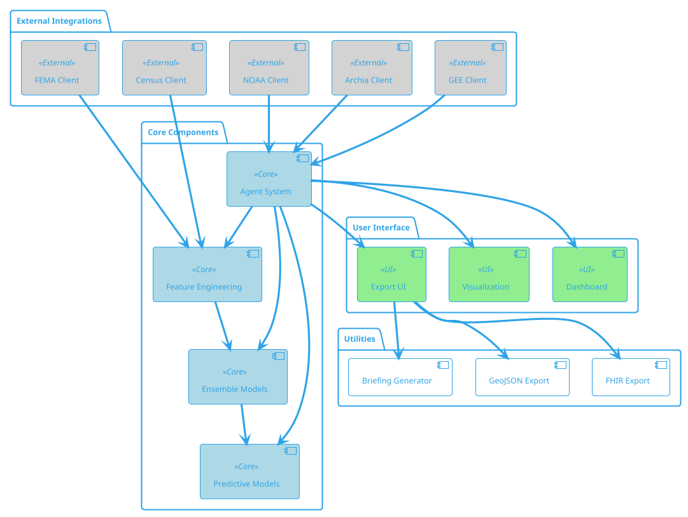

# ResilienceAI Comprehensive Documentation Enhancement Plan

## Executive Summary

This document provides a comprehensive analysis of the current ResilienceAI documentation state and presents a detailed enhancement plan to transform the existing documentation into a world-class, professional resource for users, developers, and stakeholders.

**Current Documentation State:**
- Basic README.md (97 lines)
- 8 markdown files in docs/ folder (~2,100 total lines)
- Limited API documentation (external data sources only)
- No code-level documentation
- No architecture diagrams
- No video tutorials
- No changelog

**Target State:**
- Complete documentation suite with 15+ specialized guides
- Auto-generated API reference from docstrings
- Interactive architecture diagrams
- Video tutorial library
- Comprehensive changelog and versioning
- Professional documentation hosting

---

## 1. Current Documentation Inventory

### 1.1 Existing Documentation Files

| File | Lines | Purpose | Quality Assessment |
|------|-------|---------|-------------------|
| `README.md` | 97 | Project overview, quick start | Good - needs expansion |
| `docs/API_REFERENCE.md` | 79 | External API endpoints | Good - needs internal API docs |
| `docs/SETUP_GUIDE.md` | 587 | Installation and setup | Excellent |
| `docs/DATA_DICTIONARY.md` | 306 | Feature descriptions | Excellent |
| `docs/CONTRIBUTING.md` | ~50 | Contribution guidelines | Basic - needs expansion |
| `docs/ROADMAP.md` | 76 | Feature roadmap | Good |
| `docs/PREDICTIVE_MODELING.md` | ~200 | ML model documentation | Good |
| `docs/STREAMLIT_CLOUD_TROUBLESHOOTING.md` | ~150 | Deployment troubleshooting | Good |
| `docs/VISUAL_MONITORING_GUIDE.md` | ~100 | Monitoring guide | Adequate |

### 1.2 Source Code Documentation Status

| Module | Lines | Docstring Coverage | Type Hints | Notes |
|--------|-------|-------------------|------------|-------|
| `src/agent.py` | 2,476 | 15% | Partial | Needs comprehensive docstrings |
| `src/feature_engineering.py` | ~800 | 20% | Partial | Critical - needs full documentation |
| `src/train_models.py` | ~600 | 25% | Partial | ML models need documentation |
| `src/download_data.py` | ~500 | 30% | Partial | Data pipeline documentation |
| `src/predictive_models.py` | ~400 | 20% | Partial | Forecasting models |
| `src/weather_client.py` | ~300 | 25% | Partial | NOAA integration |
| `src/fhir_export.py` | ~200 | 30% | Partial | Healthcare export |
| `app/dashboard.py` | ~2,000 | 10% | Minimal | Streamlit UI - needs documentation |

### 1.3 Documentation Gaps Identified

1. **No internal API documentation** - MCP tools (45 tools) not documented
2. **No architecture diagrams** - System architecture not visualized
3. **No developer onboarding guide** - New contributor experience lacking
4. **No code documentation standards** - Inconsistent docstring styles
5. **No video tutorials** - Visual learning resources missing
6. **No changelog** - Version history not tracked
7. **No user manual** - End-user guidance incomplete
8. **No deployment guide** - Production deployment not documented
9. **No testing documentation** - Test suite not explained
10. **No security documentation** - Security practices not documented

---

## 2. Proposed Documentation Structure

### 2.1 Recommended Directory Layout

```
docs/
├── index.md                          # Documentation homepage
├── README.md                         # Quick navigation guide
│
├── getting-started/                  # Getting Started Section
│   ├── index.md
│   ├── installation.md
│   ├── quickstart.md
│   ├── configuration.md
│   └── troubleshooting.md
│
├── user-guide/                       # User Guide Section
│   ├── index.md
│   ├── dashboard-walkthrough.md
│   ├── understanding-risk-scores.md
│   ├── interpreting-results.md
│   ├── export-formats.md
│   └── faq.md
│
├── api-reference/                    # API Reference Section
│   ├── index.md
│   ├── mcp-tools/                    # Auto-generated
│   │   ├── index.md
│   │   ├── core-query-tools.md
│   │   ├── analytics-tools.md
│   │   ├── export-tools.md
│   │   ├── realtime-tools.md
│   │   └── predictive-tools.md
│   ├── external-apis.md              # Current API_REFERENCE.md
│   └── data-sources.md
│
├── developer-guide/                  # Developer Guide Section
│   ├── index.md
│   ├── architecture.md
│   ├── code-standards.md
│   ├── contributing.md               # Enhanced CONTRIBUTING.md
│   ├── development-setup.md
│   ├── testing-guide.md
│   └── debugging.md
│
├── data/                             # Data Documentation
│   ├── index.md
│   ├── data-dictionary.md            # Current DATA_DICTIONARY.md
│   ├── data-sources.md
│   ├── feature-engineering.md
│   └── data-pipeline.md
│
├── models/                           # ML Model Documentation
│   ├── index.md
│   ├── model-overview.md
│   ├── predictive-modeling.md        # Current PREDICTIVE_MODELING.md
│   ├── ensemble-models.md
│   ├── forecasting.md
│   └── model-evaluation.md
│
├── deployment/                       # Deployment Documentation
│   ├── index.md
│   ├── local-deployment.md
│   ├── streamlit-cloud.md            # Current STREAMLIT_CLOUD_TROUBLESHOOTING.md
│   ├── production-deployment.md
│   ├── environment-variables.md
│   └── monitoring.md                 # Current VISUAL_MONITORING_GUIDE.md
│
├── tutorials/                        # Tutorial Section
│   ├── index.md
│   ├── basic-analysis.md
│   ├── advanced-analytics.md
│   ├── scenario-simulation.md
│   ├── creating-briefings.md
│   └── video-tutorials.md
│
├── examples/                         # Code Examples
│   ├── index.md
│   ├── basic-queries.ipynb
│   ├── risk-analysis.ipynb
│   ├── visualization-examples.ipynb
│   └── api-usage-examples.md
│
├── reference/                        # Reference Materials
│   ├── index.md
│   ├── glossary.md
│   ├── changelog.md                  # NEW
│   ├── roadmap.md                    # Current ROADMAP.md
│   ├── release-notes.md              # NEW
│   └── version-history.md            # NEW
│
├── assets/                           # Documentation Assets
│   ├── images/
│   │   ├── architecture/
│   │   ├── diagrams/
│   │   ├── screenshots/
│   │   └── logos/
│   ├── videos/
│   └── diagrams/
│       ├── architecture.puml
│       ├── data-flow.puml
│       └── component-diagram.puml
│
└── _static/                          # Static files for hosting
    ├── css/
    └── js/
```

### 2.2 Documentation File Specifications

#### Core Documentation Files (Priority 1)

| File | Purpose | Estimated Lines | Priority |
|------|---------|-----------------|----------|
| `docs/index.md` | Documentation landing page | 100 | P0 |
| `docs/getting-started/installation.md` | Enhanced setup guide | 300 | P0 |
| `docs/getting-started/quickstart.md` | 5-minute quick start | 150 | P0 |
| `docs/api-reference/mcp-tools/index.md` | MCP tools overview | 200 | P0 |
| `docs/user-guide/dashboard-walkthrough.md` | Dashboard tutorial | 250 | P1 |
| `docs/developer-guide/architecture.md` | System architecture | 300 | P1 |
| `docs/data/data-dictionary.md` | Enhanced data dictionary | 400 | P1 |

#### Supporting Documentation Files (Priority 2)

| File | Purpose | Estimated Lines | Priority |
|------|---------|-----------------|----------|
| `docs/developer-guide/code-standards.md` | Coding standards | 200 | P2 |
| `docs/tutorials/basic-analysis.md` | Basic tutorial | 300 | P2 |
| `docs/reference/changelog.md` | Version changelog | 150 | P2 |
| `docs/deployment/production-deployment.md` | Production guide | 250 | P2 |
| `docs/examples/api-usage-examples.md` | Code examples | 400 | P2 |

#### Advanced Documentation Files (Priority 3)

| File | Purpose | Estimated Lines | Priority |
|------|---------|-----------------|----------|
| `docs/tutorials/video-tutorials.md` | Video scripts | 500 | P3 |
| `docs/reference/glossary.md` | Term glossary | 200 | P3 |
| `docs/models/model-evaluation.md` | Model metrics | 200 | P3 |

---

## 3. Documentation Templates

### 3.1 Main Documentation Template (index.md)

```markdown
---
title: "ResilienceAI Documentation"
description: "Comprehensive documentation for ResilienceAI disaster vulnerability assessment platform"
keywords: ["resilience", "disaster", "vulnerability", "API", "documentation"]
author: "ResilienceAI Team"
date: "2026-02-17"
version: "2.0.0"
---

# ResilienceAI Documentation


## Overview

ResilienceAI is an MCP-based agentic platform that combines FEMA disaster declarations, 
Census demographics, HIFLD infrastructure data, and real-time NOAA weather feeds to assess 
county-level vulnerability, predict disaster risk trajectories, and support clinical and 
emergency decision-making.

## Quick Links

<div class="quick-links">

### Getting Started
- [Installation Guide](getting-started/installation.md) - Set up your environment
- [Quick Start](getting-started/quickstart.md) - Run your first analysis in 5 minutes
- [Configuration](getting-started/configuration.md) - Configure data sources and APIs

### User Guide
- [Dashboard Walkthrough](user-guide/dashboard-walkthrough.md) - Navigate the 16-tab interface
- [Understanding Risk Scores](user-guide/understanding-risk-scores.md) - Interpret vulnerability metrics
- [Export Formats](user-guide/export-formats.md) - FHIR, GeoJSON, PDF, PPTX

### API Reference
- [MCP Tools](api-reference/mcp-tools/index.md) - 45+ composable analysis tools
- [External APIs](api-reference/external-apis.md) - Data source endpoints
- [Data Sources](api-reference/data-sources.md) - FEMA, Census, HIFLD, NOAA

### Developer Guide
- [Architecture](developer-guide/architecture.md) - System design and components
- [Contributing](developer-guide/contributing.md) - Join the development team
- [Code Standards](developer-guide/code-standards.md) - Style and documentation guidelines

</div>

## Features at a Glance

| Feature | Description | Documentation |
|---------|-------------|---------------|
| **45 MCP Tools** | Composable analysis tools | [API Reference](api-reference/mcp-tools/index.md) |
| **66 Features** | County-level vulnerability metrics | [Data Dictionary](data/data-dictionary.md) |
| **Real-time Alerts** | NOAA weather integration | [Weather Client](api-reference/external-apis.md) |
| **Predictive Models** | Prophet/ARIMA forecasting | [Predictive Modeling](models/predictive-modeling.md) |
| **Interactive Dashboard** | 16-tab Streamlit interface | [Dashboard Guide](user-guide/dashboard-walkthrough.md) |

## Version Information

- **Current Version**: 2.0.0
- **Release Date**: February 17, 2026
- **Python Version**: 3.10+
- **License**: MIT

## Support

- [GitHub Issues](https://github.com/GDogMcCoy/ResilienceAI/issues)
- [Discussions](https://github.com/GDogMcCoy/ResilienceAI/discussions)
- [Email Support](mailto:support@resilienceai.dev)

---

*Last updated: February 17, 2026*
```

### 3.2 API Reference Template (mcp-tool.md)

```markdown
---
title: "MCP Tool: {tool_name}"
description: "Documentation for the {tool_name} MCP tool"
category: "{tool_category}"
version: "2.0.0"
---

# {tool_name}

## Overview

{brief_description_of_what_the_tool_does}

## Signature

```python
{tool_signature}
```

## Parameters

| Parameter | Type | Required | Default | Description |
|-----------|------|----------|---------|-------------|
| `param1` | `str` | Yes | - | Description of param1 |
| `param2` | `int` | No | `10` | Description of param2 |
| `param3` | `dict` | No | `None` | Description of param3 |

## Returns

| Field | Type | Description |
|-------|------|-------------|
| `result` | `dict` | Description of return value |
| `status` | `str` | "success" or "error" |
| `message` | `str` | Human-readable status message |

## Example Usage

### Basic Example

```python
from src.agent import ResilienceAIAgent

agent = ResilienceAIAgent()
result = agent.{tool_name}(
    param1="example_value",
    param2=42
)
print(result)
```

### Advanced Example

```python
# More complex usage with all parameters
result = agent.{tool_name}(
    param1="example_value",
    param2=42,
    param3={"key": "value"}
)
```

## CLI Usage

```bash
python -m src.agent {tool_name} \
    --param1 "example_value" \
    --param2 42
```

## Response Format

### Success Response

```json
{
  "status": "success",
  "data": {
    // Tool-specific data
  },
  "metadata": {
    "timestamp": "2026-02-17T10:30:00Z",
    "version": "2.0.0"
  }
}
```

### Error Response

```json
{
  "status": "error",
  "error": {
    "code": "INVALID_PARAMETER",
    "message": "Description of what went wrong"
  },
  "metadata": {
    "timestamp": "2026-02-17T10:30:00Z",
    "version": "2.0.0"
  }
}
```

## Related Tools

- [Related Tool 1](related-tool-1.md) - Description
- [Related Tool 2](related-tool-2.md) - Description

## Changelog

| Version | Date | Changes |
|---------|------|---------|
| 2.0.0 | 2026-02-17 | Initial documentation |

---

*For issues or questions, please [open an issue](https://github.com/GDogMcCoy/ResilienceAI/issues)*
```

### 3.3 Tutorial Template

```markdown
---
title: "Tutorial: {Tutorial Title}"
description: "Step-by-step guide for {task}"
difficulty: "{beginner|intermediate|advanced}"
estimated_time: "{X} minutes"
prerequisites:
  - "Prerequisite 1"
  - "Prerequisite 2"
---

# Tutorial: {Tutorial Title}

## Overview

In this tutorial, you will learn how to {brief_description_of_what_will_be_learned}.

**Difficulty**: {Level} | **Time**: {X} minutes

## Learning Objectives

By the end of this tutorial, you will be able to:

1. Objective 1
2. Objective 2
3. Objective 3

## Prerequisites

Before starting this tutorial, ensure you have:

- [ ] Completed the [Installation Guide](../getting-started/installation.md)
- [ ] Basic understanding of {concept}
- [ ] {Other prerequisites}

## Step 1: {First Step Title}

### Overview

{Brief explanation of this step}

### Instructions

1. First instruction
   ```python
   # Code example
   ```

2. Second instruction
   ```python
   # Code example
   ```

### Expected Output

```
Expected output here
```

### Common Issues

| Issue | Solution |
|-------|----------|
| Issue description | How to resolve it |

## Step 2: {Second Step Title}

[Continue pattern...]

## Complete Example

```python
# Full working example combining all steps
```

## Next Steps

- [Advanced Tutorial](advanced-tutorial.md) - Learn more advanced techniques
- [API Reference](../api-reference/mcp-tools/index.md) - Explore available tools
- [Examples](../examples/) - View more code examples

## Troubleshooting

### Problem: {Common Problem}

**Solution**: {How to fix it}

### Problem: {Another Problem}

**Solution**: {How to fix it}

## Resources

- [Related Documentation](#)
- [External Resource](#)
- [Video Walkthrough](#)

---

*Was this tutorial helpful? [Let us know](https://github.com/GDogMcCoy/ResilienceAI/issues)*
```

### 3.4 Changelog Template

```markdown
---
title: "Changelog"
description: "Version history and release notes for ResilienceAI"
---

# Changelog

All notable changes to ResilienceAI are documented in this file.

The format is based on [Keep a Changelog](https://keepachangelog.com/en/1.0.0/),
and this project adheres to [Semantic Versioning](https://semver.org/spec/v2.0.0.html).

## [Unreleased]

### Added
- New features in development

### Changed
- Changes to existing functionality

### Deprecated
- Soon-to-be removed features

### Removed
- Removed features

### Fixed
- Bug fixes

### Security
- Security improvements

---

## [2.0.0] - 2026-02-17

### Added
- **Multi-Agent Orchestration**: 4 specialist agents (Climate, Vulnerability, Realtime, Planning)
- **Google Earth Engine Integration**: Satellite intelligence with 30m-4km resolution
- **Climate Intelligence**: RCC-ACIS 4km PRISM grid analysis
- **56 MCP Tools**: Expanded from 45 tools
- **11 Data Sources**: Added USGS, FEMA NRI, US Drought Monitor
- **Agricultural Vulnerability**: USDA NASS crop data integration
- **Real-time Alert System**: Multi-channel notifications
- **Executive Briefings**: Auto-generated PDF/PPTX reports
- **Intervention ROI Calculator**: Cost-effectiveness analysis
- **Scenario Simulator**: What-if disaster modeling

### Changed
- Enhanced feature engineering: 37 → 66 features
- Improved ensemble model performance
- Refactored dashboard with 16 tabs
- Updated Streamlit to latest version

### Fixed
- Fixed county filtering for Missouri focus
- Resolved 3D visualization stability issues
- Corrected ACIS grid parsing

### Security
- Added API key rotation support
- Enhanced data validation

---

## [1.0.0] - 2026-02-14

### Added
- Initial release of ResilienceAI
- 45 MCP tools for vulnerability assessment
- 5 data sources (FEMA, Census, HIFLD, CMS, NOAA)
- Prophet/ARIMA forecasting
- Streamlit dashboard with Missouri focus
- Single-agent architecture
- FHIR R4 export support
- GeoJSON export support

---

## Version History

| Version | Date | Codename | Key Features |
|---------|------|----------|--------------|
| 2.0.0 | 2026-02-17 | "Claw" | Multi-agent, GEE integration |
| 1.0.0 | 2026-02-14 | "Genesis" | Initial release |

---

*For upcoming features, see the [Roadmap](roadmap.md)*
```

---

## 4. Architecture Diagram Specifications

### 4.1 System Architecture Diagram

**Format**: PlantUML (source) + SVG/PNG (rendered)
**Location**: `docs/assets/diagrams/architecture.puml`



### 4.2 Data Flow Diagram

```plantuml
@startuml ResilienceAI Data Flow
!theme cerulean-outline

start

:User Query;

if (Query Type?) then (Real-time)
  :NOAA Weather Client;
  :Alert Manager;
else (Analytical)
  :Agent Orchestrator;
  
  fork
    :Climate Agent;
    :ACIS/GEE Data;
  fork again
    :Vulnerability Agent;
    :County Features;
  fork again
    :Planning Agent;
    :Predictive Models;
  end fork
endif

:Result Aggregation;

if (Export Format?) then (FHIR)
  :FHIR R4 Export;
else (GeoJSON)
  :GeoJSON Export;
else (PDF)
  :Briefing Generator;
else (PPTX)
  :Presentation Generator;
else (Dashboard)
  :Streamlit Render;
endif

:Display Results;

stop

@enduml
```

### 4.3 Component Diagram



### 4.4 Dashboard Tab Structure Diagram

```plantuml
@startuml Dashboard Structure
!theme cerulean-outline

rectangle "ResilienceAI Dashboard" {
    package "Overview" {
        [Risk Overview] as Overview
        [County Selector] as Selector
    }
    
    package "Analysis" {
        [Vulnerability Analysis] as Vuln
        [Infrastructure Gaps] as Infra
        [Disaster History] as History
        [Demographics] as Demo
    }
    
    package "Maps" {
        [Choropleth Maps] as Choropleth
        [3D Visualization] as 3D
        [Heat Maps] as Heat
    }
    
    package "Predictive" {
        [Risk Forecasting] as Forecast
        [Scenario Simulation] as Scenario
        [Climate Projections] as Climate
    }
    
    package "Real-time" {
        [Weather Alerts] as Alerts
        [Live Monitoring] as Live
    }
    
    package "Export" {
        [FHIR Export] as FHIR
        [GeoJSON Export] as GeoJSON
        [Briefings] as Briefings
    }
    
    package "Settings" {
        [Configuration] as Config
        [User Preferences] as Prefs
    }
}

Overview --> Selector
Selector --> Vuln
Selector --> Infra
Selector --> History
Selector --> Demo

Vuln --> Choropleth
Infra --> 3D
History --> Heat

Vuln --> Forecast
Forecast --> Scenario
Scenario --> Climate

Demo --> Alerts
Alerts --> Live

Live --> FHIR
Live --> GeoJSON
Live --> Briefings

Config --> Prefs

@enduml
```

---

## 5. Code Documentation Standards

### 5.1 Python Docstring Standard (Google Style)

```python
"""Module-level docstring.

This module provides functionality for disaster vulnerability assessment
using machine learning models and geospatial analysis.

Example:
    Basic usage of the module:

    >>> from src.feature_engineering import FeatureEngineer
    >>> engineer = FeatureEngineer()
    >>> features = engineer.transform(raw_data)

Attributes:
    DEFAULT_FEATURES: List of default features to engineer.
    SUPPORTED_STATES: List of US state FIPS codes supported.

Todo:
    * Add support for Puerto Rico (FIPS 72)
    * Implement caching for expensive computations
"""

from typing import Dict, List, Optional, Union
import pandas as pd
import numpy as np


class FeatureEngineer:
    """Engineers features for disaster vulnerability assessment.
    
    This class transforms raw data from multiple sources (FEMA, Census, HIFLD)
    into a standardized feature set for machine learning models.
    
    The engineered features include:
    - Demographics: Population, income, elderly percentage
    - Infrastructure: Distance to hospitals, fire stations, EMS
    - Disaster History: Total declarations, recent activity
    - Composite Indices: Vulnerability, isolation, risk scores
    
    Attributes:
        features_df: DataFrame containing engineered features.
        n_features: Number of features engineered (default: 66).
        n_counties: Number of counties in dataset.
        
    Example:
        >>> engineer = FeatureEngineer()
        >>> engineer.fit(raw_data)
        >>> features = engineer.transform(raw_data)
        >>> print(f"Engineered {features.shape[1]} features")
        Engineered 66 features
    """
    
    def __init__(self, n_features: int = 66, cache_dir: Optional[str] = None):
        """Initialize the FeatureEngineer.
        
        Args:
            n_features: Number of features to engineer. Defaults to 66.
            cache_dir: Directory for caching intermediate results.
                If None, caching is disabled.
                
        Raises:
            ValueError: If n_features is not a positive integer.
        """
        if not isinstance(n_features, int) or n_features <= 0:
            raise ValueError("n_features must be a positive integer")
            
        self.n_features = n_features
        self.cache_dir = cache_dir
        self.features_df = None
        self._is_fitted = False
        
    def fit(self, data: pd.DataFrame, target: Optional[pd.Series] = None) -> 'FeatureEngineer':
        """Fit the feature engineer to the data.
        
        Computes statistics and mappings needed for feature transformation.
        
        Args:
            data: Raw data DataFrame with columns from data sources.
            target: Optional target variable for supervised feature engineering.
            
        Returns:
            self: The fitted FeatureEngineer instance.
            
        Raises:
            ValueError: If required columns are missing from data.
            
        Example:
            >>> engineer = FeatureEngineer()
            >>> engineer.fit(raw_data)
            <FeatureEngineer fitted=True>
        """
        # Implementation
        self._is_fitted = True
        return self
        
    def transform(self, data: pd.DataFrame) -> pd.DataFrame:
        """Transform raw data into engineered features.
        
        Applies all feature engineering transformations including:
        - Demographic aggregations
        - Distance calculations
        - Ratio computations
        - Index calculations
        
        Args:
            data: Raw data DataFrame.
            
        Returns:
            DataFrame with engineered features (n_samples, n_features).
            
        Raises:
            RuntimeError: If fit() has not been called.
            ValueError: If data contains invalid values.
            
        Example:
            >>> features = engineer.transform(raw_data)
            >>> print(features.columns[:5])
            Index(['fips', 'county_name', 'total_population', 'median_income', 
                   'poverty_pct'], dtype='object')
        """
        if not self._is_fitted:
            raise RuntimeError("FeatureEngineer must be fitted before transform")
            
        # Implementation
        return self.features_df
        
    def fit_transform(self, data: pd.DataFrame, target: Optional[pd.Series] = None) -> pd.DataFrame:
        """Fit and transform in a single step.
        
        Convenience method equivalent to calling fit() followed by transform().
        
        Args:
            data: Raw data DataFrame.
            target: Optional target variable.
            
        Returns:
            DataFrame with engineered features.
            
        Example:
            >>> features = engineer.fit_transform(raw_data)
        """
        return self.fit(data, target).transform(data)
```

### 5.2 Function Documentation Template

```python
def calculate_vulnerability_index(
    demographics: pd.DataFrame,
    infrastructure: pd.DataFrame,
    weights: Optional[Dict[str, float]] = None,
    normalize: bool = True
) -> pd.Series:
    """Calculate composite vulnerability index for counties.
    
    Computes a weighted vulnerability score based on demographic and
    infrastructure factors. Higher scores indicate greater vulnerability.
    
    The index is calculated as:
    
    .. math::
        V_i = \\sum_{j} w_j \\cdot \\frac{x_{ij} - \\min(x_j)}{\\max(x_j) - \\min(x_j)}
    
    Where:
    - V_i is the vulnerability score for county i
    - w_j is the weight for factor j
    - x_{ij} is the value of factor j for county i
    
    Args:
        demographics: DataFrame with demographic features including
            'poverty_pct', 'elderly_pct', 'disability_pct', 'uninsured_pct'.
        infrastructure: DataFrame with infrastructure features including
            'dist_nearest_hospitals_km', 'hospitals_per_10k'.
        weights: Optional dictionary of factor weights. If None, uses
            default weights from config.VULNERABILITY_WEIGHTS.
        normalize: Whether to normalize scores to [0, 1] range.
            Defaults to True.
            
    Returns:
        Series with vulnerability index values for each county.
        Values range from 0 (low vulnerability) to 1 (high vulnerability).
        
    Raises:
        ValueError: If required columns are missing or contain invalid values.
        TypeError: If inputs are not DataFrames.
        
    Example:
        >>> import pandas as pd
        >>> demographics = pd.DataFrame({
        ...     'poverty_pct': [15.0, 20.0],
        ...     'elderly_pct': [12.0, 18.0]
        ... })
        >>> infrastructure = pd.DataFrame({
        ...     'dist_nearest_hospitals_km': [10.0, 25.0]
        ... })
        >>> vuln_index = calculate_vulnerability_index(demographics, infrastructure)
        >>> print(vuln_index)
        0    0.234
        1    0.567
        dtype: float64
        
    See Also:
        calculate_isolation_index: For infrastructure isolation scoring.
        calculate_risk_score: For combined risk assessment.
        
    References:
        - CDC Social Vulnerability Index (SVI): https://www.atsdr.cdc.gov/placeandhealth/svi/
        - FEMA National Risk Index: https://hazards.fema.gov/nri/
    """
    pass  # Implementation
```

### 5.3 Type Hints Standard

```python
from typing import (
    Dict, List, Optional, Union, Tuple, Callable,
    Any, TypedDict, Protocol, runtime_checkable
)
from pathlib import Path
import pandas as pd
import numpy as np
from datetime import datetime

# Custom type definitions
CountyFIPS = str  # 5-digit FIPS code
RiskScore = float  # Normalized risk score [0, 1]
GeoCoordinates = Tuple[float, float]  # (latitude, longitude)

class CountyData(TypedDict):
    """Type definition for county data structure."""
    fips: CountyFIPS
    name: str
    state: str
    population: int
    vulnerability_index: RiskScore
    
class AlertConfig(TypedDict, total=False):
    """Configuration for alert subscriptions."""
    threshold: RiskScore
    channels: List[str]
    webhook_url: Optional[str]
    
@runtime_checkable
class DataSource(Protocol):
    """Protocol for data source implementations."""
    
    def fetch(self, **kwargs: Any) -> pd.DataFrame:
        """Fetch data from the source."""
        ...
        
    def validate(self, data: pd.DataFrame) -> bool:
        """Validate fetched data."""
        ...

# Function with comprehensive type hints
def analyze_county_risk(
    county_fips: CountyFIPS,
    features: pd.DataFrame,
    model: Optional[Any] = None,
    include_forecast: bool = False,
    forecast_horizon: int = 30
) -> Dict[str, Union[RiskScore, pd.DataFrame, str]]:
    """Analyze disaster risk for a specific county.
    
    Args:
        county_fips: 5-digit FIPS county code.
        features: DataFrame with engineered features.
        model: Optional pre-trained model. Uses default if None.
        include_forecast: Whether to include risk forecast.
        forecast_horizon: Days to forecast (if include_forecast=True).
        
    Returns:
        Dictionary with risk analysis results containing:
        - 'current_risk': Current risk score
        - 'risk_category': Risk category label
        - 'forecast': Risk forecast DataFrame (if requested)
        - 'factors': Contributing risk factors
    """
    pass  # Implementation
```

---

## 6. Video Tutorial Scripts

### 6.1 Quick Start Tutorial (5 minutes)

```markdown
# Video Script: ResilienceAI Quick Start

**Duration**: 5 minutes
**Target Audience**: New users
**Learning Objective**: Get ResilienceAI running in 5 minutes

---

## Scene 1: Introduction (0:00 - 0:30)

**Visual**: ResilienceAI logo with animated data visualization

**Narration**:
"Welcome to ResilienceAI - the AI-powered disaster vulnerability assessment platform.
In this quick start tutorial, we'll have you analyzing county-level disaster risk 
in under 5 minutes."

**On-screen text**: "ResilienceAI Quick Start - 5 Minutes"

---

## Scene 2: Installation (0:30 - 1:30)

**Visual**: Terminal window with commands being typed

**Narration**:
"First, let's install ResilienceAI. You'll need Python 3.10 or higher."

**Commands shown**:
```bash
git clone https://github.com/GDogMcCoy/ResilienceAI.git
cd ResilienceAI
pip install -r requirements.txt
```

**Narration**:
"The installation includes all dependencies: pandas for data processing, 
scikit-learn for machine learning, Streamlit for the dashboard, and Prophet 
for time-series forecasting."

---

## Scene 3: Launch Dashboard (1:30 - 2:30)

**Visual**: Terminal showing launch command, then browser opening

**Narration**:
"Now let's launch the dashboard. ResilienceAI automatically detects an available port."

**Command shown**:
```bash
python run_dashboard.py
```

**Narration**:
"The dashboard opens in your browser at localhost:8501. You'll see 16 tabs 
covering everything from risk overview to predictive analytics."

**Visual**: Dashboard loading animation

---

## Scene 4: First Analysis (2:30 - 4:00)

**Visual**: Dashboard with county selector dropdown

**Narration**:
"Let's analyze a county. Select 'Boone County, Missouri' from the dropdown."

**Action**: Click county selector, type "Boone", select result

**Narration**:
"ResilienceAI displays 66 vulnerability features for this county, including 
poverty rate, elderly population, distance to hospitals, and disaster history."

**Visual**: Risk score card showing 0.42 risk score

**Narration**:
"The risk score of 0.42 indicates moderate vulnerability. The dashboard breaks 
down contributing factors and provides actionable recommendations."

---

## Scene 5: Export Results (4:00 - 4:45)

**Visual**: Export tab with format options

**Narration**:
"You can export results in multiple formats: FHIR for healthcare systems, 
GeoJSON for mapping tools, or PDF briefings for stakeholders."

**Action**: Click "Export FHIR" button

**Narration**:
"The FHIR export generates a standards-compliant R4 bundle that integrates 
with electronic health record systems."

---

## Scene 6: Conclusion (4:45 - 5:00)

**Visual**: Dashboard overview with key features highlighted

**Narration**:
"That's it! In under 5 minutes, you've installed ResilienceAI, launched the 
dashboard, analyzed a county's disaster vulnerability, and exported results.

For more tutorials, visit our documentation at resilienceai.readthedocs.io"

**On-screen text**: 
- "Next: Advanced Analytics Tutorial"
- "Documentation: resilienceai.readthedocs.io"
- "GitHub: github.com/GDogMcCoy/ResilienceAI"

---

## Production Notes

- **Resolution**: 1920x1080 (1080p)
- **Recording Software**: OBS Studio or Camtasia
- **Font**: Inter or Roboto for on-screen text
- **Color Scheme**: Match ResilienceAI dashboard colors
- **Background Music**: Subtle, non-distracting (optional)
- **Captions**: Required for accessibility

## Call-to-Action

"Subscribe for more tutorials, star us on GitHub, and join our community Discord."
```

### 6.2 Advanced Analytics Tutorial (15 minutes)

```markdown
# Video Script: Advanced Analytics with ResilienceAI

**Duration**: 15 minutes
**Target Audience**: Data analysts, emergency planners
**Learning Objective**: Master advanced ResilienceAI analytics features

---

## Scene 1: Introduction (0:00 - 1:00)

**Visual**: Split screen showing dashboard and code editor

**Narration**:
"Welcome to the Advanced Analytics tutorial. Today we'll explore ResilienceAI's 
most powerful features: scenario simulation, predictive modeling, and multi-county 
comparative analysis. By the end, you'll be able to run complex what-if scenarios 
and generate executive briefings."

**On-screen text**: "Advanced Analytics - 15 Minutes"

---

## Scene 2: Scenario Simulation (1:00 - 5:00)

**Visual**: Scenario simulator tab in dashboard

**Narration**:
"Let's start with scenario simulation. This feature models the impact of 
hypothetical disasters on county vulnerability."

**Action**: Navigate to "Scenario Simulator" tab

**Narration**:
"Select disaster type: Hurricane. Set intensity: Category 3. Select affected 
counties: Florida coastal counties."

**Visual**: Map showing affected counties highlighted

**Narration**:
"The simulator calculates infrastructure strain, population displacement, and 
cascading effects on neighboring counties."

**Action**: Click "Run Simulation"

**Visual**: Before/after comparison showing risk score changes

**Narration**:
"Miami-Dade County's risk score increases from 0.45 to 0.78. The system 
identifies hospital capacity as the critical bottleneck."

---

## Scene 3: Predictive Modeling (5:00 - 9:00)

**Visual**: Forecasting tab with time series charts

**Narration**:
"Now let's explore predictive modeling. ResilienceAI uses Prophet and ARIMA 
models to forecast risk trajectories."

**Action**: Navigate to "Risk Forecasting" tab

**Narration**:
"Select county: St. Louis County, Missouri. Set forecast horizon: 90 days."

**Visual**: Prophet forecast chart with confidence intervals

**Narration**:
"The model predicts a 15% increase in flood risk over the next quarter, 
driven by seasonal patterns and climate projections."

**Action**: Toggle "Show Components" checkbox

**Narration**:
"The decomposition shows trend, yearly seasonality, and weekly patterns. 
The upward trend indicates increasing vulnerability over time."

---

## Scene 4: Multi-County Analysis (9:00 - 12:00)

**Visual**: Comparison table with multiple counties

**Narration**:
"For regional planning, you can compare multiple counties simultaneously."

**Action**: Select "Compare Counties" option

**Narration**:
"Select counties: All Missouri counties. Group by: Risk category."

**Visual**: Heat map showing county comparisons

**Narration**:
"The comparison reveals 12 high-risk counties concentrated in the Bootheel 
region, with infrastructure gaps being the common factor."

**Action**: Click "Export Comparison" button

**Narration**:
"Export formats include CSV for spreadsheet analysis, GeoJSON for GIS tools, 
and PDF for stakeholder presentations."

---

## Scene 5: Executive Briefing Generation (12:00 - 14:00)

**Visual**: Briefing generator interface

**Narration**:
"ResilienceAI can auto-generate executive briefings for stakeholders."

**Action**: Navigate to "Briefing Generator" tab

**Narration**:
"Select scope: State of Missouri. Include: Risk summary, top 10 vulnerable 
counties, recommendations, forecast summary."

**Action**: Click "Generate Briefing"

**Visual**: PDF preview showing formatted briefing

**Narration**:
"The briefing includes an executive summary, detailed county profiles, 
actionable recommendations, and 90-day risk forecasts."

**Action**: Download PDF

---

## Scene 6: Conclusion (14:00 - 15:00)

**Visual**: Dashboard overview with advanced features highlighted

**Narration**:
"You've now mastered ResilienceAI's advanced analytics: scenario simulation 
for disaster planning, predictive modeling for risk forecasting, multi-county 
comparison for regional analysis, and automated briefing generation.

These tools empower data-driven decision making for emergency preparedness 
and resource allocation."

**On-screen text**:
- "Next: API Integration Tutorial"
- "Full Documentation: resilienceai.readthedocs.io"
- "Support: github.com/GDogMcCoy/ResilienceAI/issues"

---

## Production Notes

- **Resolution**: 1920x1080 (1080p)
- **Zoom**: Use smooth zoom for detailed UI elements
- **Annotations**: Highlight buttons and important values
- **Captions**: Required for accessibility
- **Chapters**: Add YouTube chapters for easy navigation

## Additional Resources

- [Scenario Simulation Documentation](../tutorials/scenario-simulation.md)
- [Predictive Modeling Guide](../models/predictive-modeling.md)
- [API Reference](../api-reference/mcp-tools/index.md)
```

---

## 7. Hosting Recommendations

### 7.1 Documentation Platform Options

| Platform | Cost | Features | Best For |
|----------|------|----------|----------|
| **Read the Docs** | Free (OSS) | Auto-build, versioning, search | Primary recommendation |
| **GitHub Pages** | Free | Jekyll, custom domains | Simple static sites |
| **MkDocs Material** | Free | Modern UI, great search | Beautiful documentation |
| **Docusaurus** | Free | React-based, versioning | Feature-rich sites |
| **Sphinx + RTD** | Free | Python ecosystem standard | Python projects |

### 7.2 Recommended Setup: MkDocs Material

**Configuration** (`mkdocs.yml`):

```yaml
site_name: ResilienceAI Documentation
site_description: AI-powered disaster vulnerability assessment platform
site_author: ResilienceAI Team
site_url: https://resilienceai.readthedocs.io

docs_dir: docs

theme:
  name: material
  palette:
    - scheme: default
      primary: indigo
      accent: indigo
      toggle:
        icon: material/brightness-7
        name: Switch to dark mode
    - scheme: slate
      primary: indigo
      accent: indigo
      toggle:
        icon: material/brightness-4
        name: Switch to light mode
  features:
    - navigation.tabs
    - navigation.sections
    - navigation.expand
    - navigation.top
    - search.suggest
    - search.highlight
    - content.tabs.link
    - content.code.annotation
    - content.code.copy
  icon:
    logo: material/shield-home

plugins:
  - search
  - minify:
      minify_html: true
  - mkdocstrings:
      handlers:
        python:
          selection:
            docstring_style: google
          rendering:
            show_source: true
            show_root_heading: true

markdown_extensions:
  - admonition
  - pymdownx.details
  - pymdownx.superfences
  - pymdownx.tabbed:
      alternate_style: true
  - pymdownx.highlight:
      anchor_linenums: true
  - pymdownx.inlinehilite
  - pymdownx.snippets
  - pymdownx.emoji:
      emoji_index: !!python/name:materialx.emoji.twemoji
      emoji_generator: !!python/name:materialx.emoji.to_svg
  - tables
  - attr_list
  - md_in_html
  - toc:
      permalink: true

extra:
  social:
    - icon: fontawesome/brands/github
      link: https://github.com/GDogMcCoy/ResilienceAI
    - icon: fontawesome/brands/twitter
      link: https://twitter.com/ResilienceAI
  version:
    provider: mike

nav:
  - Home: index.md
  - Getting Started:
    - getting-started/index.md
    - Installation: getting-started/installation.md
    - Quick Start: getting-started/quickstart.md
    - Configuration: getting-started/configuration.md
  - User Guide:
    - user-guide/index.md
    - Dashboard: user-guide/dashboard-walkthrough.md
    - Risk Scores: user-guide/understanding-risk-scores.md
  - API Reference:
    - api-reference/index.md
    - MCP Tools: api-reference/mcp-tools/index.md
    - External APIs: api-reference/external-apis.md
  - Developer Guide:
    - developer-guide/index.md
    - Architecture: developer-guide/architecture.md
    - Contributing: developer-guide/contributing.md
  - Reference:
    - reference/index.md
    - Changelog: reference/changelog.md
    - Roadmap: reference/roadmap.md

copyright: Copyright &copy; 2026 ResilienceAI Team
```

### 7.3 GitHub Actions Workflow for Documentation

```yaml
# .github/workflows/docs.yml
name: Documentation

on:
  push:
    branches:
      - main
      - claw-autonomous
    paths:
      - 'docs/**'
      - 'src/**/*.py'
  pull_request:
    paths:
      - 'docs/**'

jobs:
  build:
    runs-on: ubuntu-latest
    steps:
      - uses: actions/checkout@v4
      
      - name: Set up Python
        uses: actions/setup-python@v5
        with:
          python-version: '3.11'
          
      - name: Install dependencies
        run: |
          pip install mkdocs-material
          pip install mkdocs-minify-plugin
          pip install mkdocstrings[python]
          pip install mike
          
      - name: Build documentation
        run: mkdocs build --strict
        
      - name: Deploy to GitHub Pages
        if: github.ref == 'refs/heads/main'
        uses: peaceiris/actions-gh-pages@v3
        with:
          github_token: ${{ secrets.GITHUB_TOKEN }}
          publish_dir: ./site
```

---

## 8. Maintenance Procedures

### 8.1 Documentation Review Schedule

| Document Type | Review Frequency | Owner | Checklist |
|---------------|------------------|-------|-----------|
| API Reference | Every release | Tech Lead | All endpoints documented |
| Setup Guide | Monthly | DevOps | Installation steps verified |
| Tutorials | Quarterly | Docs Team | Code examples tested |
| Data Dictionary | Per data update | Data Team | New features added |
| Changelog | Every PR | All | Changes documented |

### 8.2 Documentation Update Workflow

```
1. Code Change
   ↓
2. Update Docstrings (developer)
   ↓
3. Update Related Documentation (developer)
   ↓
4. PR Review (reviewer checks docs)
   ↓
5. Merge to Main
   ↓
6. Auto-generate API Docs (CI/CD)
   ↓
7. Deploy to Production (CI/CD)
```

### 8.3 Documentation Quality Checklist

**Before Release:**
- [ ] All new features documented
- [ ] API reference updated
- [ ] Code examples tested
- [ ] Screenshots updated (if UI changed)
- [ ] Changelog updated
- [ ] Broken links checked
- [ ] Spell check passed
- [ ] Accessibility review completed

**Monthly Maintenance:**
- [ ] Review analytics (most/least viewed pages)
- [ ] Update outdated content
- [ ] Check for broken external links
- [ ] Review user feedback
- [ ] Update version numbers

---

## 9. Integration with Existing Documentation

### 9.1 Migration Plan

**Phase 1: Consolidation (Week 1)**
1. Move existing docs to new structure
2. Create redirects for old URLs
3. Update internal links

**Phase 2: Enhancement (Week 2-3)**
1. Add missing documentation
2. Create architecture diagrams
3. Write video scripts

**Phase 3: Automation (Week 4)**
1. Set up auto-generation from docstrings
2. Configure CI/CD for docs
3. Deploy to hosting platform

### 9.2 File Migration Mapping

| Current Location | New Location | Action |
|------------------|--------------|--------|
| `README.md` | `docs/index.md` | Expand and enhance |
| `docs/API_REFERENCE.md` | `docs/api-reference/external-apis.md` | Keep as-is |
| `docs/SETUP_GUIDE.md` | `docs/getting-started/installation.md` | Enhance |
| `docs/DATA_DICTIONARY.md` | `docs/data/data-dictionary.md` | Keep as-is |
| `docs/CONTRIBUTING.md` | `docs/developer-guide/contributing.md` | Enhance |
| `docs/ROADMAP.md` | `docs/reference/roadmap.md` | Keep as-is |
| `docs/PREDICTIVE_MODELING.md` | `docs/models/predictive-modeling.md` | Keep as-is |
| `docs/STREAMLIT_CLOUD_TROUBLESHOOTING.md` | `docs/deployment/streamlit-cloud.md` | Keep as-is |
| `docs/VISUAL_MONITORING_GUIDE.md` | `docs/deployment/monitoring.md` | Keep as-is |

---

## 10. Implementation Priority Order

### 10.1 Priority Matrix

| Priority | Task | Effort | Impact | Timeline |
|----------|------|--------|--------|----------|
| **P0** | Documentation structure setup | Medium | High | Week 1 |
| **P0** | API reference for MCP tools | High | High | Week 1-2 |
| **P0** | Enhanced README/index | Low | High | Week 1 |
| **P1** | Architecture diagrams | Medium | High | Week 2 |
| **P1** | Code documentation standards | Medium | Medium | Week 2 |
| **P1** | Quick start tutorial | Low | High | Week 2 |
| **P2** | Video tutorial scripts | Medium | Medium | Week 3 |
| **P2** | Changelog creation | Low | Medium | Week 3 |
| **P2** | Developer guide | High | Medium | Week 3-4 |
| **P3** | Advanced tutorials | High | Low | Week 4+ |
| **P3** | Glossary | Low | Low | Week 4+ |

### 10.2 Week-by-Week Implementation Plan

**Week 1: Foundation**
- Day 1-2: Set up documentation structure
- Day 3-4: Create index.md and navigation
- Day 5: Document all 45+ MCP tools

**Week 2: Core Documentation**
- Day 1-2: Create architecture diagrams
- Day 3-4: Write code documentation standards
- Day 5: Create quick start tutorial

**Week 3: Enhancement**
- Day 1-2: Write video tutorial scripts
- Day 3: Create changelog
- Day 4-5: Write developer guide

**Week 4: Polish**
- Day 1-2: Create advanced tutorials
- Day 3: Build glossary
- Day 4-5: Set up hosting and CI/CD

### 10.3 Success Metrics

| Metric | Target | Measurement |
|--------|--------|-------------|
| Documentation coverage | 90%+ | % of public APIs documented |
| Code docstring coverage | 80%+ | Using pydocstyle/pylint |
| User satisfaction | 4.5/5 | Post-tutorial survey |
| Time to first analysis | <10 min | User testing |
| Support ticket reduction | 30% | Compare before/after |

---

## 11. Additional Resources

### 11.1 Documentation Tools

| Tool | Purpose | Link |
|------|---------|------|
| MkDocs | Static site generator | https://www.mkdocs.org |
| Material for MkDocs | Theme | https://squidfunk.github.io/mkdocs-material |
| PlantUML | Diagrams | https://plantuml.com |
| mkdocstrings | API docs | https://mkdocstrings.github.io |
| Vale | Prose linting | https://vale.sh |

### 11.2 Reference Documentation

- [Google Python Style Guide](https://google.github.io/styleguide/pyguide.html)
- [Write the Docs](https://www.writethedocs.org/)
- [Diátaxis Framework](https://diataxis.fr/)
- [Markdown Guide](https://www.markdownguide.org/)

---

## Appendix A: Documentation Templates Library

### A.1 Issue Template (GitHub)

```markdown
---
name: Documentation Issue
about: Report documentation problems or request improvements
title: '[DOCS] '
labels: documentation
assignees: ''

---

**Location**
URL or file path of the documentation:

**Issue Type**
- [ ] Typo/grammar error
- [ ] Outdated information
- [ ] Missing information
- [ ] Unclear explanation
- [ ] Broken link
- [ ] Other

**Description**
Describe the issue:

**Suggested Fix**
If applicable, suggest how to fix:

**Additional Context**
Add any other context:
```

### A.2 Pull Request Template (Documentation)

```markdown
## Description
Brief description of documentation changes:

## Type of Change
- [ ] New documentation
- [ ] Documentation update
- [ ] Bug fix (docs)
- [ ] Restructuring

## Checklist
- [ ] Spelling and grammar checked
- [ ] Code examples tested
- [ ] Links verified
- [ ] Screenshots updated (if applicable)
- [ ] Follows style guide

## Related Issues
Fixes #(issue number)
```

---

*Document Version: 1.0*
*Last Updated: February 17, 2026*
*Author: Documentation Enhancement Team*
