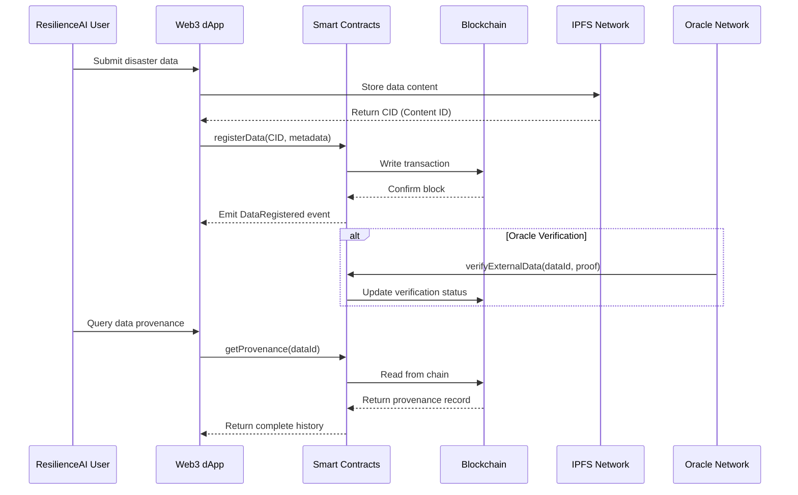

# ResilienceAI Blockchain/Web3 Integration Framework

## Executive Summary

This document provides a comprehensive blockchain and Web3 integration framework for ResilienceAI, designed to enhance data integrity, establish verifiable provenance, enable decentralized storage, and create incentive mechanisms for disaster resilience data sharing. The framework addresses critical challenges in AI-driven disaster management including data tampering prevention, audit trail immutability, cross-organizational trust, and transparent governance.

---

## Table of Contents

1. [Blockchain Architecture Overview](#1-blockchain-architecture-overview)
2. [Use Case Analysis](#2-use-case-analysis)
3. [Smart Contract Design](#3-smart-contract-design)
4. [Data Integrity & Provenance](#4-data-integrity--provenance)
5. [Decentralized Storage (IPFS)](#5-decentralized-storage-ipfs)
6. [Oracle Integration](#6-oracle-integration)
7. [Tokenization Strategy](#7-tokenization-strategy)
8. [DAO Governance](#8-dao-governance)
9. [Blockchain Selection](#9-blockchain-selection)
10. [Web3 Integration](#10-web3-integration)
11. [Transaction Management](#11-transaction-management)
12. [Cost Optimization](#12-cost-optimization)
13. [Security Considerations](#13-security-considerations)
14. [Implementation Roadmap](#14-implementation-roadmap)

---

## 1. Blockchain Architecture Overview

### 1.1 High-Level Architecture

```
┌─────────────────────────────────────────────────────────────────────────────┐
│                         RESILIENCEAI WEB3 LAYER                              │
│                                                                              │
│  ┌──────────────┐  ┌──────────────┐  ┌──────────────┐  ┌──────────────┐     │
│  │   dApp       │  │   Data       │  │   Governance │  │   Incentive  │     │
│  │   Interface  │  │   Provenance │  │   Portal     │  │   Dashboard  │     │
│  └──────────────┘  └──────────────┘  └──────────────┘  └──────────────┘     │
│         │                 │                 │                 │              │
└─────────┼─────────────────┼─────────────────┼─────────────────┼──────────────┘
          │                 │                 │                 │
          ▼                 ▼                 ▼                 ▼
┌─────────────────────────────────────────────────────────────────────────────┐
│                         SMART CONTRACT LAYER                                 │
│                                                                              │
│  ┌─────────────────┐  ┌─────────────────┐  ┌─────────────────┐              │
│  │ DataRegistry    │  │ Provenance      │  │ AccessControl   │              │
│  │ Contract        │  │ Tracker         │  │ Manager         │              │
│  └─────────────────┘  └─────────────────┘  └─────────────────┘              │
│  ┌─────────────────┐  ┌─────────────────┐  ┌─────────────────┐              │
│  │ ResilienceToken │  │ Governance      │  │ OracleConsumer  │              │
│  │ (ERC-20/ERC-721)│  │ Contract        │  │ Contract        │              │
│  └─────────────────┘  └─────────────────┘  └─────────────────┘              │
└─────────────────────────────────────────────────────────────────────────────┘
          │                 │                 │                 │
          ▼                 ▼                 ▼                 ▼
┌─────────────────────────────────────────────────────────────────────────────┐
│                         BLOCKCHAIN NETWORK                                   │
│                                                                              │
│  ┌─────────────────────────────────────────────────────────────────────┐    │
│  │              EVM-Compatible Layer 1/2 (Polygon/Ethereum)            │    │
│  │                                                                     │    │
│  │  ┌─────────┐ ┌─────────┐ ┌─────────┐ ┌─────────┐ ┌─────────┐       │    │
│  │  │ Node 1  │ │ Node 2  │ │ Node 3  │ │ Node 4  │ │ Node N  │       │    │
│  │  └─────────┘ └─────────┘ └─────────┘ └─────────┘ └─────────┘       │    │
│  └─────────────────────────────────────────────────────────────────────┘    │
└─────────────────────────────────────────────────────────────────────────────┘
          │                 │                 │                 │
          ▼                 ▼                 ▼                 ▼
┌─────────────────────────────────────────────────────────────────────────────┐
│                         DECENTRALIZED STORAGE                                │
│                                                                              │
│  ┌─────────────────────────┐  ┌─────────────────────────┐                   │
│  │      IPFS Network       │  │    Filecoin/Storage     │                   │
│  │  (Content-addressed)    │  │    (Persistent storage) │                   │
│  └─────────────────────────┘  └─────────────────────────┘                   │
└─────────────────────────────────────────────────────────────────────────────┘
          │
          ▼
┌─────────────────────────────────────────────────────────────────────────────┐
│                         ORACLE NETWORK                                       │
│                                                                              │
│  ┌──────────────┐  ┌──────────────┐  ┌──────────────┐  ┌──────────────┐     │
│  │ Chainlink    │  │ API3         │  │ Custom       │  │ Weather/IoT  │     │
│  │ Price Feeds  │  │ dAPIs        │  │ Oracles      │  │ Oracles      │     │
│  └──────────────┘  └──────────────┘  └──────────────┘  └──────────────┘     │
└─────────────────────────────────────────────────────────────────────────────┘
```

### 1.2 Component Interactions



### 1.3 Key Architectural Principles

| Principle | Description | Implementation |
|-----------|-------------|----------------|
| **Immutability** | Data once recorded cannot be altered | Blockchain storage for hashes, IPFS for content |
| **Transparency** | All transactions are publicly verifiable | Public blockchain with open smart contracts |
| **Decentralization** | No single point of failure or control | Multi-node network, distributed storage |
| **Interoperability** | Seamless integration with existing systems | Standard interfaces (ERC standards, REST APIs) |
| **Scalability** | Handle high transaction volumes | Layer 2 solutions, batching, off-chain computation |
| **Cost Efficiency** | Minimize transaction costs | Optimized gas usage, L2 deployment |

---

## 2. Use Case Analysis

### 2.1 Primary Use Cases

| Use Case | Description | Value Proposition | Priority |
|----------|-------------|-------------------|----------|
| **Data Provenance** | Track origin and modifications of all disaster data | Verifiable data lineage, audit compliance | Critical |
| **Immutable Audit Trail** | Record all system actions on-chain | Non-repudiation, regulatory compliance | Critical |
| **Decentralized Data Sharing** | Share data across organizations without central authority | Cross-agency collaboration, trustless exchange | High |
| **Credential Verification** | Verify responder credentials and certifications | Rapid deployment validation, fraud prevention | High |
| **Resource Tracking** | Track allocation and usage of disaster resources | Transparent resource management, accountability | Medium |
| **Incentive Distribution** | Reward data contributors with tokens | Encourage data sharing, build ecosystem | Medium |
| **DAO Governance** | Community-driven protocol decisions | Democratic governance, stakeholder alignment | Medium |

### 2.2 Use Case Details

#### 2.2.1 Data Provenance Tracking

```
Scenario: A satellite image is processed through multiple AI models

Traditional Approach:
- Image stored in central database
- Processing logs in application logs
- No verifiable proof of transformations

Blockchain Approach:
1. Original image hash stored on-chain
2. Each processing step recorded with:
   - Input hash
   - Output hash  
   - Algorithm version
   - Timestamp
   - Operator identity
3. Complete lineage queryable and verifiable
4. Cryptographic proof of data integrity
```

#### 2.2.2 Cross-Organization Data Sharing

```
Scenario: FEMA shares damage assessment data with state agencies

Traditional Approach:
- Email/file transfer with manual verification
- Data silos across organizations
- Version control challenges

Blockchain Approach:
1. Data stored on IPFS (content-addressed)
2. Access permissions managed via smart contracts
3. All accesses logged immutably
4. Real-time synchronization across nodes
5. Automatic version tracking
```

### 2.3 Business Value Matrix

| Stakeholder | Pain Point | Blockchain Solution | ROI Indicator |
|-------------|------------|---------------------|---------------|
| **Government Agencies** | Data tampering concerns | Immutable audit trails | Compliance audit time reduction: 70% |
| **Insurance Companies** | Fraudulent claims | Verifiable damage evidence | Claim processing cost reduction: 40% |
| **NGOs** | Resource tracking | Transparent allocation | Donor trust increase: measurable |
| **Researchers** | Data access barriers | Permissioned sharing | Collaboration efficiency: +50% |
| **Citizens** | Information authenticity | Verified public data | Trust in disaster info: +60% |

---

## 3. Smart Contract Design

### 3.1 Contract Architecture

```solidity
// SPDX-License-Identifier: MIT
pragma solidity ^0.8.19;

/**
 * @title ResilienceAI Data Registry
 * @notice Core contract for registering and tracking disaster resilience data
 * @dev Implements data provenance, access control, and verification
 */

import "@openzeppelin/contracts/access/AccessControl.sol";
import "@openzeppelin/contracts/security/ReentrancyGuard.sol";
import "@openzeppelin/contracts/utils/Counters.sol";

contract ResilienceDataRegistry is AccessControl, ReentrancyGuard {
    using Counters for Counters.Counter;
    
    // ============ Roles ============
    bytes32 public constant DATA_PUBLISHER = keccak256("DATA_PUBLISHER");
    bytes32 public constant VERIFIER = keccak256("VERIFIER");
    bytes32 public constant ORACLE = keccak256("ORACLE");
    
    // ============ Enums ============
    enum DataType { 
        SATELLITE_IMAGE, 
        SENSOR_DATA, 
        DAMAGE_ASSESSMENT, 
        INCIDENT_REPORT,
        RESOURCE_ALLOCATION,
        EVACUATION_PLAN,
        FORECAST_MODEL
    }
    
    enum VerificationStatus { 
        PENDING, 
        VERIFIED, 
        REJECTED, 
        DISPUTED 
    }
    
    // ============ Structs ============
    struct DataRecord {
        bytes32 contentHash;           // IPFS CID or content hash
        DataType dataType;
        address publisher;
        uint256 timestamp;
        uint256 blockNumber;
        string metadataURI;            // Additional metadata on IPFS
        VerificationStatus status;
        uint256 version;               // For versioned data
        bytes32 previousVersion;       // Link to previous version
        mapping(address => bool) authorizedReaders;
        bytes signature;               // Publisher's signature
    }
    
    struct ProvenanceEntry {
        bytes32 dataId;
        bytes32 operationHash;
        string operationType;          // "CREATE", "UPDATE", "TRANSFORM", "VERIFY"
        address operator;
        uint256 timestamp;
        string description;
        bytes32 inputDataId;           // For transformations
    }
    
    // ============ State Variables ============
    Counters.Counter private _dataIdCounter;
    
    mapping(bytes32 => DataRecord) public dataRecords;
    mapping(bytes32 => ProvenanceEntry[]) public provenanceChains;
    mapping(address => bytes32[]) public publisherData;
    mapping(DataType => bytes32[]) public dataByType;
    
    bytes32[] public allDataIds;
    
    // ============ Events ============
    event DataRegistered(
        bytes32 indexed dataId,
        bytes32 indexed contentHash,
        DataType dataType,
        address indexed publisher,
        uint256 timestamp,
        uint256 version
    );
    
    event DataUpdated(
        bytes32 indexed dataId,
        bytes32 indexed newContentHash,
        uint256 newVersion,
        uint256 timestamp
    );
    
    event DataVerified(
        bytes32 indexed dataId,
        address indexed verifier,
        VerificationStatus status,
        uint256 timestamp
    );
    
    event ProvenanceRecorded(
        bytes32 indexed dataId,
        bytes32 indexed operationHash,
        string operationType,
        address operator,
        uint256 timestamp
    );
    
    event AccessGranted(
        bytes32 indexed dataId,
        address indexed reader
    );
    
    event AccessRevoked(
        bytes32 indexed dataId,
        address indexed reader
    );
    
    // ============ Modifiers ============
    modifier onlyDataPublisher(bytes32 dataId) {
        require(
            dataRecords[dataId].publisher == msg.sender || 
            hasRole(DEFAULT_ADMIN_ROLE, msg.sender),
            "Not authorized"
        );
        _;
    }
    
    modifier dataExists(bytes32 dataId) {
        require(dataRecords[dataId].timestamp > 0, "Data does not exist");
        _;
    }
    
    // ============ Constructor ============
    constructor() {
        _grantRole(DEFAULT_ADMIN_ROLE, msg.sender);
        _grantRole(DATA_PUBLISHER, msg.sender);
    }
    
    // ============ Core Functions ============
    
    /**
     * @notice Register new data on the blockchain
     * @param contentHash IPFS CID or content hash
     * @param dataType Type of data being registered
     * @param metadataURI URI to additional metadata
     * @param signature Publisher's cryptographic signature
     * @return dataId Unique identifier for the registered data
     */
    function registerData(
        bytes32 contentHash,
        DataType dataType,
        string calldata metadataURI,
        bytes calldata signature
    ) external nonReentrant returns (bytes32 dataId) {
        require(hasRole(DATA_PUBLISHER, msg.sender), "Not a publisher");
        require(contentHash != bytes32(0), "Invalid content hash");
        
        _dataIdCounter.increment();
        uint256 newId = _dataIdCounter.current();
        dataId = keccak256(abi.encodePacked(newId, contentHash, block.timestamp));
        
        DataRecord storage record = dataRecords[dataId];
        record.contentHash = contentHash;
        record.dataType = dataType;
        record.publisher = msg.sender;
        record.timestamp = block.timestamp;
        record.blockNumber = block.number;
        record.metadataURI = metadataURI;
        record.status = VerificationStatus.PENDING;
        record.version = 1;
        record.signature = signature;
        
        // Grant publisher access by default
        record.authorizedReaders[msg.sender] = true;
        
        // Track publisher's data
        publisherData[msg.sender].push(dataId);
        dataByType[dataType].push(dataId);
        allDataIds.push(dataId);
        
        // Record provenance
        _recordProvenance(
            dataId,
            "CREATE",
            "Initial data registration",
            bytes32(0)
        );
        
        emit DataRegistered(
            dataId,
            contentHash,
            dataType,
            msg.sender,
            block.timestamp,
            1
        );
        
        return dataId;
    }
    
    /**
     * @notice Update existing data with new version
     * @param dataId Original data identifier
     * @param newContentHash New IPFS CID or content hash
     * @param newMetadataURI Updated metadata URI
     * @return newDataId Identifier for the new version
     */
    function updateData(
        bytes32 dataId,
        bytes32 newContentHash,
        string calldata newMetadataURI
    ) external onlyDataPublisher(dataId) dataExists(dataId) nonReentrant returns (bytes32 newDataId) {
        DataRecord storage oldRecord = dataRecords[dataId];
        
        // Create new version
        _dataIdCounter.increment();
        uint256 newId = _dataIdCounter.current();
        newDataId = keccak256(abi.encodePacked(newId, newContentHash, block.timestamp));
        
        DataRecord storage newRecord = dataRecords[newDataId];
        newRecord.contentHash = newContentHash;
        newRecord.dataType = oldRecord.dataType;
        newRecord.publisher = msg.sender;
        newRecord.timestamp = block.timestamp;
        newRecord.blockNumber = block.number;
        newRecord.metadataURI = newMetadataURI;
        newRecord.status = VerificationStatus.PENDING;
        newRecord.version = oldRecord.version + 1;
        newRecord.previousVersion = dataId;
        
        // Copy access permissions
        // Note: In production, implement proper access list copying
        newRecord.authorizedReaders[msg.sender] = true;
        
        publisherData[msg.sender].push(newDataId);
        dataByType[oldRecord.dataType].push(newDataId);
        allDataIds.push(newDataId);
        
        _recordProvenance(
            newDataId,
            "UPDATE",
            "Data version update",
            dataId
        );
        
        emit DataUpdated(newDataId, newContentHash, newRecord.version, block.timestamp);
        
        return newDataId;
    }
    
    /**
     * @notice Verify data authenticity (called by authorized verifiers)
     * @param dataId Data to verify
     * @param status Verification status
     * @param verificationProof Optional proof of verification
     */
    function verifyData(
        bytes32 dataId,
        VerificationStatus status,
        bytes calldata verificationProof
    ) external dataExists(dataId) {
        require(hasRole(VERIFIER, msg.sender) || hasRole(ORACLE, msg.sender), "Not authorized");
        
        dataRecords[dataId].status = status;
        
        _recordProvenance(
            dataId,
            "VERIFY",
            status == VerificationStatus.VERIFIED ? "Data verified" : "Verification failed",
            bytes32(0)
        );
        
        emit DataVerified(dataId, msg.sender, status, block.timestamp);
    }
    
    /**
     * @notice Grant read access to a data record
     * @param dataId Data identifier
     * @param reader Address to grant access
     */
    function grantAccess(bytes32 dataId, address reader) 
        external 
        onlyDataPublisher(dataId) 
        dataExists(dataId) 
    {
        dataRecords[dataId].authorizedReaders[reader] = true;
        emit AccessGranted(dataId, reader);
    }
    
    /**
     * @notice Revoke read access from a data record
     * @param dataId Data identifier
     * @param reader Address to revoke access
     */
    function revokeAccess(bytes32 dataId, address reader) 
        external 
        onlyDataPublisher(dataId) 
        dataExists(dataId) 
    {
        dataRecords[dataId].authorizedReaders[reader] = false;
        emit AccessRevoked(dataId, reader);
    }
    
    /**
     * @notice Check if address has read access to data
     * @param dataId Data identifier
     * @param reader Address to check
     */
    function hasAccess(bytes32 dataId, address reader) 
        external 
        view 
        dataExists(dataId) 
        returns (bool) 
    {
        return dataRecords[dataId].authorizedReaders[reader];
    }
    
    /**
     * @notice Get complete provenance chain for data
     * @param dataId Data identifier
     * @return entries Array of provenance entries
     */
    function getProvenance(bytes32 dataId) 
        external 
        view 
        dataExists(dataId) 
        returns (ProvenanceEntry[] memory entries) 
    {
        return provenanceChains[dataId];
    }
    
    /**
     * @notice Get data record details
     * @param dataId Data identifier
     */
    function getDataRecord(bytes32 dataId)
        external
        view
        dataExists(dataId)
        returns (
            bytes32 contentHash,
            DataType dataType,
            address publisher,
            uint256 timestamp,
            uint256 blockNumber,
            string memory metadataURI,
            VerificationStatus status,
            uint256 version
        )
    {
        DataRecord storage record = dataRecords[dataId];
        return (
            record.contentHash,
            record.dataType,
            record.publisher,
            record.timestamp,
            record.blockNumber,
            record.metadataURI,
            record.status,
            record.version
        );
    }
    
    // ============ Internal Functions ============
    
    function _recordProvenance(
        bytes32 dataId,
        string memory operationType,
        string memory description,
        bytes32 inputDataId
    ) internal {
        bytes32 operationHash = keccak256(
            abi.encodePacked(dataId, operationType, msg.sender, block.timestamp)
        );
        
        provenanceChains[dataId].push(ProvenanceEntry({
            dataId: dataId,
            operationHash: operationHash,
            operationType: operationType,
            operator: msg.sender,
            timestamp: block.timestamp,
            description: description,
            inputDataId: inputDataId
        }));
        
        emit ProvenanceRecorded(
            dataId,
            operationHash,
            operationType,
            msg.sender,
            block.timestamp
        );
    }
}
```

### 3.2 Access Control Contract

```solidity
// SPDX-License-Identifier: MIT
pragma solidity ^0.8.19;

import "@openzeppelin/contracts/access/AccessControl.sol";
import "@openzeppelin/contracts/security/Pausable.sol";

/**
 * @title ResilienceAccessControl
 * @notice Manages fine-grained access control for ResilienceAI data
 */
contract ResilienceAccessControl is AccessControl, Pausable {
    
    // Role definitions
    bytes32 public constant ADMIN = keccak256("ADMIN");
    bytes32 public constant DATA_PUBLISHER = keccak256("DATA_PUBLISHER");
    bytes32 public constant VERIFIER = keccak256("VERIFIER");
    bytes32 public constant ORACLE = keccak256("ORACLE");
    bytes32 public constant GOVERNANCE = keccak256("GOVERNANCE");
    bytes32 public constant EMERGENCY_RESPONDER = keccak256("EMERGENCY_RESPONDER");
    
    // Organization types
    enum OrganizationType {
        GOVERNMENT,
        NGO,
        PRIVATE_SECTOR,
        ACADEMIC,
        INDIVIDUAL
    }
    
    struct Organization {
        string name;
        OrganizationType orgType;
        bool isVerified;
        uint256 registrationTime;
        bytes32 credentialsHash;
    }
    
    struct AccessPolicy {
        bytes32 dataType;
        bytes32 requiredRole;
        uint256 minReputation;
        bool requiresVerification;
        uint256 expirationTime;
    }
    
    mapping(address => Organization) public organizations;
    mapping(bytes32 => AccessPolicy) public accessPolicies;
    mapping(address => uint256) public reputationScores;
    mapping(address => mapping(bytes32 => uint256)) public roleExpirations;
    
    event OrganizationRegistered(
        address indexed orgAddress,
        string name,
        OrganizationType orgType
    );
    
    event OrganizationVerified(address indexed orgAddress);
    event ReputationUpdated(address indexed user, uint256 newScore);
    event AccessPolicyCreated(bytes32 indexed policyId);
    
    constructor() {
        _grantRole(DEFAULT_ADMIN_ROLE, msg.sender);
        _grantRole(ADMIN, msg.sender);
    }
    
    function registerOrganization(
        string calldata name,
        OrganizationType orgType,
        bytes32 credentialsHash
    ) external whenNotPaused {
        require(bytes(organizations[msg.sender].name).length == 0, "Already registered");
        
        organizations[msg.sender] = Organization({
            name: name,
            orgType: orgType,
            isVerified: false,
            registrationTime: block.timestamp,
            credentialsHash: credentialsHash
        });
        
        emit OrganizationRegistered(msg.sender, name, orgType);
    }
    
    function verifyOrganization(address orgAddress) external onlyRole(ADMIN) {
        organizations[orgAddress].isVerified = true;
        _grantRole(DATA_PUBLISHER, orgAddress);
        emit OrganizationVerified(orgAddress);
    }
    
    function updateReputation(address user, uint256 newScore) external onlyRole(ADMIN) {
        reputationScores[user] = newScore;
        emit ReputationUpdated(user, newScore);
    }
    
    function checkAccess(
        address user,
        bytes32 dataType,
        bytes32 requiredRole
    ) external view returns (bool) {
        if (!hasRole(requiredRole, user)) {
            return false;
        }
        
        AccessPolicy memory policy = accessPolicies[dataType];
        if (policy.requiresVerification && !organizations[user].isVerified) {
            return false;
        }
        
        if (reputationScores[user] < policy.minReputation) {
            return false;
        }
        
        uint256 expiration = roleExpirations[user][requiredRole];
        if (expiration > 0 && expiration < block.timestamp) {
            return false;
        }
        
        return true;
    }
    
    function pause() external onlyRole(ADMIN) {
        _pause();
    }
    
    function unpause() external onlyRole(ADMIN) {
        _unpause();
    }
}
```

### 3.3 Token Contract (ERC-20 with Utility)

```solidity
// SPDX-License-Identifier: MIT
pragma solidity ^0.8.19;

import "@openzeppelin/contracts/token/ERC20/ERC20.sol";
import "@openzeppelin/contracts/token/ERC20/extensions/ERC20Burnable.sol";
import "@openzeppelin/contracts/token/ERC20/extensions/ERC20Pausable.sol";
import "@openzeppelin/contracts/access/AccessControl.sol";

/**
 * @title ResilienceToken
 * @notice Utility token for the ResilienceAI ecosystem
 * @dev Used for incentives, governance, and premium features
 */
contract ResilienceToken is ERC20, ERC20Burnable, ERC20Pausable, AccessControl {
    bytes32 public constant MINTER_ROLE = keccak256("MINTER_ROLE");
    bytes32 public constant REWARD_MANAGER = keccak256("REWARD_MANAGER");
    
    // Token economics
    uint256 public constant MAX_SUPPLY = 100_000_000 * 10**18; // 100M tokens
    uint256 public constant INITIAL_SUPPLY = 10_000_000 * 10**18; // 10M tokens
    
    // Reward rates
    uint256 public dataSubmissionReward = 10 * 10**18;      // 10 tokens
    uint256 public verificationReward = 5 * 10**18;          // 5 tokens
    uint256 public governanceParticipationReward = 2 * 10**18; // 2 tokens
    
    // Staking
    struct Stake {
        uint256 amount;
        uint256 startTime;
        uint256 lockPeriod;
    }
    
    mapping(address => Stake) public stakes;
    mapping(address => uint256) public pendingRewards;
    
    uint256 public stakingAPY = 500; // 5% APY (in basis points)
    uint256 public constant REWARD_INTERVAL = 30 days;
    
    // Events
    event RewardDistributed(address indexed recipient, uint256 amount, string reason);
    event TokensStaked(address indexed user, uint256 amount, uint256 lockPeriod);
    event TokensUnstaked(address indexed user, uint256 amount);
    event RewardClaimed(address indexed user, uint256 amount);
    
    constructor() ERC20("Resilience Token", "RSL") {
        _grantRole(DEFAULT_ADMIN_ROLE, msg.sender);
        _grantRole(MINTER_ROLE, msg.sender);
        _grantRole(REWARD_MANAGER, msg.sender);
        
        _mint(msg.sender, INITIAL_SUPPLY);
    }
    
    function mint(address to, uint256 amount) external onlyRole(MINTER_ROLE) {
        require(totalSupply() + amount <= MAX_SUPPLY, "Exceeds max supply");
        _mint(to, amount);
    }
    
    function rewardDataSubmission(address contributor) external onlyRole(REWARD_MANAGER) {
        _mint(contributor, dataSubmissionReward);
        emit RewardDistributed(contributor, dataSubmissionReward, "DATA_SUBMISSION");
    }
    
    function rewardVerification(address verifier) external onlyRole(REWARD_MANAGER) {
        _mint(verifier, verificationReward);
        emit RewardDistributed(verifier, verificationReward, "VERIFICATION");
    }
    
    function rewardGovernance(address participant) external onlyRole(REWARD_MANAGER) {
        _mint(participant, governanceParticipationReward);
        emit RewardDistributed(participant, governanceParticipationReward, "GOVERNANCE");
    }
    
    function stake(uint256 amount, uint256 lockPeriod) external whenNotPaused {
        require(amount > 0, "Cannot stake 0");
        require(balanceOf(msg.sender) >= amount, "Insufficient balance");
        require(stakes[msg.sender].amount == 0, "Already staking");
        
        _transfer(msg.sender, address(this), amount);
        
        stakes[msg.sender] = Stake({
            amount: amount,
            startTime: block.timestamp,
            lockPeriod: lockPeriod
        });
        
        emit TokensStaked(msg.sender, amount, lockPeriod);
    }
    
    function unstake() external {
        Stake memory userStake = stakes[msg.sender];
        require(userStake.amount > 0, "No active stake");
        require(
            block.timestamp >= userStake.startTime + userStake.lockPeriod,
            "Lock period not ended"
        );
        
        // Calculate and distribute rewards
        uint256 reward = _calculateStakingReward(msg.sender);
        if (reward > 0) {
            _mint(msg.sender, reward);
            emit RewardClaimed(msg.sender, reward);
        }
        
        uint256 amount = userStake.amount;
        delete stakes[msg.sender];
        
        _transfer(address(this), msg.sender, amount);
        emit TokensUnstaked(msg.sender, amount);
    }
    
    function _calculateStakingReward(address user) internal view returns (uint256) {
        Stake memory userStake = stakes[user];
        if (userStake.amount == 0) return 0;
        
        uint256 stakingDuration = block.timestamp - userStake.startTime;
        uint256 annualReward = (userStake.amount * stakingAPY) / 10000;
        
        return (annualReward * stakingDuration) / 365 days;
    }
    
    function updateRewardRates(
        uint256 dataReward,
        uint256 verifyReward,
        uint256 govReward
    ) external onlyRole(DEFAULT_ADMIN_ROLE) {
        dataSubmissionReward = dataReward;
        verificationReward = verifyReward;
        governanceParticipationReward = govReward;
    }
    
    function updateStakingAPY(uint256 newAPY) external onlyRole(DEFAULT_ADMIN_ROLE) {
        require(newAPY <= 2000, "APY cannot exceed 20%");
        stakingAPY = newAPY;
    }
    
    function pause() external onlyRole(DEFAULT_ADMIN_ROLE) {
        _pause();
    }
    
    function unpause() external onlyRole(DEFAULT_ADMIN_ROLE) {
        _unpause();
    }
    
    function _beforeTokenTransfer(
        address from,
        address to,
        uint256 amount
    ) internal override(ERC20, ERC20Pausable) {
        super._beforeTokenTransfer(from, to, amount);
    }
}
```

---

## 4. Data Integrity & Provenance

### 4.1 Provenance Tracking System

```python
# /mnt/okcomputer/output/resilience_ai_analysis/blockchain/provenance_tracker.py

"""
ResilienceAI Blockchain Provenance Tracker

This module provides comprehensive data provenance tracking using blockchain
technology to ensure data integrity and auditability.
"""

import hashlib
import json
from datetime import datetime
from typing import Dict, List, Optional, Any, Callable
from dataclasses import dataclass, asdict
from enum import Enum
import asyncio
from web3 import Web3
from eth_account import Account
import ipfshttpclient


class DataType(Enum):
    """Types of data that can be tracked"""
    SATELLITE_IMAGE = "satellite_image"
    SENSOR_DATA = "sensor_data"
    DAMAGE_ASSESSMENT = "damage_assessment"
    INCIDENT_REPORT = "incident_report"
    RESOURCE_ALLOCATION = "resource_allocation"
    EVACUATION_PLAN = "evacuation_plan"
    FORECAST_MODEL = "forecast_model"


class OperationType(Enum):
    """Types of operations in provenance chain"""
    CREATE = "create"
    UPDATE = "update"
    TRANSFORM = "transform"
    VERIFY = "verify"
    SHARE = "share"
    ARCHIVE = "archive"


@dataclass
class ProvenanceRecord:
    """Single provenance entry"""
    data_id: str
    operation: OperationType
    operator: str
    timestamp: datetime
    description: str
    input_data_id: Optional[str] = None
    metadata: Optional[Dict[str, Any]] = None
    transaction_hash: Optional[str] = None
    block_number: Optional[int] = None
    
    def to_dict(self) -> Dict:
        """Convert to dictionary"""
        return {
            "data_id": self.data_id,
            "operation": self.operation.value,
            "operator": self.operator,
            "timestamp": self.timestamp.isoformat(),
            "description": self.description,
            "input_data_id": self.input_data_id,
            "metadata": self.metadata,
            "transaction_hash": self.transaction_hash,
            "block_number": self.block_number
        }


@dataclass
class DataFingerprint:
    """Cryptographic fingerprint of data"""
    content_hash: str
    data_type: DataType
    size_bytes: int
    created_at: datetime
    signature: Optional[str] = None
    
    def verify_integrity(self, content: bytes) -> bool:
        """Verify content matches fingerprint"""
        computed_hash = hashlib.sha256(content).hexdigest()
        return computed_hash == self.content_hash


class BlockchainProvenanceTracker:
    """
    Blockchain-based provenance tracking for ResilienceAI data
    
    Features:
    - Immutable audit trails
    - Cryptographic verification
    - Multi-chain support
    - IPFS integration
    """
    
    def __init__(
        self,
        web3_provider: str,
        contract_address: str,
        contract_abi: List[Dict],
        private_key: Optional[str] = None,
        ipfs_host: str = "/ip4/127.0.0.1/tcp/5001"
    ):
        """
        Initialize the provenance tracker
        
        Args:
            web3_provider: URL of Ethereum node (e.g., Infura, Alchemy)
            contract_address: Deployed contract address
            contract_abi: Contract ABI
            private_key: Optional private key for transactions
            ipfs_host: IPFS node connection string
        """
        self.w3 = Web3(Web3.HTTPProvider(web3_provider))
        self.contract = self.w3.eth.contract(
            address=Web3.to_checksum_address(contract_address),
            abi=contract_abi
        )
        
        if private_key:
            self.account = Account.from_key(private_key)
        else:
            self.account = None
            
        self.ipfs_client = ipfshttpclient.connect(ipfs_host)
        self._pending_records: List[ProvenanceRecord] = []
        
    def compute_content_hash(self, content: bytes) -> str:
        """Compute SHA-256 hash of content"""
        return hashlib.sha256(content).hexdigest()
    
    def store_on_ipfs(self, content: bytes) -> str:
        """Store content on IPFS and return CID"""
        result = self.ipfs_client.add_bytes(content)
        return result
    
    def retrieve_from_ipfs(self, cid: str) -> bytes:
        """Retrieve content from IPFS by CID"""
        return self.ipfs_client.cat(cid)
    
    async def register_data(
        self,
        content: bytes,
        data_type: DataType,
        metadata: Dict[str, Any],
        publisher_address: Optional[str] = None
    ) -> Dict[str, Any]:
        """
        Register new data with blockchain provenance
        
        Args:
            content: Raw data content
            data_type: Type of data
            metadata: Additional metadata
            publisher_address: Optional override for publisher
            
        Returns:
            Registration result with data_id and transaction details
        """
        # Compute content hash
        content_hash = self.compute_content_hash(content)
        
        # Store on IPFS
        ipfs_cid = self.store_on_ipfs(content)
        
        # Store metadata on IPFS
        metadata_json = json.dumps(metadata)
        metadata_cid = self.store_on_ipfs(metadata_json.encode())
        
        # Sign the content hash
        if self.account:
            message = Web3.keccak(text=f"{content_hash}{ipfs_cid}")
            signature = self.account.sign_message(message).signature.hex()
        else:
            signature = "0x"
        
        # Build transaction
        publisher = publisher_address or self.account.address
        
        # Convert data type to contract enum
        data_type_int = list(DataType).index(data_type)
        
        tx = self.contract.functions.registerData(
            Web3.to_bytes(hexstr=content_hash),
            data_type_int,
            f"ipfs://{metadata_cid}",
            Web3.to_bytes(hexstr=signature)
        ).build_transaction({
            'from': publisher,
            'nonce': self.w3.eth.get_transaction_count(publisher),
            'gas': 500000,
            'gasPrice': self.w3.eth.gas_price
        })
        
        # Sign and send transaction
        if self.account:
            signed_tx = self.w3.eth.account.sign_transaction(tx, self.account.key)
            tx_hash = self.w3.eth.send_raw_transaction(signed_tx.rawTransaction)
            receipt = self.w3.eth.wait_for_transaction_receipt(tx_hash)
            
            # Get data ID from event
            logs = self.contract.events.DataRegistered().process_receipt(receipt)
            data_id = logs[0]['args']['dataId'].hex() if logs else None
            
            return {
                "data_id": data_id,
                "content_hash": content_hash,
                "ipfs_cid": ipfs_cid,
                "metadata_cid": metadata_cid,
                "transaction_hash": tx_hash.hex(),
                "block_number": receipt.blockNumber,
                "gas_used": receipt.gasUsed,
                "status": "success" if receipt.status == 1 else "failed"
            }
        else:
            return {
                "content_hash": content_hash,
                "ipfs_cid": ipfs_cid,
                "metadata_cid": metadata_cid,
                "transaction": tx,
                "status": "pending_signature"
            }
    
    async def record_transformation(
        self,
        input_data_id: str,
        output_content: bytes,
        operation: OperationType,
        description: str,
        operator_address: Optional[str] = None
    ) -> Dict[str, Any]:
        """
        Record a data transformation operation
        
        Args:
            input_data_id: ID of input data
            output_content: Transformed content
            operation: Type of operation
            description: Human-readable description
            operator_address: Optional operator override
            
        Returns:
            Transformation record details
        """
        # Store output on IPFS
        output_cid = self.store_on_ipfs(output_content)
        output_hash = self.compute_content_hash(output_content)
        
        # Register as new data with link to previous
        operator = operator_address or self.account.address
        
        # Build provenance record
        record = ProvenanceRecord(
            data_id=output_cid,
            operation=operation,
            operator=operator,
            timestamp=datetime.utcnow(),
            description=description,
            input_data_id=input_data_id
        )
        
        # Store provenance on IPFS
        provenance_json = json.dumps(record.to_dict())
        provenance_cid = self.store_on_ipfs(provenance_json.encode())
        
        return {
            "output_data_id": output_cid,
            "output_hash": output_hash,
            "provenance_cid": provenance_cid,
            "input_data_id": input_data_id,
            "operation": operation.value,
            "record": record.to_dict()
        }
    
    async def get_provenance_chain(
        self,
        data_id: str
    ) -> List[ProvenanceRecord]:
        """
        Retrieve complete provenance chain for data
        
        Args:
            data_id: Data identifier
            
        Returns:
            List of provenance records in chronological order
        """
        # Query contract for provenance
        try:
            entries = self.contract.functions.getProvenance(
                Web3.to_bytes(hexstr=data_id)
            ).call()
            
            records = []
            for entry in entries:
                record = ProvenanceRecord(
                    data_id=entry[0].hex(),
                    operation=OperationType(entry[2]),
                    operator=entry[3],
                    timestamp=datetime.fromtimestamp(entry[4]),
                    description=entry[5],
                    input_data_id=entry[6].hex() if entry[6] else None,
                    transaction_hash=entry[1].hex(),
                    block_number=None  # Would need additional lookup
                )
                records.append(record)
            
            return records
            
        except Exception as e:
            # Fallback: retrieve from IPFS if available
            try:
                provenance_data = self.retrieve_from_ipfs(data_id)
                provenance_json = json.loads(provenance_data.decode())
                return [ProvenanceRecord(**provenance_json)]
            except:
                raise Exception(f"Could not retrieve provenance: {e}")
    
    def verify_data_integrity(
        self,
        data_id: str,
        content: bytes
    ) -> Dict[str, Any]:
        """
        Verify data integrity against blockchain record
        
        Args:
            data_id: Data identifier
            content: Content to verify
            
        Returns:
            Verification result with details
        """
        # Get stored hash from contract
        try:
            record = self.contract.functions.getDataRecord(
                Web3.to_bytes(hexstr=data_id)
            ).call()
            
            stored_hash = record[0].hex()
            computed_hash = self.compute_content_hash(content)
            
            return {
                "data_id": data_id,
                "stored_hash": stored_hash,
                "computed_hash": computed_hash,
                "is_valid": stored_hash == computed_hash,
                "publisher": record[2],
                "timestamp": datetime.fromtimestamp(record[3]),
                "block_number": record[4],
                "verification_status": record[6]
            }
            
        except Exception as e:
            return {
                "data_id": data_id,
                "is_valid": False,
                "error": str(e)
            }
    
    async def batch_register(
        self,
        items: List[Dict[str, Any]]
    ) -> List[Dict[str, Any]]:
        """
        Register multiple data items efficiently
        
        Args:
            items: List of items with content, type, and metadata
            
        Returns:
            List of registration results
        """
        results = []
        
        # Process in batches for gas optimization
        batch_size = 10
        for i in range(0, len(items), batch_size):
            batch = items[i:i + batch_size]
            
            # Prepare batch transaction
            # Note: This would require a batch function in the contract
            # For now, process sequentially
            for item in batch:
                result = await self.register_data(
                    content=item['content'],
                    data_type=item['data_type'],
                    metadata=item.get('metadata', {})
                )
                results.append(result)
        
        return results
    
    def create_merkle_root(
        self,
        data_hashes: List[str]
    ) -> str:
        """
        Create Merkle root for batch verification
        
        Args:
            data_hashes: List of data hashes
            
        Returns:
            Merkle root hash
        """
        if len(data_hashes) == 0:
            return "0" * 64
        
        if len(data_hashes) == 1:
            return data_hashes[0]
        
        # Build tree level by level
        current_level = data_hashes
        
        while len(current_level) > 1:
            next_level = []
            for i in range(0, len(current_level), 2):
                left = current_level[i]
                right = current_level[i + 1] if i + 1 < len(current_level) else left
                combined = hashlib.sha256(
                    (left + right).encode()
                ).hexdigest()
                next_level.append(combined)
            current_level = next_level
        
        return current_level[0]


# Example usage and testing
if __name__ == "__main__":
    # Configuration
    config = {
        "web3_provider": "https://polygon-mumbai.infura.io/v3/YOUR_KEY",
        "contract_address": "0x...",
        "contract_abi": [],  # Load from compiled contract
        "private_key": "0x..."  # Test key only
    }
    
    # Initialize tracker
    tracker = BlockchainProvenanceTracker(
        web3_provider=config["web3_provider"],
        contract_address=config["contract_address"],
        contract_abi=config["contract_abi"],
        private_key=config["private_key"]
    )
    
    # Example: Register satellite imagery
    async def example():
        # Sample satellite image data
        image_data = b"sample_satellite_image_data"
        
        result = await tracker.register_data(
            content=image_data,
            data_type=DataType.SATELLITE_IMAGE,
            metadata={
                "source": "Landsat-8",
                "capture_date": "2024-01-15T10:30:00Z",
                "resolution": "30m",
                "coordinates": {"lat": 40.7128, "lon": -74.0060},
                "bands": ["RGB", "NIR"]
            }
        )
        
        print(f"Registration result: {json.dumps(result, indent=2)}")
        
        # Verify integrity
        verification = tracker.verify_data_integrity(
            data_id=result["data_id"],
            content=image_data
        )
        
        print(f"Verification result: {json.dumps(verification, indent=2)}")
    
    # Run example
    asyncio.run(example())


### 4.2 Merkle Tree for Batch Verification

```solidity
// SPDX-License-Identifier: MIT
pragma solidity ^0.8.19;

/**
 * @title MerkleVerifier
 * @notice Efficient batch verification using Merkle trees
 */
library MerkleVerifier {
    
    /**
     * @notice Verify a Merkle proof
     * @param root Merkle root
     * @param leaf Leaf node hash
     * @param proof Array of sibling hashes
     * @return isValid Whether the proof is valid
     */
    function verifyProof(
        bytes32 root,
        bytes32 leaf,
        bytes32[] memory proof
    ) internal pure returns (bool isValid) {
        bytes32 computedHash = leaf;
        
        for (uint256 i = 0; i < proof.length; i++) {
            bytes32 proofElement = proof[i];
            
            if (computedHash <= proofElement) {
                computedHash = keccak256(
                    abi.encodePacked(computedHash, proofElement)
                );
            } else {
                computedHash = keccak256(
                    abi.encodePacked(proofElement, computedHash)
                );
            }
        }
        
        return computedHash == root;
    }
    
    /**
     * @notice Compute Merkle root from leaves
     * @param leaves Array of leaf hashes
     * @return root Computed Merkle root
     */
    function computeRoot(bytes32[] memory leaves) 
        internal 
        pure 
        returns (bytes32 root) 
    {
        require(leaves.length > 0, "Empty leaves");
        
        if (leaves.length == 1) {
            return leaves[0];
        }
        
        bytes32[] memory currentLevel = leaves;
        
        while (currentLevel.length > 1) {
            bytes32[] memory nextLevel = new bytes32[](
                (currentLevel.length + 1) / 2
            );
            
            for (uint256 i = 0; i < currentLevel.length; i += 2) {
                bytes32 left = currentLevel[i];
                bytes32 right = (i + 1 < currentLevel.length) 
                    ? currentLevel[i + 1] 
                    : left;
                
                nextLevel[i / 2] = keccak256(
                    abi.encodePacked(left, right)
                );
            }
            
            currentLevel = nextLevel;
        }
        
        return currentLevel[0];
    }
}

/**
 * @title BatchDataRegistry
 * @notice Register multiple data items with single transaction
 */
contract BatchDataRegistry {
    using MerkleVerifier for bytes32;
    
    struct BatchRegistration {
        bytes32 merkleRoot;
        uint256 timestamp;
        address registrant;
        uint256 itemCount;
        string metadataURI;
    }
    
    mapping(bytes32 => BatchRegistration) public batches;
    mapping(bytes32 => bool) public verifiedLeaves;
    
    event BatchRegistered(
        bytes32 indexed batchId,
        bytes32 merkleRoot,
        uint256 itemCount,
        address registrant
    );
    
    event LeafVerified(
        bytes32 indexed batchId,
        bytes32 indexed leaf
    );
    
    /**
     * @notice Register a batch of data items
     * @param merkleRoot Root hash of Merkle tree
     * @param itemCount Number of items in batch
     * @param metadataURI URI to batch metadata
     * @return batchId Unique batch identifier
     */
    function registerBatch(
        bytes32 merkleRoot,
        uint256 itemCount,
        string calldata metadataURI
    ) external returns (bytes32 batchId) {
        require(merkleRoot != bytes32(0), "Invalid root");
        require(itemCount > 0, "Empty batch");
        
        batchId = keccak256(
            abi.encodePacked(merkleRoot, block.timestamp, msg.sender)
        );
        
        batches[batchId] = BatchRegistration({
            merkleRoot: merkleRoot,
            timestamp: block.timestamp,
            registrant: msg.sender,
            itemCount: itemCount,
            metadataURI: metadataURI
        });
        
        emit BatchRegistered(batchId, merkleRoot, itemCount, msg.sender);
        
        return batchId;
    }
    
    /**
     * @notice Verify a single item from a batch
     * @param batchId Batch identifier
     * @param leafHash Hash of the item to verify
     * @param proof Merkle proof
     * @return isValid Whether verification succeeded
     */
    function verifyBatchItem(
        bytes32 batchId,
        bytes32 leafHash,
        bytes32[] calldata proof
    ) external returns (bool isValid) {
        BatchRegistration memory batch = batches[batchId];
        require(batch.timestamp > 0, "Batch not found");
        
        isValid = MerkleVerifier.verifyProof(
            batch.merkleRoot,
            leafHash,
            proof
        );
        
        if (isValid) {
            verifiedLeaves[leafHash] = true;
            emit LeafVerified(batchId, leafHash);
        }
        
        return isValid;
    }
    
    /**
     * @notice Check if a leaf has been verified
     */
    function isVerified(bytes32 leafHash) external view returns (bool) {
        return verifiedLeaves[leafHash];
    }
}
```

---

## 5. Decentralized Storage (IPFS)

### 5.1 IPFS Integration Architecture

```python
# /mnt/okcomputer/output/resilience_ai_analysis/blockchain/ipfs_storage.py

"""
ResilienceAI IPFS Storage Manager

Provides decentralized storage integration for disaster resilience data
using IPFS (InterPlanetary File System) with optional Filecoin persistence.
"""

import json
import hashlib
import asyncio
from typing import Dict, List, Optional, BinaryIO, Union, Any
from dataclasses import dataclass, asdict
from datetime import datetime
import ipfshttpclient
from aioipfs import AsyncIPFS
import logging

logging.basicConfig(level=logging.INFO)
logger = logging.getLogger(__name__)


@dataclass
class IPFSMetadata:
    """Metadata for IPFS-stored content"""
    cid: str
    size_bytes: int
    content_type: str
    filename: Optional[str] = None
    created_at: Optional[datetime] = None
    tags: Optional[List[str]] = None
    encryption: Optional[str] = None
    original_hash: Optional[str] = None
    
    def to_dict(self) -> Dict[str, Any]:
        return {
            "cid": self.cid,
            "size_bytes": self.size_bytes,
            "content_type": self.content_type,
            "filename": self.filename,
            "created_at": self.created_at.isoformat() if self.created_at else None,
            "tags": self.tags,
            "encryption": self.encryption,
            "original_hash": self.original_hash
        }


class IPFSStorageManager:
    """
    Manager for IPFS storage operations
    
    Features:
    - Content-addressed storage
    - Pin management
    - Replication across nodes
    - Filecoin persistence integration
    - Encryption support
    """
    
    def __init__(
        self,
        host: str = "/ip4/127.0.0.1/tcp/5001",
        async_host: str = "localhost",
        async_port: int = 5001,
        pinata_api_key: Optional[str] = None,
        pinata_secret: Optional[str] = None,
        web3_storage_token: Optional[str] = None
    ):
        """
        Initialize IPFS storage manager
        
        Args:
            host: IPFS daemon connection string
            async_host: Host for async client
            async_port: Port for async client
            pinata_api_key: Pinata API key for remote pinning
            pinata_secret: Pinata API secret
            web3_storage_token: Web3.Storage API token
        """
        self.host = host
        self.async_host = async_host
        self.async_port = async_port
        self.pinata_api_key = pinata_api_key
        self.pinata_secret = pinata_secret
        self.web3_storage_token = web3_storage_token
        
        # Initialize clients
        self._client = None
        self._async_client = None
        
    @property
    def client(self):
        """Lazy initialization of sync client"""
        if self._client is None:
            self._client = ipfshttpclient.connect(self.host)
        return self._client
    
    async def get_async_client(self):
        """Lazy initialization of async client"""
        if self._async_client is None:
            self._async_client = AsyncIPFS(self.async_host, self.async_port)
        return self._async_client
    
    def compute_hash(self, content: bytes) -> str:
        """Compute SHA-256 hash of content"""
        return hashlib.sha256(content).hexdigest()
    
    def store_bytes(
        self,
        content: bytes,
        filename: Optional[str] = None,
        content_type: str = "application/octet-stream",
        pin: bool = True,
        encrypt: bool = False,
        tags: Optional[List[str]] = None
    ) -> IPFSMetadata:
        """
        Store bytes on IPFS
        
        Args:
            content: Raw bytes to store
            filename: Optional filename
            content_type: MIME type
            pin: Whether to pin content
            encrypt: Whether to encrypt before storage
            tags: Optional tags for organization
            
        Returns:
            IPFSMetadata with CID and details
        """
        original_hash = self.compute_hash(content)
        
        # Encrypt if requested
        if encrypt:
            content = self._encrypt_content(content)
        
        # Add to IPFS
        result = self.client.add_bytes(content)
        cid = result
        
        # Pin if requested
        if pin:
            self.client.pin.add(cid)
            
            # Remote pin if credentials available
            if self.pinata_api_key:
                self._pin_to_pinata(cid)
        
        # Get size info
        stats = self.client.object.stat(cid)
        
        metadata = IPFSMetadata(
            cid=cid,
            size_bytes=stats['CumulativeSize'],
            content_type=content_type,
            filename=filename,
            created_at=datetime.utcnow(),
            tags=tags or [],
            encryption="aes-256-gcm" if encrypt else None,
            original_hash=original_hash
        )
        
        logger.info(f"Stored content with CID: {cid}")
        return metadata
    
    def store_json(
        self,
        data: Dict[str, Any],
        filename: Optional[str] = None,
        pin: bool = True
    ) -> IPFSMetadata:
        """Store JSON data on IPFS"""
        content = json.dumps(data, indent=2).encode('utf-8')
        return self.store_bytes(
            content=content,
            filename=filename,
            content_type="application/json",
            pin=pin
        )
    
    def store_file(
        self,
        file_path: str,
        pin: bool = True,
        wrap_with_directory: bool = False
    ) -> IPFSMetadata:
        """
        Store file on IPFS
        
        Args:
            file_path: Path to file
            pin: Whether to pin
            wrap_with_directory: Wrap in directory for filename preservation
            
        Returns:
            IPFSMetadata with CID
        """
        import os
        
        filename = os.path.basename(file_path)
        
        if wrap_with_directory:
            result = self.client.add(
                file_path,
                wrap_with_directory=True,
                pin=pin
            )
            cid = result[-1]['Hash']  # Directory CID
        else:
            result = self.client.add(file_path, pin=pin)
            cid = result['Hash']
        
        # Get file size
        size = os.path.getsize(file_path)
        
        # Detect content type
        content_type = self._detect_content_type(file_path)
        
        return IPFSMetadata(
            cid=cid,
            size_bytes=size,
            content_type=content_type,
            filename=filename,
            created_at=datetime.utcnow()
        )
    
    async def store_large_file(
        self,
        file_path: str,
        chunk_size: int = 1024 * 1024,  # 1MB chunks
        pin: bool = True
    ) -> IPFSMetadata:
        """
        Store large file with chunked upload
        
        Args:
            file_path: Path to large file
            chunk_size: Size of chunks for streaming
            pin: Whether to pin
            
        Returns:
            IPFSMetadata with CID
        """
        client = await self.get_async_client()
        
        async with client as ipfs:
            # Stream file in chunks
            async def file_chunks():
                with open(file_path, 'rb') as f:
                    while True:
                        chunk = f.read(chunk_size)
                        if not chunk:
                            break
                        yield chunk
            
            # Add chunked content
            result = await ipfs.add(file_chunks())
            cid = result['Hash']
            
            if pin:
                await ipfs.pin.add(cid)
        
        import os
        return IPFSMetadata(
            cid=cid,
            size_bytes=os.path.getsize(file_path),
            content_type=self._detect_content_type(file_path),
            filename=os.path.basename(file_path),
            created_at=datetime.utcnow()
        )
    
    def retrieve_bytes(self, cid: str) -> bytes:
        """
        Retrieve bytes from IPFS
        
        Args:
            cid: Content identifier
            
        Returns:
            Raw bytes
        """
        return self.client.cat(cid)
    
    def retrieve_json(self, cid: str) -> Dict[str, Any]:
        """Retrieve and parse JSON from IPFS"""
        content = self.retrieve_bytes(cid)
        return json.loads(content.decode('utf-8'))
    
    def retrieve_to_file(self, cid: str, output_path: str) -> str:
        """
        Retrieve content to file
        
        Args:
            cid: Content identifier
            output_path: Path to save file
            
        Returns:
            Path to saved file
        """
        content = self.retrieve_bytes(cid)
        with open(output_path, 'wb') as f:
            f.write(content)
        return output_path
    
    def pin_content(self, cid: str) -> bool:
        """
        Pin content to prevent garbage collection
        
        Args:
            cid: Content to pin
            
        Returns:
            Success status
        """
        try:
            self.client.pin.add(cid)
            
            # Also pin to remote services
            if self.pinata_api_key:
                self._pin_to_pinata(cid)
            
            return True
        except Exception as e:
            logger.error(f"Failed to pin {cid}: {e}")
            return False
    
    def unpin_content(self, cid: str) -> bool:
        """Unpin content"""
        try:
            self.client.pin.rm(cid)
            return True
        except Exception as e:
            logger.error(f"Failed to unpin {cid}: {e}")
            return False
    
    def list_pins(self) -> List[Dict[str, Any]]:
        """List all pinned content"""
        pins = self.client.pin.ls()
        return [
            {
                "cid": pin['Hash'],
                "type": pin['Type']
            }
            for pin in pins
        ]
    
    def get_content_info(self, cid: str) -> Dict[str, Any]:
        """Get information about stored content"""
        try:
            stats = self.client.object.stat(cid)
            return {
                "cid": cid,
                "size": stats['CumulativeSize'],
                "links": stats['NumLinks'],
                "data_size": stats['DataSize'],
                "is_pinned": self._is_pinned(cid)
            }
        except Exception as e:
            logger.error(f"Failed to get info for {cid}: {e}")
            return {"cid": cid, "error": str(e)}
    
    def replicate_to_filecoin(
        self,
        cid: str,
        duration_days: int = 365
    ) -> Dict[str, Any]:
        """
        Replicate content to Filecoin for persistent storage
        
        Args:
            cid: Content to replicate
            duration_days: Storage duration
            
        Returns:
            Filecoin deal information
        """
        if not self.web3_storage_token:
            raise ValueError("Web3.Storage token not configured")
        
        import requests
        
        # Use Web3.Storage for Filecoin deals
        url = "https://api.web3.storage/upload"
        headers = {
            "Authorization": f"Bearer {self.web3_storage_token}"
        }
        
        # Retrieve content and upload
        content = self.retrieve_bytes(cid)
        
        response = requests.post(
            url,
            headers=headers,
            files={"file": content}
        )
        
        if response.status_code == 200:
            result = response.json()
            return {
                "cid": result.get('cid'),
                "status": "uploaded",
                "filecoin_deals": result.get('deals', []),
                "duration_days": duration_days
            }
        else:
            raise Exception(f"Upload failed: {response.text}")
    
    def _pin_to_pinata(self, cid: str) -> bool:
        """Pin content to Pinata"""
        if not self.pinata_api_key or not self.pinata_secret:
            return False
        
        import requests
        
        url = "https://api.pinata.cloud/pinning/pinByHash"
        headers = {
            "pinata_api_key": self.pinata_api_key,
            "pinata_secret_api_key": self.pinata_secret
        }
        data = {
            "hashToPin": cid,
            "pinataMetadata": {
                "name": f"ResilienceAI-{cid[:16]}"
            }
        }
        
        try:
            response = requests.post(url, json=data, headers=headers)
            return response.status_code == 200
        except Exception as e:
            logger.error(f"Pinata pinning failed: {e}")
            return False
    
    def _encrypt_content(self, content: bytes) -> bytes:
        """Encrypt content before storage"""
        from cryptography.fernet import Fernet
        
        # In production, use proper key management
        key = Fernet.generate_key()
        f = Fernet(key)
        return f.encrypt(content)
    
    def _detect_content_type(self, file_path: str) -> str:
        """Detect MIME type from file extension"""
        import mimetypes
        content_type, _ = mimetypes.guess_type(file_path)
        return content_type or "application/octet-stream"
    
    def _is_pinned(self, cid: str) -> bool:
        """Check if content is pinned"""
        try:
            pins = self.client.pin.ls(cid)
            return len(pins) > 0
        except:
            return False
    
    def close(self):
        """Close connections"""
        if self._client:
            self._client.close()


class IPFSDataCatalog:
    """
    Catalog for managing IPFS-stored data with indexing
    """
    
    def __init__(self, storage_manager: IPFSStorageManager, index_path: str):
        """
        Initialize catalog
        
        Args:
            storage_manager: IPFSStorageManager instance
            index_path: Path to local index database
        """
        self.storage = storage_manager
        self.index_path = index_path
        self._index = self._load_index()
    
    def _load_index(self) -> Dict[str, Any]:
        """Load index from disk"""
        try:
            with open(self.index_path, 'r') as f:
                return json.load(f)
        except FileNotFoundError:
            return {"entries": [], "tags": {}, "types": {}}
    
    def _save_index(self):
        """Save index to disk"""
        with open(self.index_path, 'w') as f:
            json.dump(self._index, f, indent=2)
    
    def add_entry(
        self,
        metadata: IPFSMetadata,
        blockchain_tx: Optional[str] = None
    ) -> str:
        """
        Add entry to catalog
        
        Args:
            metadata: IPFS metadata
            blockchain_tx: Optional blockchain transaction hash
            
        Returns:
            Entry ID
        """
        entry_id = f"entry_{len(self._index['entries'])}"
        
        entry = {
            "id": entry_id,
            **metadata.to_dict(),
            "blockchain_tx": blockchain_tx,
            "indexed_at": datetime.utcnow().isoformat()
        }
        
        self._index['entries'].append(entry)
        
        # Index by tags
        for tag in metadata.tags or []:
            if tag not in self._index['tags']:
                self._index['tags'][tag] = []
            self._index['tags'][tag].append(entry_id)
        
        # Index by type
        content_type = metadata.content_type
        if content_type not in self._index['types']:
            self._index['types'][content_type] = []
        self._index['types'][content_type].append(entry_id)
        
        self._save_index()
        return entry_id
    
    def search_by_tag(self, tag: str) -> List[Dict[str, Any]]:
        """Search entries by tag"""
        entry_ids = self._index['tags'].get(tag, [])
        return [e for e in self._index['entries'] if e['id'] in entry_ids]
    
    def search_by_type(self, content_type: str) -> List[Dict[str, Any]]:
        """Search entries by content type"""
        entry_ids = self._index['types'].get(content_type, [])
        return [e for e in self._index['entries'] if e['id'] in entry_ids]
    
    def get_entry(self, entry_id: str) -> Optional[Dict[str, Any]]:
        """Get entry by ID"""
        for entry in self._index['entries']:
            if entry['id'] == entry_id:
                return entry
        return None


# Example usage
if __name__ == "__main__":
    # Initialize storage manager
    storage = IPFSStorageManager(
        host="/ip4/127.0.0.1/tcp/5001",
        pinata_api_key="your_pinata_key",
        pinata_secret="your_pinata_secret"
    )
    
    # Store example data
    example_data = {
        "disaster_id": "D2024-001",
        "type": "hurricane",
        "location": {"lat": 25.7617, "lon": -80.1918},
        "severity": "major",
        "affected_population": 500000,
        "timestamp": "2024-01-15T12:00:00Z"
    }
    
    metadata = storage.store_json(
        data=example_data,
        filename="disaster_report.json",
        pin=True
    )
    
    print(f"Stored with CID: {metadata.cid}")
    
    # Retrieve and verify
    retrieved = storage.retrieve_json(metadata.cid)
    print(f"Retrieved: {json.dumps(retrieved, indent=2)}")
    
    # Initialize catalog
    catalog = IPFSDataCatalog(storage, "/tmp/ipfs_catalog.json")
    entry_id = catalog.add_entry(metadata)
    print(f"Catalog entry: {entry_id}")
    
    storage.close()
```

### 5.2 IPFS-Blockchain Bridge

```solidity
// SPDX-License-Identifier: MIT
pragma solidity ^0.8.19;

/**
 * @title IPFSStorageBridge
 * @notice Bridge between blockchain and IPFS storage
 * @dev Stores IPFS CIDs on-chain with verification
 */
contract IPFSStorageBridge {
    
    struct IPFSRecord {
        string cid;
        bytes32 contentHash;
        uint256 size;
        address uploader;
        uint256 timestamp;
        bool isPinned;
        string contentType;
    }
    
    mapping(bytes32 => IPFSRecord) public records;
    mapping(address => bytes32[]) public userUploads;
    mapping(string => bytes32[]) public contentTypeIndex;
    
    bytes32[] public allRecordIds;
    
    event ContentStored(
        bytes32 indexed recordId,
        string cid,
        bytes32 contentHash,
        address uploader,
        uint256 size
    );
    
    event ContentVerified(
        bytes32 indexed recordId,
        bool isValid,
        bytes32 computedHash
    );
    
    event PinStatusUpdated(
        bytes32 indexed recordId,
        bool isPinned
    );
    
    /**
     * @notice Store IPFS content reference on-chain
     * @param cid IPFS content identifier
     * @param contentHash SHA-256 hash of content
     * @param size Content size in bytes
     * @param contentType MIME type
     * @return recordId Unique record identifier
     */
    function storeContent(
        string calldata cid,
        bytes32 contentHash,
        uint256 size,
        string calldata contentType
    ) external returns (bytes32 recordId) {
        require(bytes(cid).length > 0, "Invalid CID");
        require(contentHash != bytes32(0), "Invalid hash");
        require(size > 0, "Invalid size");
        
        recordId = keccak256(abi.encodePacked(cid, msg.sender, block.timestamp));
        
        records[recordId] = IPFSRecord({
            cid: cid,
            contentHash: contentHash,
            size: size,
            uploader: msg.sender,
            timestamp: block.timestamp,
            isPinned: false,
            contentType: contentType
        });
        
        userUploads[msg.sender].push(recordId);
        contentTypeIndex[contentType].push(recordId);
        allRecordIds.push(recordId);
        
        emit ContentStored(recordId, cid, contentHash, msg.sender, size);
        
        return recordId;
    }
    
    /**
     * @notice Verify content integrity against stored hash
     * @param recordId Record to verify
     * @param computedHash Hash of retrieved content
     * @return isValid Whether hash matches
     */
    function verifyContent(
        bytes32 recordId,
        bytes32 computedHash
    ) external returns (bool isValid) {
        IPFSRecord storage record = records[recordId];
        require(record.timestamp > 0, "Record not found");
        
        isValid = record.contentHash == computedHash;
        
        emit ContentVerified(recordId, isValid, computedHash);
        
        return isValid;
    }
    
    /**
     * @notice Update pin status (called by oracle or admin)
     */
    function updatePinStatus(bytes32 recordId, bool isPinned) external {
        // Add access control in production
        records[recordId].isPinned = isPinned;
        emit PinStatusUpdated(recordId, isPinned);
    }
    
    /**
     * @notice Get records by uploader
     */
    function getUserUploads(address user) external view returns (bytes32[] memory) {
        return userUploads[user];
    }
    
    /**
     * @notice Get records by content type
     */
    function getByContentType(string calldata contentType) 
        external 
        view 
        returns (bytes32[] memory) 
    {
        return contentTypeIndex[contentType];
    }
    
    /**
     * @notice Get total number of records
     */
    function getRecordCount() external view returns (uint256) {
        return allRecordIds.length;
    }
}
```

---

## 6. Oracle Integration

### 6.1 Oracle Architecture

```
┌─────────────────────────────────────────────────────────────────────────────┐
│                         ORACLE NETWORK ARCHITECTURE                          │
│                                                                              │
│  ┌─────────────────────────────────────────────────────────────────────┐    │
│  │                    CHAINLINK DECENTRALIZED ORACLE NETWORK           │    │
│  │                                                                     │    │
│  │  ┌──────────┐  ┌──────────┐  ┌──────────┐  ┌──────────┐            │    │
│  │  │ Oracle 1 │  │ Oracle 2 │  │ Oracle 3 │  │ Oracle N │            │    │
│  │  │ Node     │  │ Node     │  │ Node     │  │ Node     │            │    │
│  │  └────┬─────┘  └────┬─────┘  └────┬─────┘  └────┬─────┘            │    │
│  │       │             │             │             │                   │    │
│  │       └─────────────┴─────────────┴─────────────┘                   │    │
│  │                         │                                           │    │
│  │                    Consensus Layer                                  │    │
│  └─────────────────────────┼───────────────────────────────────────────┘    │
│                            │                                                │
│                            ▼                                                │
│  ┌─────────────────────────────────────────────────────────────────────┐    │
│  │                    SMART CONTRACT LAYER                              │    │
│  │                                                                     │    │
│  │  ┌──────────────┐  ┌──────────────┐  ┌──────────────┐              │    │
│  │  │ Price Feeds  │  │ Weather Data │  │ IoT Sensors  │              │    │
│  │  │ Consumer     │  │ Consumer     │  │ Consumer     │              │    │
│  │  └──────────────┘  └──────────────┘  └──────────────┘              │    │
│  └─────────────────────────────────────────────────────────────────────┘    │
│                            │                                                │
│                            ▼                                                │
│  ┌─────────────────────────────────────────────────────────────────────┐    │
│  │                    RESILIENCEAI PLATFORM                             │    │
│  │                                                                     │    │
│  │  ┌──────────┐  ┌──────────┐  ┌──────────┐  ┌──────────┐            │    │
│  │  │ AI       │  │ Risk     │  │ Alert    │  │ Resource │            │    │
│  │  │ Models   │  │ Scoring  │  │ System   │  │ Allocator│            │    │
│  │  └──────────┘  └──────────┘  └──────────┘  └──────────┘            │    │
│  └─────────────────────────────────────────────────────────────────────┘    │
└─────────────────────────────────────────────────────────────────────────────┘
```

### 6.2 Custom Oracle Implementation

```solidity
// SPDX-License-Identifier: MIT
pragma solidity ^0.8.19;

import "@chainlink/contracts/src/v0.8/interfaces/AggregatorV3Interface.sol";

/**
 * @title ResilienceOracle
 * @notice Custom oracle for disaster-related external data
 */
contract ResilienceOracle {
    
    // Chainlink price feeds
    AggregatorV3Interface public ethUsdPriceFeed;
    
    // Oracle data structures
    struct WeatherData {
        uint256 temperature;
        uint256 humidity;
        uint256 windSpeed;
        uint256 precipitation;
        uint256 timestamp;
        bool isValid;
    }
    
    struct DisasterAlert {
        string disasterType;
        uint256 severity;
        string location;
        uint256 timestamp;
        bool isActive;
    }
    
    struct IoTReading {
        string sensorId;
        uint256 value;
        string unit;
        uint256 timestamp;
        bool isAnomaly;
    }
    
    // State variables
    mapping(string => WeatherData) public weatherData;
    mapping(string => DisasterAlert) public disasterAlerts;
    mapping(string => IoTReading[]) public sensorReadings;
    mapping(address => bool) public authorizedOracles;
    
    address[] public oracleList;
    
    // Events
    event WeatherUpdated(
        string indexed location,
        uint256 temperature,
        uint256 windSpeed,
        uint256 timestamp
    );
    
    event DisasterAlertIssued(
        string indexed alertId,
        string disasterType,
        uint256 severity,
        string location
    );
    
    event SensorDataReceived(
        string indexed sensorId,
        uint256 value,
        uint256 timestamp
    );
    
    // Modifiers
    modifier onlyAuthorizedOracle() {
        require(authorizedOracles[msg.sender], "Not authorized oracle");
        _;
    }
    
    constructor(address _ethUsdPriceFeed) {
        ethUsdPriceFeed = AggregatorV3Interface(_ethUsdPriceFeed);
        authorizedOracles[msg.sender] = true;
        oracleList.push(msg.sender);
    }
    
    /**
     * @notice Update weather data (called by oracle nodes)
     */
    function updateWeatherData(
        string calldata location,
        uint256 temperature,
        uint256 humidity,
        uint256 windSpeed,
        uint256 precipitation
    ) external onlyAuthorizedOracle {
        weatherData[location] = WeatherData({
            temperature: temperature,
            humidity: humidity,
            windSpeed: windSpeed,
            precipitation: precipitation,
            timestamp: block.timestamp,
            isValid: true
        });
        
        emit WeatherUpdated(location, temperature, windSpeed, block.timestamp);
    }
    
    /**
     * @notice Issue disaster alert
     */
    function issueDisasterAlert(
        string calldata alertId,
        string calldata disasterType,
        uint256 severity,
        string calldata location
    ) external onlyAuthorizedOracle {
        require(severity > 0 && severity <= 5, "Invalid severity level");
        
        disasterAlerts[alertId] = DisasterAlert({
            disasterType: disasterType,
            severity: severity,
            location: location,
            timestamp: block.timestamp,
            isActive: true
        });
        
        emit DisasterAlertIssued(alertId, disasterType, severity, location);
    }
    
    /**
     * @notice Record IoT sensor reading
     */
    function recordSensorReading(
        string calldata sensorId,
        uint256 value,
        string calldata unit,
        bool isAnomaly
    ) external onlyAuthorizedOracle {
        IoTReading memory reading = IoTReading({
            sensorId: sensorId,
            value: value,
            unit: unit,
            timestamp: block.timestamp,
            isAnomaly: isAnomaly
        });
        
        sensorReadings[sensorId].push(reading);
        
        emit SensorDataReceived(sensorId, value, block.timestamp);
    }
    
    /**
     * @notice Get latest ETH/USD price from Chainlink
     */
    function getEthUsdPrice() external view returns (int256) {
        (
            uint80 roundID,
            int256 price,
            uint256 startedAt,
            uint256 timeStamp,
            uint80 answeredInRound
        ) = ethUsdPriceFeed.latestRoundData();
        
        require(timeStamp > 0, "Round not complete");
        require(price > 0, "Invalid price");
        
        return price;
    }
    
    /**
     * @notice Add authorized oracle
     */
    function addOracle(address oracle) external {
        require(authorizedOracles[msg.sender], "Not authorized");
        require(!authorizedOracles[oracle], "Already authorized");
        
        authorizedOracles[oracle] = true;
        oracleList.push(oracle);
    }
    
    /**
     * @notice Get weather data for location
     */
    function getWeatherData(string calldata location) 
        external 
        view 
        returns (WeatherData memory) 
    {
        return weatherData[location];
    }
    
    /**
     * @notice Get sensor reading history
     */
    function getSensorHistory(string calldata sensorId) 
        external 
        view 
        returns (IoTReading[] memory) 
    {
        return sensorReadings[sensorId];
    }
    
    /**
     * @notice Check if weather conditions indicate disaster risk
     */
    function checkDisasterRisk(string calldata location) 
        external 
        view 
        returns (uint256 riskLevel) 
    {
        WeatherData memory data = weatherData[location];
        
        if (!data.isValid) return 0;
        
        // Simple risk calculation
        riskLevel = 0;
        
        if (data.windSpeed > 100) riskLevel += 2; // High wind
        if (data.precipitation > 50) riskLevel += 2; // Heavy rain
        if (data.temperature > 40) riskLevel += 1; // Extreme heat
        if (data.humidity > 90) riskLevel += 1; // High humidity
        
        return riskLevel > 5 ? 5 : riskLevel;
    }
}
```

### 6.3 Oracle Node Implementation (Python)

```python
# /mnt/okcomputer/output/resilience_ai_analysis/blockchain/oracle_node.py

"""
ResilienceAI Oracle Node

Decentralized oracle node for feeding external data to blockchain.
Supports weather data, IoT sensors, and disaster alerts.
"""

import asyncio
import json
import time
from typing import Dict, Any, Optional, Callable, List
from dataclasses import dataclass
from datetime import datetime
import aiohttp
from web3 import Web3
import logging

logging.basicConfig(level=logging.INFO)
logger = logging.getLogger(__name__)


@dataclass
class OracleJob:
    """Oracle job specification"""
    job_id: str
    data_source: str
    parameters: Dict[str, Any]
    update_interval: int  # seconds
    contract_address: str
    contract_function: str
    last_update: Optional[datetime] = None


class OracleNode:
    """
    Decentralized oracle node for ResilienceAI
    
    Features:
    - Multi-source data aggregation
    - Consensus mechanism
    - Blockchain submission
    - Fault tolerance
    """
    
    def __init__(
        self,
        web3_provider: str,
        private_key: str,
        oracle_contract_address: str,
        oracle_contract_abi: List[Dict],
        node_id: str
    ):
        """
        Initialize oracle node
        
        Args:
            web3_provider: Ethereum node URL
            private_key: Node's private key
            oracle_contract_address: Oracle contract address
            oracle_contract_abi: Contract ABI
            node_id: Unique node identifier
        """
        self.w3 = Web3(Web3.HTTPProvider(web3_provider))
        self.account = self.w3.eth.account.from_key(private_key)
        self.contract = self.w3.eth.contract(
            address=Web3.to_checksum_address(oracle_contract_address),
            abi=oracle_contract_abi
        )
        self.node_id = node_id
        
        self.jobs: Dict[str, OracleJob] = {}
        self.data_sources: Dict[str, Callable] = {}
        self.is_running = False
        
        # Register data sources
        self._register_data_sources()
    
    def _register_data_sources(self):
        """Register available data sources"""
        self.data_sources = {
            "weather_api": self._fetch_weather_data,
            "noaa_api": self._fetch_noaa_data,
            "usgs_api": self._fetch_usgs_data,
            "iot_sensors": self._fetch_iot_data,
            "fema_api": self._fetch_fema_data
        }
    
    async def _fetch_weather_data(
        self,
        params: Dict[str, Any]
    ) -> Dict[str, Any]:
        """Fetch weather data from OpenWeatherMap or similar"""
        api_key = params.get('api_key')
        lat = params.get('lat')
        lon = params.get('lon')
        
        url = f"https://api.openweathermap.org/data/2.5/weather"
        
        async with aiohttp.ClientSession() as session:
            async with session.get(url, params={
                'lat': lat,
                'lon': lon,
                'appid': api_key,
                'units': 'metric'
            }) as response:
                if response.status == 200:
                    data = await response.json()
                    return {
                        'temperature': int(data['main']['temp']),
                        'humidity': int(data['main']['humidity']),
                        'wind_speed': int(data['wind']['speed']),
                        'precipitation': int(data.get('rain', {}).get('1h', 0)),
                        'timestamp': int(time.time())
                    }
                else:
                    raise Exception(f"Weather API error: {response.status}")
    
    async def _fetch_noaa_data(
        self,
        params: Dict[str, Any]
    ) -> Dict[str, Any]:
        """Fetch data from NOAA API"""
        # Implementation for NOAA API
        pass
    
    async def _fetch_usgs_data(
        self,
        params: Dict[str, Any]
    ) -> Dict[str, Any]:
        """Fetch earthquake data from USGS"""
        url = "https://earthquake.usgs.gov/earthquakes/feed/v1.0/summary/significant.geojson"
        
        async with aiohttp.ClientSession() as session:
            async with session.get(url) as response:
                if response.status == 200:
                    data = await response.json()
                    # Process earthquake data
                    features = data.get('features', [])
                    if features:
                        latest = features[0]
                        return {
                            'magnitude': int(latest['properties']['mag'] * 100),
                            'location': latest['properties']['place'],
                            'timestamp': latest['properties']['time'] // 1000,
                            'coordinates': latest['geometry']['coordinates']
                        }
                return {}
    
    async def _fetch_iot_data(
        self,
        params: Dict[str, Any]
    ) -> Dict[str, Any]:
        """Fetch data from IoT sensors"""
        sensor_endpoint = params.get('endpoint')
        
        async with aiohttp.ClientSession() as session:
            async with session.get(sensor_endpoint) as response:
                if response.status == 200:
                    return await response.json()
                return {}
    
    async def _fetch_fema_data(
        self,
        params: Dict[str, Any]
    ) -> Dict[str, Any]:
        """Fetch disaster declarations from FEMA API"""
        url = "https://www.fema.gov/api/open/v2/DisasterDeclarationsSummaries"
        
        async with aiohttp.ClientSession() as session:
            async with session.get(url, params={
                '$filter': "declarationDate ge '2024-01-01'",
                '$orderby': 'declarationDate desc',
                '$top': 10
            }) as response:
                if response.status == 200:
                    data = await response.json()
                    disasters = data.get('DisasterDeclarationsSummaries', [])
                    return {
                        'count': len(disasters),
                        'latest': disasters[0] if disasters else None
                    }
                return {}
    
    def add_job(self, job: OracleJob):
        """Add oracle job"""
        self.jobs[job.job_id] = job
        logger.info(f"Added job: {job.job_id}")
    
    async def execute_job(self, job_id: str):
        """Execute a single oracle job"""
        job = self.jobs.get(job_id)
        if not job:
            logger.error(f"Job not found: {job_id}")
            return
        
        try:
            # Fetch data from source
            data_source = self.data_sources.get(job.data_source)
            if not data_source:
                logger.error(f"Unknown data source: {job.data_source}")
                return
            
            data = await data_source(job.parameters)
            
            # Submit to blockchain
            await self._submit_to_blockchain(job, data)
            
            job.last_update = datetime.utcnow()
            logger.info(f"Job {job_id} executed successfully")
            
        except Exception as e:
            logger.error(f"Job {job_id} failed: {e}")
    
    async def _submit_to_blockchain(
        self,
        job: OracleJob,
        data: Dict[str, Any]
    ):
        """Submit data to blockchain"""
        # Build transaction based on job specification
        function_name = job.contract_function
        contract_function = getattr(self.contract.functions, function_name)
        
        # Prepare parameters
        if function_name == "updateWeatherData":
            tx = contract_function(
                job.parameters.get('location', ''),
                data.get('temperature', 0),
                data.get('humidity', 0),
                data.get('wind_speed', 0),
                data.get('precipitation', 0)
            )
        elif function_name == "recordSensorReading":
            tx = contract_function(
                job.parameters.get('sensor_id', ''),
                data.get('value', 0),
                job.parameters.get('unit', ''),
                data.get('is_anomaly', False)
            )
        else:
            logger.error(f"Unknown function: {function_name}")
            return
        
        # Build and send transaction
        tx_params = {
            'from': self.account.address,
            'nonce': self.w3.eth.get_transaction_count(self.account.address),
            'gas': 300000,
            'gasPrice': self.w3.eth.gas_price
        }
        
        built_tx = tx.build_transaction(tx_params)
        signed_tx = self.w3.eth.account.sign_transaction(
            built_tx,
            self.account.key
        )
        
        tx_hash = self.w3.eth.send_raw_transaction(signed_tx.rawTransaction)
        receipt = self.w3.eth.wait_for_transaction_receipt(tx_hash)
        
        logger.info(f"Transaction submitted: {tx_hash.hex()}")
    
    async def run(self):
        """Run oracle node main loop"""
        self.is_running = True
        logger.info(f"Oracle node {self.node_id} started")
        
        while self.is_running:
            tasks = []
            
            for job_id, job in self.jobs.items():
                # Check if job needs execution
                if job.last_update is None or \
                   (datetime.utcnow() - job.last_update).seconds >= job.update_interval:
                    tasks.append(self.execute_job(job_id))
            
            if tasks:
                await asyncio.gather(*tasks, return_exceptions=True)
            
            await asyncio.sleep(10)  # Check every 10 seconds
        
        logger.info(f"Oracle node {self.node_id} stopped")
    
    def stop(self):
        """Stop oracle node"""
        self.is_running = False


# Example usage
if __name__ == "__main__":
    # Configuration
    config = {
        "web3_provider": "https://polygon-mumbai.infura.io/v3/YOUR_KEY",
        "private_key": "0x...",  # Oracle node private key
        "oracle_contract_address": "0x...",
        "oracle_contract_abi": [],  # Load from compiled contract
        "node_id": "oracle-node-1"
    }
    
    # Initialize node
    node = OracleNode(
        web3_provider=config["web3_provider"],
        private_key=config["private_key"],
        oracle_contract_address=config["oracle_contract_address"],
        oracle_contract_abi=config["oracle_contract_abi"],
        node_id=config["node_id"]
    )
    
    # Add weather monitoring job
    weather_job = OracleJob(
        job_id="weather-miami",
        data_source="weather_api",
        parameters={
            "api_key": "YOUR_OPENWEATHER_KEY",
            "lat": 25.7617,
            "lon": -80.1918,
            "location": "Miami,FL"
        },
        update_interval=300,  # 5 minutes
        contract_address=config["oracle_contract_address"],
        contract_function="updateWeatherData"
    )
    
    node.add_job(weather_job)
    
    # Run node
    asyncio.run(node.run())
```

---

## 7. Tokenization Strategy

### 7.1 Token Economics

```solidity
// SPDX-License-Identifier: MIT
pragma solidity ^0.8.19;

import "@openzeppelin/contracts/token/ERC20/ERC20.sol";
import "@openzeppelin/contracts/token/ERC20/extensions/ERC20Burnable.sol";
import "@openzeppelin/contracts/token/ERC20/extensions/ERC20Pausable.sol";
import "@openzeppelin/contracts/access/AccessControl.sol";
import "@openzeppelin/contracts/security/ReentrancyGuard.sol";

/**
 * @title ResilienceToken
 * @notice ERC-20 token for ResilienceAI ecosystem incentives
 * @dev Implements staking, rewards, and governance features
 */
contract ResilienceToken is 
    ERC20, 
    ERC20Burnable, 
    ERC20Pausable, 
    AccessControl,
    ReentrancyGuard 
{
    bytes32 public constant MINTER_ROLE = keccak256("MINTER_ROLE");
    bytes32 public constant REWARD_MANAGER = keccak256("REWARD_MANAGER");
    bytes32 public constant GOVERNANCE_MANAGER = keccak256("GOVERNANCE_MANAGER");
    
    // Token parameters
    uint256 public constant MAX_SUPPLY = 100_000_000 * 10**18; // 100M tokens
    uint256 public constant INITIAL_SUPPLY = 10_000_000 * 10**18; // 10M tokens
    uint8 public constant DECIMALS = 18;
    
    // Reward parameters
    struct RewardTier {
        uint256 minContribution;
        uint256 rewardAmount;
        string description;
    }
    
    RewardTier[] public rewardTiers;
    
    // Staking parameters
    struct StakeInfo {
        uint256 amount;
        uint256 startTime;
        uint256 lockPeriod;
        uint256 lastClaimTime;
        bool active;
    }
    
    mapping(address => StakeInfo) public stakes;
    mapping(address => uint256) public totalRewardsClaimed;
    
    uint256 public totalStaked;
    uint256 public baseStakingAPY = 500; // 5% in basis points
    uint256 public maxStakingAPY = 2000; // 20% in basis points
    
    // Contribution tracking
    struct Contribution {
        uint256 dataSubmissions;
        uint256 verifications;
        uint256 governanceVotes;
        uint256 lastActivity;
    }
    
    mapping(address => Contribution) public contributions;
    
    // Events
    event RewardDistributed(
        address indexed recipient,
        uint256 amount,
        string rewardType,
        string reason
    );
    
    event TokensStaked(
        address indexed user,
        uint256 amount,
        uint256 lockPeriod
    );
    
    event TokensUnstaked(
        address indexed user,
        uint256 amount,
        uint256 reward
    );
    
    event RewardClaimed(
        address indexed user,
        uint256 amount
    );
    
    event ContributionRecorded(
        address indexed user,
        string contributionType,
        uint256 value
    );
    
    constructor() ERC20("Resilience Token", "RSL") {
        _grantRole(DEFAULT_ADMIN_ROLE, msg.sender);
        _grantRole(MINTER_ROLE, msg.sender);
        _grantRole(REWARD_MANAGER, msg.sender);
        _grantRole(GOVERNANCE_MANAGER, msg.sender);
        
        // Mint initial supply
        _mint(msg.sender, INITIAL_SUPPLY);
        
        // Initialize reward tiers
        _initializeRewardTiers();
    }
    
    function _initializeRewardTiers() internal {
        rewardTiers.push(RewardTier({
            minContribution: 1,
            rewardAmount: 10 * 10**18,
            description: "Basic data submission"
        }));
        
        rewardTiers.push(RewardTier({
            minContribution: 10,
            rewardAmount: 50 * 10**18,
            description: "Regular contributor"
        }));
        
        rewardTiers.push(RewardTier({
            minContribution: 100,
            rewardAmount: 200 * 10**18,
            description: "Power contributor"
        }));
        
        rewardTiers.push(RewardTier({
            minContribution: 1000,
            rewardAmount: 1000 * 10**18,
            description: "Elite contributor"
        }));
    }
    
    /**
     * @notice Mint new tokens (governance controlled)
     */
    function mint(address to, uint256 amount) 
        external 
        onlyRole(MINTER_ROLE) 
    {
        require(totalSupply() + amount <= MAX_SUPPLY, "Exceeds max supply");
        _mint(to, amount);
    }
    
    /**
     * @notice Reward data submission
     */
    function rewardDataSubmission(
        address contributor,
        string calldata dataType,
        uint256 dataQuality
    ) external onlyRole(REWARD_MANAGER) {
        // Calculate reward based on quality
        uint256 baseReward = 10 * 10**18;
        uint256 qualityBonus = (dataQuality * baseReward) / 100;
        uint256 totalReward = baseReward + qualityBonus;
        
        // Check supply
        require(totalSupply() + totalReward <= MAX_SUPPLY, "Would exceed max supply");
        
        _mint(contributor, totalReward);
        
        // Update contribution tracking
        contributions[contributor].dataSubmissions++;
        contributions[contributor].lastActivity = block.timestamp;
        
        emit RewardDistributed(
            contributor,
            totalReward,
            "DATA_SUBMISSION",
            dataType
        );
        
        emit ContributionRecorded(contributor, "data_submission", 1);
    }
    
    /**
     * @notice Reward data verification
     */
    function rewardVerification(
        address verifier,
        bool isAccurate
    ) external onlyRole(REWARD_MANAGER) {
        uint256 reward = isAccurate ? 5 * 10**18 : 1 * 10**18;
        
        require(totalSupply() + reward <= MAX_SUPPLY, "Would exceed max supply");
        
        _mint(verifier, reward);
        
        contributions[verifier].verifications++;
        contributions[verifier].lastActivity = block.timestamp;
        
        emit RewardDistributed(
            verifier,
            reward,
            "VERIFICATION",
            isAccurate ? "accurate" : "inaccurate"
        );
        
        emit ContributionRecorded(verifier, "verification", 1);
    }
    
    /**
     * @notice Reward governance participation
     */
    function rewardGovernance(
        address participant,
        uint256 proposalId
    ) external onlyRole(GOVERNANCE_MANAGER) {
        uint256 reward = 2 * 10**18;
        
        require(totalSupply() + reward <= MAX_SUPPLY, "Would exceed max supply");
        
        _mint(participant, reward);
        
        contributions[participant].governanceVotes++;
        contributions[participant].lastActivity = block.timestamp;
        
        emit RewardDistributed(
            participant,
            reward,
            "GOVERNANCE",
            string(abi.encodePacked("Proposal ", _uintToString(proposalId)))
        );
        
        emit ContributionRecorded(participant, "governance_vote", 1);
    }
    
    /**
     * @notice Stake tokens for rewards and governance
     */
    function stake(uint256 amount, uint256 lockPeriod) 
        external 
        nonReentrant 
        whenNotPaused 
    {
        require(amount >= 100 * 10**18, "Minimum stake is 100 RSL");
        require(lockPeriod >= 7 days, "Minimum lock period is 7 days");
        require(lockPeriod <= 365 days, "Maximum lock period is 365 days");
        require(balanceOf(msg.sender) >= amount, "Insufficient balance");
        require(!stakes[msg.sender].active, "Already staking");
        
        // Transfer tokens to contract
        _transfer(msg.sender, address(this), amount);
        
        // Create stake
        stakes[msg.sender] = StakeInfo({
            amount: amount,
            startTime: block.timestamp,
            lockPeriod: lockPeriod,
            lastClaimTime: block.timestamp,
            active: true
        });
        
        totalStaked += amount;
        
        emit TokensStaked(msg.sender, amount, lockPeriod);
    }
    
    /**
     * @notice Unstake tokens and claim rewards
     */
    function unstake() external nonReentrant {
        StakeInfo storage userStake = stakes[msg.sender];
        require(userStake.active, "No active stake");
        require(
            block.timestamp >= userStake.startTime + userStake.lockPeriod,
            "Lock period not ended"
        );
        
        // Calculate pending rewards
        uint256 pendingReward = _calculatePendingReward(msg.sender);
        
        // Update state
        uint256 stakedAmount = userStake.amount;
        totalStaked -= stakedAmount;
        
        // Clear stake
        delete stakes[msg.sender];
        
        // Return staked tokens
        _transfer(address(this), msg.sender, stakedAmount);
        
        // Mint rewards
        if (pendingReward > 0) {
            require(
                totalSupply() + pendingReward <= MAX_SUPPLY,
                "Would exceed max supply"
            );
            _mint(msg.sender, pendingReward);
            totalRewardsClaimed[msg.sender] += pendingReward;
        }
        
        emit TokensUnstaked(msg.sender, stakedAmount, pendingReward);
    }
    
    /**
     * @notice Claim staking rewards without unstaking
     */
    function claimRewards() external nonReentrant {
        StakeInfo storage userStake = stakes[msg.sender];
        require(userStake.active, "No active stake");
        
        uint256 pendingReward = _calculatePendingReward(msg.sender);
        require(pendingReward > 0, "No rewards to claim");
        
        userStake.lastClaimTime = block.timestamp;
        
        require(
            totalSupply() + pendingReward <= MAX_SUPPLY,
            "Would exceed max supply"
        );
        _mint(msg.sender, pendingReward);
        totalRewardsClaimed[msg.sender] += pendingReward;
        
        emit RewardClaimed(msg.sender, pendingReward);
    }
    
    /**
     * @notice Calculate pending staking reward
     */
    function _calculatePendingReward(address user) 
        internal 
        view 
        returns (uint256) 
    {
        StakeInfo memory userStake = stakes[user];
        if (!userStake.active) return 0;
        
        uint256 stakingDuration = block.timestamp - userStake.lastClaimTime;
        
        // Calculate APY based on lock period
        uint256 apy = _calculateAPY(userStake.lockPeriod);
        
        // Calculate reward: (amount * apy * duration) / (10000 * 365 days)
        uint256 reward = (userStake.amount * apy * stakingDuration) / 
                        (10000 * 365 days);
        
        return reward;
    }
    
    /**
     * @notice Calculate APY based on lock period
     */
    function _calculateAPY(uint256 lockPeriod) internal view returns (uint256) {
        // Longer lock = higher APY
        uint256 apy = baseStakingAPY + 
                     ((lockPeriod * (maxStakingAPY - baseStakingAPY)) / 365 days);
        
        return apy > maxStakingAPY ? maxStakingAPY : apy;
    }
    
    /**
     * @notice Get user's pending rewards
     */
    function getPendingRewards(address user) external view returns (uint256) {
        return _calculatePendingReward(user);
    }
    
    /**
     * @notice Get user's contribution score
     */
    function getContributionScore(address user) 
        external 
        view 
        returns (uint256) 
    {
        Contribution memory c = contributions[user];
        return (c.dataSubmissions * 10) + 
               (c.verifications * 5) + 
               (c.governanceVotes * 2);
    }
    
    /**
     * @notice Get reward tier for user
     */
    function getUserRewardTier(address user) 
        external 
        view 
        returns (uint256 tier, uint256 reward) 
    {
        uint256 score = this.getContributionScore(user);
        
        for (uint256 i = rewardTiers.length; i > 0; i--) {
            if (score >= rewardTiers[i-1].minContribution) {
                return (i, rewardTiers[i-1].rewardAmount);
            }
        }
        
        return (0, 0);
    }
    
    /**
     * @notice Update staking parameters (governance)
     */
    function updateStakingParams(
        uint256 newBaseAPY,
        uint256 newMaxAPY
    ) external onlyRole(DEFAULT_ADMIN_ROLE) {
        require(newBaseAPY <= newMaxAPY, "Invalid APY range");
        require(newMaxAPY <= 5000, "Max APY too high"); // Max 50%
        
        baseStakingAPY = newBaseAPY;
        maxStakingAPY = newMaxAPY;
    }
    
    /**
     * @notice Emergency pause
     */
    function pause() external onlyRole(DEFAULT_ADMIN_ROLE) {
        _pause();
    }
    
    /**
     * @notice Unpause
     */
    function unpause() external onlyRole(DEFAULT_ADMIN_ROLE) {
        _unpause();
    }
    
    /**
     * @notice Helper function to convert uint to string
     */
    function _uintToString(uint256 value) internal pure returns (string memory) {
        if (value == 0) return "0";
        
        uint256 temp = value;
        uint256 digits;
        
        while (temp != 0) {
            digits++;
            temp /= 10;
        }
        
        bytes memory buffer = new bytes(digits);
        
        while (value != 0) {
            digits--;
            buffer[digits] = bytes1(uint8(48 + value % 10));
            value /= 10;
        }
        
        return string(buffer);
    }
    
    function _beforeTokenTransfer(
        address from,
        address to,
        uint256 amount
    ) internal override(ERC20, ERC20Pausable) {
        super._beforeTokenTransfer(from, to, amount);
    }
}
```

### 7.2 NFT for Disaster Assets

```solidity
// SPDX-License-Identifier: MIT
pragma solidity ^0.8.19;

import "@openzeppelin/contracts/token/ERC721/ERC721.sol";
import "@openzeppelin/contracts/token/ERC721/extensions/ERC721Enumerable.sol";
import "@openzeppelin/contracts/token/ERC721/extensions/ERC721URIStorage.sol";
import "@openzeppelin/contracts/access/AccessControl.sol";
import "@openzeppelin/contracts/utils/Counters.sol";

/**
 * @title ResilienceAssetNFT
 * @notice NFT representation of verified disaster resilience assets
 * @dev Used for credentials, verified data, and unique contributions
 */
contract ResilienceAssetNFT is 
    ERC721, 
    ERC721Enumerable, 
    ERC721URIStorage, 
    AccessControl 
{
    using Counters for Counters.Counter;
    
    bytes32 public constant MINTER_ROLE = keccak256("MINTER_ROLE");
    bytes32 public constant VERIFIER_ROLE = keccak256("VERIFIER_ROLE");
    
    Counters.Counter private _tokenIdCounter;
    
    // Asset types
    enum AssetType {
        CREDENTIAL,
        VERIFIED_DATA,
        CONTRIBUTION_BADGE,
        EXPERTISE_CERTIFICATE,
        RESOURCE_TOKEN
    }
    
    struct AssetMetadata {
        AssetType assetType;
        string title;
        string description;
        address issuer;
        uint256 issuedAt;
        uint256 expiresAt;
        bool isTransferable;
        bytes32 contentHash;
        string externalURI;
    }
    
    mapping(uint256 => AssetMetadata) public assetMetadata;
    mapping(address => uint256[]) public userAssets;
    mapping(bytes32 => bool) public issuedCredentials;
    
    // Soulbound tokens (non-transferable)
    mapping(uint256 => bool) public isSoulbound;
    
    event AssetMinted(
        uint256 indexed tokenId,
        address indexed recipient,
        AssetType assetType,
        string title
    );
    
    event AssetVerified(
        uint256 indexed tokenId,
        address indexed verifier
    );
    
    event AssetRevoked(
        uint256 indexed tokenId,
        string reason
    );
    
    constructor() ERC721("Resilience Asset", "RASSET") {
        _grantRole(DEFAULT_ADMIN_ROLE, msg.sender);
        _grantRole(MINTER_ROLE, msg.sender);
        _grantRole(VERIFIER_ROLE, msg.sender);
    }
    
    /**
     * @notice Mint new asset NFT
     */
    function mintAsset(
        address recipient,
        AssetType assetType,
        string calldata title,
        string calldata description,
        string calldata uri,
        uint256 expiresAt,
        bool transferable,
        bytes32 contentHash
    ) external onlyRole(MINTER_ROLE) returns (uint256) {
        _tokenIdCounter.increment();
        uint256 tokenId = _tokenIdCounter.current();
        
        _safeMint(recipient, tokenId);
        _setTokenURI(tokenId, uri);
        
        assetMetadata[tokenId] = AssetMetadata({
            assetType: assetType,
            title: title,
            description: description,
            issuer: msg.sender,
            issuedAt: block.timestamp,
            expiresAt: expiresAt,
            isTransferable: transferable,
            contentHash: contentHash,
            externalURI: uri
        });
        
        if (!transferable) {
            isSoulbound[tokenId] = true;
        }
        
        userAssets[recipient].push(tokenId);
        
        emit AssetMinted(tokenId, recipient, assetType, title);
        
        return tokenId;
    }
    
    /**
     * @notice Issue credential (soulbound)
     */
    function issueCredential(
        address recipient,
        string calldata credentialType,
        string calldata uri,
        uint256 expiresAt,
        bytes32 credentialHash
    ) external onlyRole(MINTER_ROLE) returns (uint256) {
        require(!issuedCredentials[credentialHash], "Credential already issued");
        
        uint256 tokenId = mintAsset(
            recipient,
            AssetType.CREDENTIAL,
            credentialType,
            "Verified credential",
            uri,
            expiresAt,
            false, // Non-transferable
            credentialHash
        );
        
        issuedCredentials[credentialHash] = true;
        
        return tokenId;
    }
    
    /**
     * @notice Award contribution badge
     */
    function awardBadge(
        address recipient,
        string calldata badgeName,
        string calldata uri,
        bytes32 achievementHash
    ) external onlyRole(MINTER_ROLE) returns (uint256) {
        return mintAsset(
            recipient,
            AssetType.CONTRIBUTION_BADGE,
            badgeName,
            "Contribution recognition",
            uri,
            0, // No expiration
            false, // Soulbound
            achievementHash
        );
    }
    
    /**
     * @notice Verify an asset
     */
    function verifyAsset(uint256 tokenId) external onlyRole(VERIFIER_ROLE) {
        require(_exists(tokenId), "Asset does not exist");
        
        emit AssetVerified(tokenId, msg.sender);
    }
    
    /**
     * @notice Revoke an asset
     */
    function revokeAsset(
        uint256 tokenId,
        string calldata reason
    ) external onlyRole(DEFAULT_ADMIN_ROLE) {
        require(_exists(tokenId), "Asset does not exist");
        
        // Burn the token
        _burn(tokenId);
        
        emit AssetRevoked(tokenId, reason);
    }
    
    /**
     * @notice Check if credential is valid
     */
    function isCredentialValid(uint256 tokenId) external view returns (bool) {
        if (!_exists(tokenId)) return false;
        
        AssetMetadata memory metadata = assetMetadata[tokenId];
        
        if (metadata.assetType != AssetType.CREDENTIAL) return false;
        
        if (metadata.expiresAt > 0 && block.timestamp > metadata.expiresAt) {
            return false;
        }
        
        return true;
    }
    
    /**
     * @notice Override transfer to respect soulbound
     */
    function _beforeTokenTransfer(
        address from,
        address to,
        uint256 tokenId,
        uint256 batchSize
    ) internal override(ERC721, ERC721Enumerable) {
        super._beforeTokenTransfer(from, to, tokenId, batchSize);
        
        // Prevent transfer of soulbound tokens
        if (from != address(0) && to != address(0)) {
            require(!isSoulbound[tokenId], "Soulbound token cannot be transferred");
        }
    }
    
    /**
     * @notice Get all assets owned by user
     */
    function getUserAssets(address user) 
        external 
        view 
        returns (uint256[] memory) 
    {
        return userAssets[user];
    }
    
    /**
     * @notice Get asset details
     */
    function getAssetDetails(uint256 tokenId) 
        external 
        view 
        returns (AssetMetadata memory) 
    {
        require(_exists(tokenId), "Asset does not exist");
        return assetMetadata[tokenId];
    }
    
    function _burn(uint256 tokenId) 
        internal 
        override(ERC721, ERC721URIStorage) 
    {
        super._burn(tokenId);
    }
    
    function tokenURI(uint256 tokenId)
        public
        view
        override(ERC721, ERC721URIStorage)
        returns (string memory)
    {
        return super.tokenURI(tokenId);
    }
    
    function supportsInterface(bytes4 interfaceId)
        public
        view
        override(ERC721, ERC721Enumerable, AccessControl)
        returns (bool)
    {
        return super.supportsInterface(interfaceId);
    }
}
```

---

## 8. DAO Governance

### 8.1 Governance Contract

```solidity
// SPDX-License-Identifier: MIT
pragma solidity ^0.8.19;

import "@openzeppelin/contracts/governance/Governor.sol";
import "@openzeppelin/contracts/governance/extensions/GovernorSettings.sol";
import "@openzeppelin/contracts/governance/extensions/GovernorCountingSimple.sol";
import "@openzeppelin/contracts/governance/extensions/GovernorTimelockControl.sol";
import "@openzeppelin/contracts/governance/extensions/GovernorVotes.sol";
import "@openzeppelin/contracts/governance/extensions/GovernorVotesQuorumFraction.sol";

/**
 * @title ResilienceGovernor
 * @notice DAO governance contract for ResilienceAI protocol
 * @dev Implements on-chain governance with timelock
 */
contract ResilienceGovernor is
    Governor,
    GovernorSettings,
    GovernorCountingSimple,
    GovernorVotes,
    GovernorVotesQuorumFraction,
    GovernorTimelockControl
{
    // Proposal types
    enum ProposalType {
        PARAMETER_CHANGE,
        TREASURY_SPEND,
        CONTRACT_UPGRADE,
        MEMBERSHIP_CHANGE,
        EMERGENCY_ACTION
    }
    
    struct ProposalDetails {
        ProposalType proposalType;
        string description;
        address[] targets;
        uint256[] values;
        bytes[] calldatas;
    }
    
    mapping(uint256 => ProposalDetails) public proposalDetails;
    
    // Governance parameters (can be changed via proposals)
    uint256 public proposalThresholdTokens = 1000 * 10**18; // 1000 RSL
    uint256 public votingDelayBlocks = 1; // 1 block
    uint256 public votingPeriodBlocks = 40320; // ~1 week
    uint256 public quorumPercentage = 4; // 4%
    uint256 public timelockDelay = 2 days;
    
    event ProposalCreatedDetailed(
        uint256 indexed proposalId,
        ProposalType proposalType,
        address proposer,
        string description
    );
    
    constructor(
        IVotes _token,
        TimelockController _timelock
    )
        Governor("ResilienceGovernor")
        GovernorSettings(
            votingDelayBlocks,
            votingPeriodBlocks,
            proposalThresholdTokens
        )
        GovernorVotes(_token)
        GovernorVotesQuorumFraction(quorumPercentage)
        GovernorTimelockControl(_timelock)
    {}

    /**
     * @notice Create a new governance proposal
     */
    function propose(
        address[] memory targets,
        uint256[] memory values,
        bytes[] memory calldatas,
        string memory description,
        ProposalType proposalType
    ) public override returns (uint256) {
        uint256 proposalId = super.propose(
            targets,
            values,
            calldatas,
            description
        );
        
        proposalDetails[proposalId] = ProposalDetails({
            proposalType: proposalType,
            description: description,
            targets: targets,
            values: values,
            calldatas: calldatas
        });
        
        emit ProposalCreatedDetailed(
            proposalId,
            proposalType,
            msg.sender,
            description
        );
        
        return proposalId;
    }
    
    /**
     * @notice Create parameter change proposal
     */
    function proposeParameterChange(
        address target,
        bytes memory data,
        string memory description
    ) external returns (uint256) {
        address[] memory targets = new address[](1);
        targets[0] = target;
        
        uint256[] memory values = new uint256[](1);
        values[0] = 0;
        
        bytes[] memory calldatas = new bytes[](1);
        calldatas[0] = data;
        
        return propose(
            targets,
            values,
            calldatas,
            description,
            ProposalType.PARAMETER_CHANGE
        );
    }
    
    /**
     * @notice Create treasury spend proposal
     */
    function proposeTreasurySpend(
        address recipient,
        uint256 amount,
        string memory description
    ) external returns (uint256) {
        address[] memory targets = new address[](1);
        targets[0] = recipient;
        
        uint256[] memory values = new uint256[](1);
        values[0] = amount;
        
        bytes[] memory calldatas = new bytes[](1);
        calldatas[0] = "";
        
        return propose(
            targets,
            values,
            calldatas,
            description,
            ProposalType.TREASURY_SPEND
        );
    }
    
    /**
     * @notice Create emergency proposal (shorter voting period)
     */
    function proposeEmergency(
        address[] memory targets,
        uint256[] memory values,
        bytes[] memory calldatas,
        string memory description
    ) external returns (uint256) {
        require(
            getVotes(msg.sender, block.number - 1) >= proposalThresholdTokens * 5,
            "Must hold 5x threshold for emergency"
        );
        
        uint256 proposalId = propose(
            targets,
            values,
            calldatas,
            description,
            ProposalType.EMERGENCY_ACTION
        );
        
        // Emergency proposals have shorter voting period
        // This would require custom implementation
        
        return proposalId;
    }
    
    // The following functions are overrides required by Solidity
    
    function votingDelay()
        public
        view
        override(IGovernor, GovernorSettings)
        returns (uint256)
    {
        return super.votingDelay();
    }

    function votingPeriod()
        public
        view
        override(IGovernor, GovernorSettings)
        returns (uint256)
    {
        return super.votingPeriod();
    }

    function quorum(uint256 blockNumber)
        public
        view
        override(IGovernor, GovernorVotesQuorumFraction)
        returns (uint256)
    {
        return super.quorum(blockNumber);
    }

    function state(uint256 proposalId)
        public
        view
        override(Governor, GovernorTimelockControl)
        returns (ProposalState)
    {
        return super.state(proposalId);
    }

    function propose(
        address[] memory targets,
        uint256[] memory values,
        bytes[] memory calldatas,
        string memory description
    )
        public
        override(Governor, IGovernor)
        returns (uint256)
    {
        return super.propose(targets, values, calldatas, description);
    }

    function _execute(
        uint256 proposalId,
        address[] memory targets,
        uint256[] memory values,
        bytes[] memory calldatas,
        bytes32 descriptionHash
    ) internal override(Governor, GovernorTimelockControl) {
        super._execute(proposalId, targets, values, calldatas, descriptionHash);
    }

    function _cancel(
        address[] memory targets,
        uint256[] memory values,
        bytes[] memory calldatas,
        bytes32 descriptionHash
    ) internal override(Governor, GovernorTimelockControl) returns (uint256) {
        return super._cancel(targets, values, calldatas, descriptionHash);
    }

    function _executor()
        internal
        view
        override(Governor, GovernorTimelockControl)
        returns (address)
    {
        return super._executor();
    }

    function supportsInterface(bytes4 interfaceId)
        public
        view
        override(Governor, GovernorTimelockControl)
        returns (bool)
    {
        return super.supportsInterface(interfaceId);
    }
}
```

### 8.2 Treasury Management

```solidity
// SPDX-License-Identifier: MIT
pragma solidity ^0.8.19;

import "@openzeppelin/contracts/access/AccessControl.sol";
import "@openzeppelin/contracts/security/ReentrancyGuard.sol";
import "@openzeppelin/contracts/token/ERC20/IERC20.sol";

/**
 * @title ResilienceTreasury
 * @notice Treasury management for ResilienceAI DAO
 */
contract ResilienceTreasury is AccessControl, ReentrancyGuard {
    bytes32 public constant GOVERNANCE_ROLE = keccak256("GOVERNANCE_ROLE");
    bytes32 public constant EMERGENCY_ROLE = keccak256("EMERGENCY_ROLE");
    
    struct Budget {
        string category;
        uint256 allocated;
        uint256 spent;
        uint256 periodStart;
        uint256 periodEnd;
        bool active;
    }
    
    struct Grant {
        address recipient;
        uint256 amount;
        string purpose;
        uint256 approvedAt;
        uint256 claimed;
        bool active;
    }
    
    mapping(string => Budget) public budgets;
    mapping(uint256 => Grant) public grants;
    mapping(address => bool) public approvedTokens;
    
    uint256 public grantCounter;
    uint256 public totalValueLocked;
    
    string[] public budgetCategories;
    
    event BudgetCreated(
        string category,
        uint256 amount,
        uint256 periodStart,
        uint256 periodEnd
    );
    
    event GrantApproved(
        uint256 indexed grantId,
        address recipient,
        uint256 amount,
        string purpose
    );
    
    event GrantClaimed(
        uint256 indexed grantId,
        uint256 amount
    );
    
    event FundsReceived(
        address indexed token,
        address indexed from,
        uint256 amount
    );
    
    event FundsWithdrawn(
        address indexed token,
        address indexed to,
        uint256 amount
    );
    
    constructor() {
        _grantRole(DEFAULT_ADMIN_ROLE, msg.sender);
        _grantRole(GOVERNANCE_ROLE, msg.sender);
    }
    
    /**
     * @notice Create budget allocation
     */
    function createBudget(
        string calldata category,
        uint256 amount,
        uint256 periodStart,
        uint256 periodEnd
    ) external onlyRole(GOVERNANCE_ROLE) {
        require(bytes(budgets[category].category).length == 0, "Budget exists");
        require(amount > 0, "Invalid amount");
        require(periodEnd > periodStart, "Invalid period");
        
        budgets[category] = Budget({
            category: category,
            allocated: amount,
            spent: 0,
            periodStart: periodStart,
            periodEnd: periodEnd,
            active: true
        });
        
        budgetCategories.push(category);
        
        emit BudgetCreated(category, amount, periodStart, periodEnd);
    }
    
    /**
     * @notice Approve grant from budget
     */
    function approveGrant(
        string calldata category,
        address recipient,
        uint256 amount,
        string calldata purpose
    ) external onlyRole(GOVERNANCE_ROLE) returns (uint256) {
        Budget storage budget = budgets[category];
        require(budget.active, "Budget not active");
        require(block.timestamp >= budget.periodStart, "Budget period not started");
        require(block.timestamp <= budget.periodEnd, "Budget period ended");
        require(budget.spent + amount <= budget.allocated, "Exceeds budget");
        
        grantCounter++;
        
        grants[grantCounter] = Grant({
            recipient: recipient,
            amount: amount,
            purpose: purpose,
            approvedAt: block.timestamp,
            claimed: 0,
            active: true
        });
        
        budget.spent += amount;
        
        emit GrantApproved(grantCounter, recipient, amount, purpose);
        
        return grantCounter;
    }
    
    /**
     * @notice Claim approved grant
     */
    function claimGrant(uint256 grantId) external nonReentrant {
        Grant storage grant = grants[grantId];
        require(grant.active, "Grant not active");
        require(msg.sender == grant.recipient, "Not recipient");
        require(grant.claimed < grant.amount, "Fully claimed");
        
        uint256 claimable = grant.amount - grant.claimed;
        grant.claimed = grant.amount;
        
        (bool success, ) = grant.recipient.call{value: claimable}("");
        require(success, "Transfer failed");
        
        emit GrantClaimed(grantId, claimable);
    }
    
    /**
     * @notice Receive ETH
     */
    receive() external payable {
        totalValueLocked += msg.value;
        emit FundsReceived(address(0), msg.sender, msg.value);
    }
    
    /**
     * @notice Receive ERC20 tokens
     */
    function depositTokens(
        address token,
        uint256 amount
    ) external nonReentrant {
        require(approvedTokens[token], "Token not approved");
        
        IERC20(token).transferFrom(msg.sender, address(this), amount);
        
        emit FundsReceived(token, msg.sender, amount);
    }
    
    /**
     * @notice Governance withdrawal (requires proposal)
     */
    function governanceWithdraw(
        address token,
        address to,
        uint256 amount
    ) external onlyRole(GOVERNANCE_ROLE) nonReentrant {
        if (token == address(0)) {
            (bool success, ) = to.call{value: amount}("");
            require(success, "ETH transfer failed");
        } else {
            IERC20(token).transfer(to, amount);
        }
        
        emit FundsWithdrawn(token, to, amount);
    }
    
    /**
     * @notice Emergency withdrawal (multisig required)
     */
    function emergencyWithdraw(
        address token,
        address to,
        uint256 amount
    ) external onlyRole(EMERGENCY_ROLE) nonReentrant {
        // Add timelock or additional checks in production
        
        if (token == address(0)) {
            (bool success, ) = to.call{value: amount}("");
            require(success, "ETH transfer failed");
        } else {
            IERC20(token).transfer(to, amount);
        }
        
        emit FundsWithdrawn(token, to, amount);
    }
    
    /**
     * @notice Approve token for deposits
     */
    function approveToken(address token) external onlyRole(DEFAULT_ADMIN_ROLE) {
        approvedTokens[token] = true;
    }
    
    /**
     * @notice Get treasury balance
     */
    function getBalance(address token) external view returns (uint256) {
        if (token == address(0)) {
            return address(this).balance;
        } else {
            return IERC20(token).balanceOf(address(this));
        }
    }
    
    /**
     * @notice Get budget utilization
     */
    function getBudgetUtilization(string calldata category) 
        external 
        view 
        returns (uint256 allocated, uint256 spent, uint256 remaining) 
    {
        Budget memory budget = budgets[category];
        return (
            budget.allocated,
            budget.spent,
            budget.allocated - budget.spent
        );
    }
}
```


---

## 9. Blockchain Selection

### 9.1 Blockchain Comparison Matrix

| Blockchain | Consensus | TPS | Gas Cost | EVM | Best For | Recommendation |
|------------|-----------|-----|----------|-----|----------|----------------|
| **Ethereum** | PoS | 15-30 | High | Yes | Security, DeFi | Production mainnet |
| **Polygon PoS** | PoS | 7,000+ | Low | Yes | Cost efficiency | Recommended primary |
| **Arbitrum** | Optimistic Rollup | 40,000 | Very Low | Yes | High throughput | Alternative L2 |
| **Optimism** | Optimistic Rollup | 2,000 | Very Low | Yes | Simple deployment | Alternative L2 |
| **Base** | Optimistic Rollup | 2,000 | Very Low | Yes | Coinbase ecosystem | Alternative L2 |
| **Avalanche** | Avalanche | 4,500 | Low | Yes | Subnets | Multi-chain |
| **Celo** | PoS | 1,000 | Very Low | Yes | Mobile-first | Mobile apps |
| **Hyperledger Fabric** | Raft/PBFT | 3,000+ | None | No | Permissioned | Private deployment |

### 9.2 Recommended Architecture: Multi-Chain Strategy

```
┌─────────────────────────────────────────────────────────────────────────────┐
│                      MULTI-CHAIN ARCHITECTURE                                │
│                                                                              │
│  ┌─────────────────────────────────────────────────────────────────────┐    │
│  │                    ETHEREUM MAINNET (L1)                             │    │
│  │  - Token contract (RSL)                                             │    │
│  │  - High-value governance proposals                                    │    │
│  │  - Treasury management                                                │    │
│  │  - Final settlement layer                                             │    │
│  └─────────────────────────────────────────────────────────────────────┘    │
│                                    │                                         │
│                                    │ Bridge                                  │
│                                    ▼                                         │
│  ┌─────────────────────────────────────────────────────────────────────┐    │
│  │                    POLYGON PoS (L2) - PRIMARY                        │    │
│  │  - Data registry contract                                           │    │
│  │  - Provenance tracking                                                │    │
│  │  - Daily operations (95% of transactions)                             │    │
│  │  - Oracle data feeds                                                  │    │
│  │  - User interactions                                                    │    │
│  └─────────────────────────────────────────────────────────────────────┘    │
│                                    │                                         │
│                    ┌───────────────┼───────────────┐                         │
│                    │               │               │                         │
│                    ▼               ▼               ▼                         │
│  ┌─────────────────────┐ ┌─────────────────────┐ ┌─────────────────────┐   │
│  │ ARBITRUM (Backup)   │ │ HYPERLEDGER         │ │ FILECOIN            │   │
│  │ - Overflow capacity │ │ (Private)           │ │ (Storage)           │   │
│  │ - High throughput   │ │ - Sensitive data    │ │ - Persistent        │   │
│  │ - Complex compute   │ │ - Gov agencies      │ │   storage           │   │
│  └─────────────────────┘ └─────────────────────┘ └─────────────────────┘   │
└─────────────────────────────────────────────────────────────────────────────┘
```

### 9.3 Chain Selection Decision Tree

```
Transaction Type Selection:
│
├─ High Value (> $10,000)?
│  ├─ YES → Ethereum Mainnet
│  └─ NO → Continue
│
├─ Sensitive/Government Data?
│  ├─ YES → Hyperledger Fabric
│  └─ NO → Continue
│
├─ Storage Only?
│  ├─ YES → Filecoin/IPFS
│  └─ NO → Continue
│
├─ High Frequency (> 1000 TPS)?
│  ├─ YES → Arbitrum
│  └─ NO → Polygon PoS (Default)
```

### 9.4 Deployment Configuration

```javascript
// /mnt/okcomputer/output/resilience_ai_analysis/blockchain/hardhat.config.js

require('@nomicfoundation/hardhat-toolbox');
require('@nomicfoundation/hardhat-verify');
require('dotenv').config();

const PRIVATE_KEY = process.env.PRIVATE_KEY || '0x' + '0'.repeat(64);
const ALCHEMY_KEY = process.env.ALCHEMY_KEY || '';
const ETHERSCAN_KEY = process.env.ETHERSCAN_KEY || '';
const POLYGONSCAN_KEY = process.env.POLYGONSCAN_KEY || '';

module.exports = {
  solidity: {
    version: '0.8.19',
    settings: {
      optimizer: {
        enabled: true,
        runs: 200,
      },
    },
  },
  networks: {
    // Ethereum Mainnet
    mainnet: {
      url: `https://eth-mainnet.g.alchemy.com/v2/${ALCHEMY_KEY}`,
      accounts: [PRIVATE_KEY],
      gasPrice: 'auto',
    },
    
    // Ethereum Sepolia Testnet
    sepolia: {
      url: `https://eth-sepolia.g.alchemy.com/v2/${ALCHEMY_KEY}`,
      accounts: [PRIVATE_KEY],
    },
    
    // Polygon Mainnet
    polygon: {
      url: `https://polygon-mainnet.g.alchemy.com/v2/${ALCHEMY_KEY}`,
      accounts: [PRIVATE_KEY],
      gasPrice: 'auto',
    },
    
    // Polygon Mumbai Testnet
    mumbai: {
      url: `https://polygon-mumbai.g.alchemy.com/v2/${ALCHEMY_KEY}`,
      accounts: [PRIVATE_KEY],
    },
    
    // Arbitrum One
    arbitrum: {
      url: `https://arb-mainnet.g.alchemy.com/v2/${ALCHEMY_KEY}`,
      accounts: [PRIVATE_KEY],
    },
    
    // Arbitrum Goerli
    arbitrumGoerli: {
      url: `https://arb-goerli.g.alchemy.com/v2/${ALCHEMY_KEY}`,
      accounts: [PRIVATE_KEY],
    },
    
    // Optimism
    optimism: {
      url: `https://opt-mainnet.g.alchemy.com/v2/${ALCHEMY_KEY}`,
      accounts: [PRIVATE_KEY],
    },
    
    // Base
    base: {
      url: 'https://mainnet.base.org',
      accounts: [PRIVATE_KEY],
    },
    
    // Local development
    hardhat: {
      forking: {
        url: `https://eth-mainnet.g.alchemy.com/v2/${ALCHEMY_KEY}`,
        enabled: process.env.ENABLE_FORKING === 'true',
      },
    },
  },
  
  etherscan: {
    apiKey: {
      mainnet: ETHERSCAN_KEY,
      sepolia: ETHERSCAN_KEY,
      polygon: POLYGONSCAN_KEY,
      polygonMumbai: POLYGONSCAN_KEY,
      arbitrumOne: ETHERSCAN_KEY,
      arbitrumGoerli: ETHERSCAN_KEY,
      optimisticEthereum: ETHERSCAN_KEY,
    },
  },
  
  gasReporter: {
    enabled: process.env.REPORT_GAS === 'true',
    currency: 'USD',
    coinmarketcap: process.env.CMC_API_KEY,
  },
  
  contractSizer: {
    alphaSort: true,
    runOnCompile: true,
    disambiguatePaths: false,
  },
};
```

---

## 10. Web3 Integration

### 10.1 Web3 Service Layer

```python
# /mnt/okcomputer/output/resilience_ai_analysis/blockchain/web3_service.py

"""
ResilienceAI Web3 Service Layer

Provides unified interface for blockchain interactions across
multiple chains and contract types.
"""

import json
import asyncio
from typing import Dict, List, Optional, Any, Callable, Union
from dataclasses import dataclass
from enum import Enum
from web3 import Web3, AsyncWeb3
from web3.middleware import geth_poa_middleware
from eth_account import Account
from eth_abi import decode
import logging

logging.basicConfig(level=logging.INFO)
logger = logging.getLogger(__name__)


class ChainId(Enum):
    """Supported chain IDs"""
    ETHEREUM_MAINNET = 1
    ETHEREUM_SEPOLIA = 11155111
    POLYGON_MAINNET = 137
    POLYGON_MUMBAI = 80001
    ARBITRUM_ONE = 42161
    ARBITRUM_GOERLI = 421613
    OPTIMISM = 10
    BASE = 8453


@dataclass
class ChainConfig:
    """Chain configuration"""
    chain_id: ChainId
    name: str
    rpc_url: str
    native_currency: str
    block_time_seconds: int
    is_testnet: bool
    explorer_url: str


@dataclass
class ContractConfig:
    """Contract configuration"""
    name: str
    address: str
    abi: List[Dict]
    chain_id: ChainId


@dataclass
class TransactionResult:
    """Transaction result"""
    success: bool
    transaction_hash: Optional[str]
    block_number: Optional[int]
    gas_used: Optional[int]
    status: str
    error: Optional[str] = None
    receipt: Optional[Dict] = None


class Web3Service:
    """
    Unified Web3 service for ResilienceAI
    
    Features:
    - Multi-chain support
    - Contract interaction abstraction
    - Transaction management
    - Event listening
    - Gas optimization
    """
    
    # Chain configurations
    CHAIN_CONFIGS = {
        ChainId.ETHEREUM_MAINNET: ChainConfig(
            chain_id=ChainId.ETHEREUM_MAINNET,
            name="Ethereum Mainnet",
            rpc_url="https://eth-mainnet.g.alchemy.com/v2/{}",
            native_currency="ETH",
            block_time_seconds=12,
            is_testnet=False,
            explorer_url="https://etherscan.io"
        ),
        ChainId.ETHEREUM_SEPOLIA: ChainConfig(
            chain_id=ChainId.ETHEREUM_SEPOLIA,
            name="Ethereum Sepolia",
            rpc_url="https://eth-sepolia.g.alchemy.com/v2/{}",
            native_currency="ETH",
            block_time_seconds=12,
            is_testnet=True,
            explorer_url="https://sepolia.etherscan.io"
        ),
        ChainId.POLYGON_MAINNET: ChainConfig(
            chain_id=ChainId.POLYGON_MAINNET,
            name="Polygon Mainnet",
            rpc_url="https://polygon-mainnet.g.alchemy.com/v2/{}",
            native_currency="MATIC",
            block_time_seconds=2,
            is_testnet=False,
            explorer_url="https://polygonscan.com"
        ),
        ChainId.POLYGON_MUMBAI: ChainConfig(
            chain_id=ChainId.POLYGON_MUMBAI,
            name="Polygon Mumbai",
            rpc_url="https://polygon-mumbai.g.alchemy.com/v2/{}",
            native_currency="MATIC",
            block_time_seconds=2,
            is_testnet=True,
            explorer_url="https://mumbai.polygonscan.com"
        ),
        ChainId.ARBITRUM_ONE: ChainConfig(
            chain_id=ChainId.ARBITRUM_ONE,
            name="Arbitrum One",
            rpc_url="https://arb-mainnet.g.alchemy.com/v2/{}",
            native_currency="ETH",
            block_time_seconds=0.25,
            is_testnet=False,
            explorer_url="https://arbiscan.io"
        ),
        ChainId.BASE: ChainConfig(
            chain_id=ChainId.BASE,
            name="Base",
            rpc_url="https://mainnet.base.org",
            native_currency="ETH",
            block_time_seconds=2,
            is_testnet=False,
            explorer_url="https://basescan.org"
        ),
    }
    
    def __init__(self, api_key: Optional[str] = None):
        """
        Initialize Web3 service
        
        Args:
            api_key: Alchemy/Infura API key
        """
        self.api_key = api_key
        self._web3_instances: Dict[ChainId, Web3] = {}
        self._contracts: Dict[str, Any] = {}
        self._event_listeners: Dict[str, Callable] = {}
        
    def get_web3(self, chain_id: ChainId) -> Web3:
        """Get or create Web3 instance for chain"""
        if chain_id not in self._web3_instances:
            config = self.CHAIN_CONFIGS[chain_id]
            rpc_url = config.rpc_url.format(self.api_key) if '{}' in config.rpc_url else config.rpc_url
            
            w3 = Web3(Web3.HTTPProvider(rpc_url))
            
            # Add POA middleware for Polygon
            if chain_id in [ChainId.POLYGON_MAINNET, ChainId.POLYGON_MUMBAI]:
                w3.middleware_onion.inject(geth_poa_middleware, layer=0)
            
            self._web3_instances[chain_id] = w3
        
        return self._web3_instances[chain_id]
    
    def load_contract(
        self,
        name: str,
        address: str,
        abi: List[Dict],
        chain_id: ChainId
    ) -> Any:
        """Load contract instance"""
        w3 = self.get_web3(chain_id)
        
        contract = w3.eth.contract(
            address=Web3.to_checksum_address(address),
            abi=abi
        )
        
        self._contracts[name] = contract
        return contract
    
    def get_contract(self, name: str) -> Optional[Any]:
        """Get loaded contract"""
        return self._contracts.get(name)
    
    async def call_contract(
        self,
        contract_name: str,
        function_name: str,
        *args,
        block_identifier: Union[str, int] = 'latest'
    ) -> Any:
        """
        Call contract read function
        
        Args:
            contract_name: Name of loaded contract
            function_name: Function to call
            *args: Function arguments
            block_identifier: Block to query
            
        Returns:
            Function result
        """
        contract = self.get_contract(contract_name)
        if not contract:
            raise ValueError(f"Contract not found: {contract_name}")
        
        function = getattr(contract.functions, function_name)
        result = function(*args).call(block_identifier=block_identifier)
        
        return result
    
    async def send_transaction(
        self,
        contract_name: str,
        function_name: str,
        private_key: str,
        *args,
        value: int = 0,
        gas_limit: Optional[int] = None,
        max_priority_fee: Optional[int] = None
    ) -> TransactionResult:
        """
        Send transaction to contract
        
        Args:
            contract_name: Name of loaded contract
            function_name: Function to call
            private_key: Sender's private key
            *args: Function arguments
            value: ETH value to send
            gas_limit: Gas limit override
            max_priority_fee: Max priority fee for EIP-1559
            
        Returns:
            TransactionResult
        """
        try:
            contract = self.get_contract(contract_name)
            if not contract:
                return TransactionResult(
                    success=False,
                    transaction_hash=None,
                    block_number=None,
                    gas_used=None,
                    status="failed",
                    error=f"Contract not found: {contract_name}"
                )
            
            w3 = contract.w3
            account = Account.from_key(private_key)
            
            # Build transaction
            function = getattr(contract.functions, function_name)
            tx = function(*args)
            
            # Estimate gas
            if not gas_limit:
                try:
                    gas_limit = tx.estimate_gas({'from': account.address})
                    gas_limit = int(gas_limit * 1.2)  # Add 20% buffer
                except Exception as e:
                    gas_limit = 300000  # Default
            
            # Build transaction parameters
            tx_params = {
                'from': account.address,
                'nonce': w3.eth.get_transaction_count(account.address),
                'gas': gas_limit,
                'value': value,
            }
            
            # Use EIP-1559 if available
            if max_priority_fee:
                tx_params['maxPriorityFeePerGas'] = max_priority_fee
                tx_params['maxFeePerGas'] = w3.eth.gas_price * 2
            else:
                tx_params['gasPrice'] = w3.eth.gas_price
            
            # Build and sign
            built_tx = tx.build_transaction(tx_params)
            signed_tx = w3.eth.account.sign_transaction(built_tx, private_key)
            
            # Send
            tx_hash = w3.eth.send_raw_transaction(signed_tx.rawTransaction)
            
            # Wait for receipt
            receipt = w3.eth.wait_for_transaction_receipt(tx_hash, timeout=120)
            
            return TransactionResult(
                success=receipt.status == 1,
                transaction_hash=tx_hash.hex(),
                block_number=receipt.blockNumber,
                gas_used=receipt.gasUsed,
                status="success" if receipt.status == 1 else "failed",
                receipt=dict(receipt)
            )
            
        except Exception as e:
            logger.error(f"Transaction failed: {e}")
            return TransactionResult(
                success=False,
                transaction_hash=None,
                block_number=None,
                gas_used=None,
                status="failed",
                error=str(e)
            )
    
    async def get_gas_price(
        self,
        chain_id: ChainId,
        speed: str = 'standard'
    ) -> Dict[str, int]:
        """
        Get recommended gas prices
        
        Args:
            chain_id: Chain to query
            speed: 'slow', 'standard', 'fast', 'rapid'
            
        Returns:
            Gas price recommendations
        """
        w3 = self.get_web3(chain_id)
        
        base_gas_price = w3.eth.gas_price
        
        multipliers = {
            'slow': 0.8,
            'standard': 1.0,
            'fast': 1.2,
            'rapid': 1.5
        }
        
        multiplier = multipliers.get(speed, 1.0)
        
        return {
            'slow': int(base_gas_price * 0.8),
            'standard': int(base_gas_price),
            'fast': int(base_gas_price * 1.2),
            'rapid': int(base_gas_price * 1.5)
        }
    
    def listen_for_events(
        self,
        contract_name: str,
        event_name: str,
        callback: Callable,
        from_block: Optional[int] = None,
        to_block: Optional[int] = None
    ) -> None:
        """
        Listen for contract events
        
        Args:
            contract_name: Contract to listen on
            event_name: Event to listen for
            callback: Function to call when event is detected
            from_block: Start block
            to_block: End block (None for continuous)
        """
        contract = self.get_contract(contract_name)
        if not contract:
            raise ValueError(f"Contract not found: {contract_name}")
        
        event = getattr(contract.events, event_name)
        
        # Get past events
        if from_block:
            events = event.get_logs(fromBlock=from_block, toBlock=to_block or 'latest')
            for evt in events:
                callback(evt)
        
        # Set up continuous listener if no end block
        if to_block is None:
            listener_id = f"{contract_name}_{event_name}"
            self._event_listeners[listener_id] = callback
            
            # Start background listener
            asyncio.create_task(self._event_listener_loop(contract, event, callback))
    
    async def _event_listener_loop(
        self,
        contract: Any,
        event: Any,
        callback: Callable
    ):
        """Background event listener loop"""
        last_block = contract.w3.eth.block_number
        
        while True:
            try:
                current_block = contract.w3.eth.block_number
                
                if current_block > last_block:
                    events = event.get_logs(fromBlock=last_block + 1, toBlock=current_block)
                    for evt in events:
                        callback(evt)
                    last_block = current_block
                
                await asyncio.sleep(5)  # Poll every 5 seconds
                
            except Exception as e:
                logger.error(f"Event listener error: {e}")
                await asyncio.sleep(10)
    
    def get_explorer_url(
        self,
        chain_id: ChainId,
        tx_hash: Optional[str] = None,
        address: Optional[str] = None
    ) -> str:
        """Get block explorer URL"""
        config = self.CHAIN_CONFIGS[chain_id]
        base_url = config.explorer_url
        
        if tx_hash:
            return f"{base_url}/tx/{tx_hash}"
        elif address:
            return f"{base_url}/address/{address}"
        else:
            return base_url


# React/Vue Integration Hook (JavaScript/TypeScript)
```javascript
// /mnt/okcomputer/output/resilience_ai_analysis/blockchain/web3-integration.js

/**
 * ResilienceAI Web3 Integration Module
 * 
 * Provides React/Vue composables for blockchain interactions
 */

import { ref, computed, reactive } from 'vue'; // or from 'react' for React
import { ethers } from 'ethers';
import { Web3Modal } from '@web3modal/ethers5';
import { EthereumClient, w3mConnectors, w3mProvider } from '@web3modal/ethereum';

// Contract ABIs (import from compiled contracts)
import DataRegistryABI from './abis/DataRegistry.json';
import ResilienceTokenABI from './abis/ResilienceToken.json';

// Chain configurations
const CHAINS = {
  polygon: {
    chainId: 137,
    name: 'Polygon Mainnet',
    currency: 'MATIC',
    rpcUrl: 'https://polygon-rpc.com',
    explorerUrl: 'https://polygonscan.com'
  },
  mumbai: {
    chainId: 80001,
    name: 'Polygon Mumbai',
    currency: 'MATIC',
    rpcUrl: 'https://rpc-mumbai.maticvigil.com',
    explorerUrl: 'https://mumbai.polygonscan.com'
  }
};

// Contract addresses (update with deployed addresses)
const CONTRACTS = {
  polygon: {
    dataRegistry: '0x...',
    resilienceToken: '0x...',
    governance: '0x...'
  },
  mumbai: {
    dataRegistry: '0x...',
    resilienceToken: '0x...',
    governance: '0x...'
  }
};

/**
 * Composable for Web3 interactions
 */
export function useWeb3() {
  // Reactive state
  const state = reactive({
    isConnected: false,
    isConnecting: false,
    address: null,
    chainId: null,
    balance: '0',
    provider: null,
    signer: null,
    contracts: {}
  });

  // Web3Modal instance
  let web3Modal = null;

  /**
   * Initialize Web3 connection
   */
  const init = async (projectId, chain = 'mumbai') => {
    const chains = [CHAINS[chain]];
    
    const { provider } = configureChains(chains, [
      w3mProvider({ projectId })
    ]);
    
    const ethereumClient = new EthereumClient(provider, chains);
    
    web3Modal = new Web3Modal(
      { projectId, themeMode: 'light' },
      ethereumClient
    );

    // Listen for connection
    web3Modal.subscribeModal(async (modalState) => {
      if (modalState.open === false && state.isConnected) {
        await disconnect();
      }
    });
  };

  /**
   * Connect wallet
   */
  const connect = async () => {
    state.isConnecting = true;
    
    try {
      const instance = await web3Modal.openModal();
      const provider = new ethers.providers.Web3Provider(instance);
      const signer = provider.getSigner();
      const address = await signer.getAddress();
      const network = await provider.getNetwork();
      const balance = await provider.getBalance(address);

      state.provider = provider;
      state.signer = signer;
      state.address = address;
      state.chainId = network.chainId;
      state.balance = ethers.utils.formatEther(balance);
      state.isConnected = true;

      // Initialize contracts
      await initContracts(provider);

      // Setup event listeners
      setupEventListeners(instance);

    } catch (error) {
      console.error('Connection failed:', error);
      throw error;
    } finally {
      state.isConnecting = false;
    }
  };

  /**
   * Initialize contract instances
   */
  const initContracts = async (provider) => {
    const chain = state.chainId === 137 ? 'polygon' : 'mumbai';
    const addresses = CONTRACTS[chain];

    state.contracts.dataRegistry = new ethers.Contract(
      addresses.dataRegistry,
      DataRegistryABI,
      provider
    );

    state.contracts.resilienceToken = new ethers.Contract(
      addresses.resilienceToken,
      ResilienceTokenABI,
      provider
    );
  };

  /**
   * Register data on blockchain
   */
  const registerData = async (contentHash, dataType, metadataURI) => {
    if (!state.isConnected) throw new Error('Not connected');

    const contract = state.contracts.dataRegistry.connect(state.signer);
    
    const tx = await contract.registerData(
      contentHash,
      dataType,
      metadataURI,
      '0x' // signature placeholder
    );

    const receipt = await tx.wait();
    
    // Parse event for dataId
    const event = receipt.events.find(e => e.event === 'DataRegistered');
    
    return {
      transactionHash: receipt.transactionHash,
      blockNumber: receipt.blockNumber,
      dataId: event?.args?.dataId,
      gasUsed: receipt.gasUsed.toString()
    };
  };

  /**
   * Get data provenance
   */
  const getProvenance = async (dataId) => {
    const contract = state.contracts.dataRegistry;
    const entries = await contract.getProvenance(dataId);
    
    return entries.map(entry => ({
      dataId: entry.dataId,
      operationHash: entry.operationHash,
      operationType: entry.operationType,
      operator: entry.operator,
      timestamp: new Date(entry.timestamp * 1000),
      description: entry.description,
      inputDataId: entry.inputDataId
    }));
  };

  /**
   * Stake tokens
   */
  const stakeTokens = async (amount, lockPeriod) => {
    const contract = state.contracts.resilienceToken.connect(state.signer);
    
    const amountWei = ethers.utils.parseEther(amount.toString());
    const tx = await contract.stake(amountWei, lockPeriod);
    
    return await tx.wait();
  };

  /**
   * Get token balance
   */
  const getTokenBalance = async () => {
    if (!state.address) return '0';
    
    const contract = state.contracts.resilienceToken;
    const balance = await contract.balanceOf(state.address);
    
    return ethers.utils.formatEther(balance);
  };

  /**
   * Disconnect wallet
   */
  const disconnect = async () => {
    if (web3Modal) {
      await web3Modal.closeModal();
    }
    
    state.isConnected = false;
    state.address = null;
    state.chainId = null;
    state.balance = '0';
    state.provider = null;
    state.signer = null;
    state.contracts = {};
  };

  /**
   * Setup wallet event listeners
   */
  const setupEventListeners = (provider) => {
    provider.on('accountsChanged', (accounts) => {
      if (accounts.length === 0) {
        disconnect();
      } else {
        state.address = accounts[0];
      }
    });

    provider.on('chainChanged', (chainId) => {
      window.location.reload();
    });

    provider.on('disconnect', () => {
      disconnect();
    });
  };

  return {
    state: readonly(state),
    init,
    connect,
    disconnect,
    registerData,
    getProvenance,
    stakeTokens,
    getTokenBalance
  };
}
```

---

## 11. Transaction Management

### 11.1 Transaction Queue System

```python
# /mnt/okcomputer/output/resilience_ai_analysis/blockchain/transaction_manager.py

"""
ResilienceAI Transaction Manager

Manages blockchain transactions with queuing, retry logic,
batching, and gas optimization.
"""

import asyncio
import time
from typing import Dict, List, Optional, Any, Callable, Union
from dataclasses import dataclass, field
from enum import Enum
from datetime import datetime
import json
from web3 import Web3
from web3.types import TxReceipt, HexStr
import logging

logging.basicConfig(level=logging.INFO)
logger = logging.getLogger(__name__)


class TransactionStatus(Enum):
    """Transaction status"""
    PENDING = "pending"
    SUBMITTED = "submitted"
    CONFIRMED = "confirmed"
    FAILED = "failed"
    CANCELLED = "cancelled"
    DROPPED = "dropped"


class TransactionPriority(Enum):
    """Transaction priority levels"""
    LOW = 1
    NORMAL = 2
    HIGH = 3
    CRITICAL = 4


@dataclass
class TransactionRequest:
    """Transaction request"""
    id: str
    contract_name: str
    function_name: str
    args: tuple
    kwargs: Dict[str, Any] = field(default_factory=dict)
    priority: TransactionPriority = TransactionPriority.NORMAL
    max_retries: int = 3
    gas_limit: Optional[int] = None
    value: int = 0
    created_at: datetime = field(default_factory=datetime.utcnow)
    
    # Mutable fields
    status: TransactionStatus = TransactionStatus.PENDING
    retry_count: int = 0
    error: Optional[str] = None
    tx_hash: Optional[str] = None
    receipt: Optional[Dict] = None
    completed_at: Optional[datetime] = None


@dataclass
class GasStrategy:
    """Gas pricing strategy"""
    max_fee_per_gas: Optional[int] = None
    max_priority_fee_per_gas: Optional[int] = None
    gas_price: Optional[int] = None
    use_eip1559: bool = True
    
    @classmethod
    def from_network(cls, w3: Web3, speed: str = 'standard') -> 'GasStrategy':
        """Create strategy from network conditions"""
        base_fee = w3.eth.get_block('latest').baseFeePerGas
        
        speed_multipliers = {
            'slow': 0.8,
            'standard': 1.0,
            'fast': 1.2,
            'rapid': 1.5
        }
        
        multiplier = speed_multipliers.get(speed, 1.0)
        
        if base_fee:
            # EIP-1559
            max_priority = w3.to_wei(2, 'gwei')
            max_fee = int(base_fee * multiplier) + max_priority
            
            return cls(
                max_fee_per_gas=max_fee,
                max_priority_fee_per_gas=max_priority,
                use_eip1559=True
            )
        else:
            # Legacy
            gas_price = int(w3.eth.gas_price * multiplier)
            return cls(gas_price=gas_price, use_eip1559=False)


class TransactionManager:
    """
    Manages blockchain transactions with advanced features:
    - Priority queue
    - Batching
    - Retry logic
    - Gas optimization
    - Transaction monitoring
    """
    
    def __init__(
        self,
        web3_service: Any,
        max_queue_size: int = 1000,
        batch_size: int = 10,
        batch_interval: float = 5.0
    ):
        """
        Initialize transaction manager
        
        Args:
            web3_service: Web3Service instance
            max_queue_size: Maximum queue size
            batch_size: Maximum transactions per batch
            batch_interval: Seconds between batch processing
        """
        self.web3_service = web3_service
        self.max_queue_size = max_queue_size
        self.batch_size = batch_size
        self.batch_interval = batch_interval
        
        # Queues by priority
        self._queues: Dict[TransactionPriority, asyncio.Queue] = {
            priority: asyncio.Queue() for priority in TransactionPriority
        }
        
        # Transaction storage
        self._transactions: Dict[str, TransactionRequest] = {}
        
        # Monitoring
        self._pending_txs: Dict[str, asyncio.Task] = {}
        self._monitored_txs: Dict[str, Dict] = {}
        
        # Statistics
        self._stats = {
            'submitted': 0,
            'confirmed': 0,
            'failed': 0,
            'retried': 0
        }
        
        self._running = False
    
    async def submit(
        self,
        contract_name: str,
        function_name: str,
        *args,
        priority: TransactionPriority = TransactionPriority.NORMAL,
        max_retries: int = 3,
        gas_limit: Optional[int] = None,
        value: int = 0,
        **kwargs
    ) -> str:
        """
        Submit transaction to queue
        
        Args:
            contract_name: Contract name
            function_name: Function to call
            *args: Function arguments
            priority: Transaction priority
            max_retries: Maximum retry attempts
            gas_limit: Gas limit override
            value: ETH value
            **kwargs: Additional parameters
            
        Returns:
            Transaction ID
        """
        # Generate unique ID
        tx_id = f"tx_{int(time.time() * 1000)}_{len(self._transactions)}"
        
        # Create request
        request = TransactionRequest(
            id=tx_id,
            contract_name=contract_name,
            function_name=function_name,
            args=args,
            kwargs=kwargs,
            priority=priority,
            max_retries=max_retries,
            gas_limit=gas_limit,
            value=value
        )
        
        # Check queue size
        total_queued = sum(q.qsize() for q in self._queues.values())
        if total_queued >= self.max_queue_size:
            raise Exception("Transaction queue full")
        
        # Add to queue and storage
        await self._queues[priority].put(request)
        self._transactions[tx_id] = request
        
        logger.info(f"Transaction {tx_id} queued with priority {priority.name}")
        
        return tx_id
    
    async def submit_batch(
        self,
        transactions: List[Dict[str, Any]]
    ) -> List[str]:
        """
        Submit multiple transactions
        
        Args:
            transactions: List of transaction parameters
            
        Returns:
            List of transaction IDs
        """
        tx_ids = []
        for tx in transactions:
            tx_id = await self.submit(**tx)
            tx_ids.append(tx_id)
        return tx_ids
    
    async def get_status(self, tx_id: str) -> Optional[TransactionRequest]:
        """Get transaction status"""
        return self._transactions.get(tx_id)
    
    async def cancel(self, tx_id: str) -> bool:
        """Cancel pending transaction"""
        request = self._transactions.get(tx_id)
        if not request:
            return False
        
        if request.status == TransactionStatus.PENDING:
            request.status = TransactionStatus.CANCELLED
            return True
        
        # Cannot cancel submitted transactions
        return False
    
    async def start(self):
        """Start transaction processor"""
        self._running = True
        
        # Start batch processor
        asyncio.create_task(self._batch_processor())
        
        # Start transaction monitor
        asyncio.create_task(self._transaction_monitor())
        
        logger.info("Transaction manager started")
    
    async def stop(self):
        """Stop transaction processor"""
        self._running = False
        
        # Cancel pending tasks
        for task in self._pending_txs.values():
            task.cancel()
        
        logger.info("Transaction manager stopped")
    
    async def _batch_processor(self):
        """Process transaction batches"""
        while self._running:
            try:
                # Collect transactions from queues (priority order)
                batch = []
                
                for priority in reversed(TransactionPriority):
                    queue = self._queues[priority]
                    
                    while len(batch) < self.batch_size and not queue.empty():
                        request = await queue.get()
                        
                        if request.status == TransactionStatus.PENDING:
                            batch.append(request)
                        elif request.status == TransactionStatus.CANCELLED:
                            logger.info(f"Transaction {request.id} cancelled")
                        
                        queue.task_done()
                
                # Process batch
                if batch:
                    await self._process_batch(batch)
                
                await asyncio.sleep(self.batch_interval)
                
            except Exception as e:
                logger.error(f"Batch processor error: {e}")
                await asyncio.sleep(1)
    
    async def _process_batch(self, batch: List[TransactionRequest]):
        """Process a batch of transactions"""
        # For simplicity, process sequentially
        # In production, could use multicall or parallel processing
        
        for request in batch:
            try:
                await self._execute_transaction(request)
            except Exception as e:
                logger.error(f"Transaction {request.id} failed: {e}")
                await self._handle_failure(request, str(e))
    
    async def _execute_transaction(self, request: TransactionRequest):
        """Execute a single transaction"""
        logger.info(f"Executing transaction {request.id}")
        
        # Get gas strategy
        # In production, determine chain from contract
        gas_strategy = GasStrategy.from_network(
            self.web3_service.get_web3(ChainId.POLYGON_MUMBAI),
            speed='fast' if request.priority == TransactionPriority.CRITICAL else 'standard'
        )
        
        # Execute via web3 service
        result = await self.web3_service.send_transaction(
            request.contract_name,
            request.function_name,
            request.kwargs.get('private_key'),
            *request.args,
            value=request.value,
            gas_limit=request.gas_limit,
            max_priority_fee=gas_strategy.max_priority_fee_per_gas
        )
        
        if result.success:
            request.status = TransactionStatus.SUBMITTED
            request.tx_hash = result.transaction_hash
            
            # Start monitoring
            self._monitored_txs[request.id] = {
                'tx_hash': result.transaction_hash,
                'start_time': time.time(),
                'request': request
            }
            
            self._stats['submitted'] += 1
            
        else:
            await self._handle_failure(request, result.error)
    
    async def _handle_failure(self, request: TransactionRequest, error: str):
        """Handle transaction failure"""
        request.retry_count += 1
        request.error = error
        
        if request.retry_count < request.max_retries:
            # Re-queue for retry
            request.status = TransactionStatus.PENDING
            await self._queues[request.priority].put(request)
            self._stats['retried'] += 1
            
            logger.warning(
                f"Transaction {request.id} failed, retrying "
                f"({request.retry_count}/{request.max_retries})"
            )
        else:
            request.status = TransactionStatus.FAILED
            request.completed_at = datetime.utcnow()
            self._stats['failed'] += 1
            
            logger.error(f"Transaction {request.id} failed permanently: {error}")
    
    async def _transaction_monitor(self):
        """Monitor submitted transactions"""
        while self._running:
            try:
                for tx_id, monitor_info in list(self._monitored_txs.items()):
                    request = monitor_info['request']
                    tx_hash = monitor_info['tx_hash']
                    
                    # Check if confirmed
                    # In production, use proper chain detection
                    w3 = self.web3_service.get_web3(ChainId.POLYGON_MUMBAI)
                    
                    try:
                        receipt = w3.eth.get_transaction_receipt(tx_hash)
                        
                        if receipt:
                            if receipt['status'] == 1:
                                request.status = TransactionStatus.CONFIRMED
                                request.receipt = dict(receipt)
                                request.completed_at = datetime.utcnow()
                                self._stats['confirmed'] += 1
                                
                                logger.info(f"Transaction {tx_id} confirmed")
                            else:
                                await self._handle_failure(request, "Transaction reverted")
                            
                            del self._monitored_txs[tx_id]
                    
                    except Exception as e:
                        # Transaction not yet mined
                        elapsed = time.time() - monitor_info['start_time']
                        
                        # Check if dropped (after 5 minutes)
                        if elapsed > 300:
                            request.status = TransactionStatus.DROPPED
                            request.error = "Transaction dropped from mempool"
                            del self._monitored_txs[tx_id]
                            
                            logger.warning(f"Transaction {tx_id} dropped")
                
                await asyncio.sleep(5)
                
            except Exception as e:
                logger.error(f"Monitor error: {e}")
                await asyncio.sleep(5)
    
    def get_stats(self) -> Dict[str, int]:
        """Get transaction statistics"""
        return self._stats.copy()
    
    def get_queue_status(self) -> Dict[str, int]:
        """Get queue status"""
        return {
            priority.name: queue.qsize()
            for priority, queue in self._queues.items()
        }


# Usage example
if __name__ == "__main__":
    from web3_service import Web3Service, ChainId
    
    async def main():
        # Initialize services
        web3_service = Web3Service(api_key="your_api_key")
        
        # Load contracts
        web3_service.load_contract(
            "dataRegistry",
            "0x...",
            [],  # ABI
            ChainId.POLYGON_MUMBAI
        )
        
        # Initialize transaction manager
        tx_manager = TransactionManager(web3_service)
        await tx_manager.start()
        
        # Submit transactions
        tx_id = await tx_manager.submit(
            "dataRegistry",
            "registerData",
            "0x...",  # content hash
            0,        # data type
            "ipfs://...",
            priority=TransactionPriority.HIGH,
            private_key="0x..."
        )
        
        # Wait for completion
        while True:
            status = await tx_manager.get_status(tx_id)
            if status.status in [TransactionStatus.CONFIRMED, TransactionStatus.FAILED]:
                break
            await asyncio.sleep(1)
        
        # Get stats
        print(f"Stats: {tx_manager.get_stats()}")
        
        await tx_manager.stop()
    
    asyncio.run(main())
```

---

## 12. Cost Optimization

### 12.1 Gas Optimization Strategies

```solidity
// SPDX-License-Identifier: MIT
pragma solidity ^0.8.19;

/**
 * @title GasOptimizedRegistry
 * @notice Gas-optimized version of data registry
 */
contract GasOptimizedRegistry {
    
    // Pack variables to save storage slots
    struct DataRecord {
        bytes32 contentHash;    // 32 bytes
        address publisher;      // 20 bytes
        uint32 timestamp;       // 4 bytes (enough until year 2106)
        uint32 blockNumber;     // 4 bytes
        uint16 dataType;        // 2 bytes
        uint8 status;           // 1 byte
        bool exists;            // 1 byte
    } // Total: 64 bytes = 2 storage slots
    
    mapping(bytes32 => DataRecord) public records;
    
    // Use events for data that doesn't need on-chain access
    event DataRegistered(
        bytes32 indexed contentHash,
        address indexed publisher,
        uint32 timestamp,
        uint16 dataType
    );
    
    /**
     * @notice Register data with minimal storage
     */
    function registerData(
        bytes32 contentHash,
        uint16 dataType
    ) external {
        require(!records[contentHash].exists, "Already registered");
        
        records[contentHash] = DataRecord({
            contentHash: contentHash,
            publisher: msg.sender,
            timestamp: uint32(block.timestamp),
            blockNumber: uint32(block.number),
            dataType: dataType,
            status: 0,
            exists: true
        });
        
        emit DataRegistered(
            contentHash,
            msg.sender,
            uint32(block.timestamp),
            dataType
        );
    }
    
    /**
     * @notice Batch register multiple items
     */
    function batchRegister(
        bytes32[] calldata contentHashes,
        uint16[] calldata dataTypes
    ) external {
        require(contentHashes.length == dataTypes.length, "Length mismatch");
        require(contentHashes.length <= 100, "Batch too large");
        
        for (uint256 i = 0; i < contentHashes.length; i++) {
            bytes32 hash = contentHashes[i];
            
            if (!records[hash].exists) {
                records[hash] = DataRecord({
                    contentHash: hash,
                    publisher: msg.sender,
                    timestamp: uint32(block.timestamp),
                    blockNumber: uint32(block.number),
                    dataType: dataTypes[i],
                    status: 0,
                    exists: true
                });
            }
        }
        
        // Single event for batch
        emit BatchRegistered(contentHashes.length, msg.sender);
    }
    
    event BatchRegistered(uint256 count, address publisher);
}
```

### 12.2 Cost Analysis

| Operation | Ethereum | Polygon | Arbitrum | Optimism |
|-----------|----------|---------|----------|----------|
| **Data Registration** | $5-15 | $0.01-0.05 | $0.50-1 | $0.30-0.80 |
| **Provenance Update** | $3-8 | $0.005-0.02 | $0.30-0.60 | $0.20-0.50 |
| **Token Transfer** | $2-5 | $0.001-0.005 | $0.20-0.40 | $0.10-0.30 |
| **Governance Vote** | $5-12 | $0.01-0.03 | $0.40-0.80 | $0.30-0.60 |
| **Contract Deploy** | $500-2000 | $1-5 | $50-150 | $30-100 |

### 12.3 Cost Optimization Recommendations

```python
# /mnt/okcomputer/output/resilience_ai_analysis/blockchain/cost_optimizer.py

"""
ResilienceAI Blockchain Cost Optimizer

Provides strategies and tools for minimizing blockchain costs.
"""

from typing import Dict, List, Optional, Any
from dataclasses import dataclass
from enum import Enum
import json


class OptimizationStrategy(Enum):
    """Cost optimization strategies"""
    LAYER_2 = "layer_2"
    BATCHING = "batching"
    OFF_CHAIN_COMPUTE = "off_chain_compute"
    STATE_CHANNELS = "state_channels"
    ROLLUPS = "rollups"
    GAS_TOKEN = "gas_token"


@dataclass
class CostEstimate:
    """Cost estimate for operation"""
    gas_units: int
    gas_price_gwei: float
    eth_cost: float
    usd_cost: float
    chain: str
    optimization_savings: float = 0.0


class CostOptimizer:
    """
    Blockchain cost optimization for ResilienceAI
    
    Strategies:
    1. Layer 2 migration
    2. Transaction batching
    3. Off-chain computation
    4. State channels for frequent operations
    5. Rollup integration
    6. Gas token usage
    """
    
    # Gas costs for common operations (in gas units)
    GAS_COSTS = {
        'data_registration': 150000,
        'provenance_update': 80000,
        'token_transfer': 65000,
        'governance_vote': 120000,
        'contract_deploy': 3000000,
    }
    
    # Chain configurations
    CHAIN_CONFIGS = {
        'ethereum': {
            'gas_price_gwei': 30,
            'eth_price_usd': 2500,
            'is_l2': False
        },
        'polygon': {
            'gas_price_gwei': 100,
            'eth_price_usd': 0.8,
            'is_l2': True
        },
        'arbitrum': {
            'gas_price_gwei': 0.1,
            'eth_price_usd': 2500,
            'is_l2': True
        },
        'optimism': {
            'gas_price_gwei': 0.001,
            'eth_price_usd': 2500,
            'is_l2': True
        }
    }
    
    def __init__(self):
        self.optimizations: Dict[str, Any] = {}
    
    def estimate_cost(
        self,
        operation: str,
        chain: str,
        count: int = 1
    ) -> CostEstimate:
        """
        Estimate cost for operation
        
        Args:
            operation: Operation type
            chain: Target chain
            count: Number of operations
            
        Returns:
            CostEstimate
        """
        gas_units = self.GAS_COSTS.get(operation, 100000) * count
        config = self.CHAIN_CONFIGS[chain]
        
        gas_price_eth = config['gas_price_gwei'] * 1e-9
        eth_cost = gas_units * gas_price_eth
        usd_cost = eth_cost * config['eth_price_usd']
        
        return CostEstimate(
            gas_units=gas_units,
            gas_price_gwei=config['gas_price_gwei'],
            eth_cost=eth_cost,
            usd_cost=usd_cost,
            chain=chain
        )
    
    def compare_chains(self, operation: str, count: int = 1) -> List[CostEstimate]:
        """Compare costs across chains"""
        estimates = []
        
        for chain in self.CHAIN_CONFIGS:
            estimate = self.estimate_cost(operation, chain, count)
            estimates.append(estimate)
        
        return sorted(estimates, key=lambda x: x.usd_cost)
    
    def recommend_chain(
        self,
        operation: str,
        count: int = 1,
        priority: str = 'cost'  # 'cost', 'speed', 'security'
    ) -> Dict[str, Any]:
        """
        Recommend best chain for operation
        
        Args:
            operation: Operation type
            count: Number of operations
            priority: Optimization priority
            
        Returns:
            Recommendation with reasoning
        """
        estimates = self.compare_chains(operation, count)
        
        if priority == 'cost':
            best = estimates[0]
            reasoning = f"Lowest cost at ${best.usd_cost:.4f}"
        elif priority == 'speed':
            # Arbitrum is fastest
            best = next(e for e in estimates if e.chain == 'arbitrum')
            reasoning = "Fastest confirmation times"
        else:  # security
            best = next(e for e in estimates if e.chain == 'ethereum')
            reasoning = "Highest security (Layer 1)"
        
        savings_vs_eth = estimates[-1].usd_cost - best.usd_cost
        
        return {
            'recommended_chain': best.chain,
            'estimated_cost_usd': best.usd_cost,
            'estimated_cost_eth': best.eth_cost,
            'gas_units': best.gas_units,
            'reasoning': reasoning,
            'savings_vs_ethereum_usd': savings_vs_eth,
            'savings_percentage': (savings_vs_eth / estimates[-1].usd_cost) * 100,
            'all_options': [
                {
                    'chain': e.chain,
                    'cost_usd': e.usd_cost,
                    'cost_eth': e.eth_cost
                }
                for e in estimates
            ]
        }
    
    def batch_savings(
        self,
        operation: str,
        individual_count: int,
        chain: str = 'polygon'
    ) -> Dict[str, Any]:
        """
        Calculate savings from batching
        
        Args:
            operation: Operation type
            individual_count: Number of individual transactions
            chain: Target chain
            
        Returns:
            Savings analysis
        """
        # Individual transactions
        individual_cost = self.estimate_cost(operation, chain, individual_count)
        
        # Batched transaction (assume 40% gas savings per item after first)
        batch_gas = self.GAS_COSTS[operation] + \
                   (self.GAS_COSTS[operation] * 0.6 * (individual_count - 1))
        
        config = self.CHAIN_CONFIGS[chain]
        batch_eth_cost = batch_gas * config['gas_price_gwei'] * 1e-9
        batch_usd_cost = batch_eth_cost * config['eth_price_usd']
        
        savings_usd = individual_cost.usd_cost - batch_usd_cost
        
        return {
            'individual_cost_usd': individual_cost.usd_cost,
            'batched_cost_usd': batch_usd_cost,
            'savings_usd': savings_usd,
            'savings_percentage': (savings_usd / individual_cost.usd_cost) * 100,
            'break_even_count': 2,  # Batching always beneficial for 2+
            'recommended': individual_count >= 2
        }
    
    def generate_monthly_budget(
        self,
        operations: Dict[str, int],
        chain: str = 'polygon'
    ) -> Dict[str, Any]:
        """
        Generate monthly cost budget
        
        Args:
            operations: Dict of operation -> monthly count
            chain: Target chain
            
        Returns:
            Budget breakdown
        """
        total_usd = 0
        total_eth = 0
        breakdown = []
        
        for operation, count in operations.items():
            estimate = self.estimate_cost(operation, chain, count)
            
            breakdown.append({
                'operation': operation,
                'monthly_count': count,
                'cost_usd': estimate.usd_cost,
                'cost_eth': estimate.eth_cost
            })
            
            total_usd += estimate.usd_cost
            total_eth += estimate.eth_cost
        
        # Add 20% buffer
        budget_usd = total_usd * 1.2
        
        return {
            'chain': chain,
            'monthly_operations': operations,
            'breakdown': breakdown,
            'total_cost_usd': total_usd,
            'total_cost_eth': total_eth,
            'recommended_budget_usd': budget_usd,
            'recommended_budget_eth': total_eth * 1.2
        }


# Example usage
if __name__ == "__main__":
    optimizer = CostOptimizer()
    
    # Compare chains for data registration
    print("=== Chain Comparison: Data Registration ===")
    comparison = optimizer.compare_chains('data_registration', 1000)
    for est in comparison:
        print(f"{est.chain}: ${est.usd_cost:.2f} ({est.eth_cost:.6f} ETH)")
    
    # Get recommendation
    print("\n=== Recommendation ===")
    rec = optimizer.recommend_chain('data_registration', 1000, 'cost')
    print(json.dumps(rec, indent=2))
    
    # Batch savings
    print("\n=== Batch Savings ===")
    batch = optimizer.batch_savings('data_registration', 100)
    print(json.dumps(batch, indent=2))
    
    # Monthly budget
    print("\n=== Monthly Budget ===")
    monthly_ops = {
        'data_registration': 5000,
        'provenance_update': 10000,
        'token_transfer': 2000,
        'governance_vote': 100
    }
    budget = optimizer.generate_monthly_budget(monthly_ops, 'polygon')
    print(json.dumps(budget, indent=2))
```

---

## 13. Security Considerations

### 13.1 Security Checklist

| Category | Requirement | Implementation | Priority |
|----------|-------------|----------------|----------|
| **Access Control** | Role-based permissions | OpenZeppelin AccessControl | Critical |
| **Reentrancy** | Prevent reentrancy attacks | ReentrancyGuard modifier | Critical |
| **Integer Overflow** | Safe math operations | Solidity 0.8+ built-in | Critical |
| **Front-running** | Commit-reveal pattern | Timelock + salt | High |
| **Oracle Manipulation** | Multi-source validation | Chainlink + custom oracles | High |
| **Upgradeability** | Proxy pattern | Transparent/UUPS proxy | Medium |
| **Emergency Pause** | Circuit breaker | Pausable contract | Critical |
| **Gas Limits** | Prevent DoS | Gas optimization | High |

### 13.2 Security Best Practices

```solidity
// SPDX-License-Identifier: MIT
pragma solidity ^0.8.19;

import "@openzeppelin/contracts/security/ReentrancyGuard.sol";
import "@openzeppelin/contracts/security/Pausable.sol";
import "@openzeppelin/contracts/access/AccessControl.sol";
import "@openzeppelin/contracts/utils/Address.sol";

/**
 * @title SecureBaseContract
 * @notice Security best practices implementation
 */
abstract contract SecureBaseContract is 
    ReentrancyGuard, 
    Pausable, 
    AccessControl 
{
    using Address for address;
    
    // Emergency pause
    bytes32 public constant PAUSER_ROLE = keccak256("PAUSER_ROLE");
    
    // Rate limiting
    mapping(address => uint256) public lastActionTime;
    uint256 public constant ACTION_COOLDOWN = 1 minutes;
    
    // Value limits
    uint256 public maxTransactionValue;
    
    // Events
    event EmergencyPaused(address indexed pauser);
    event EmergencyUnpaused(address indexed unpauser);
    event RateLimitHit(address indexed user, uint256 retryAfter);
    
    modifier rateLimited() {
        require(
            block.timestamp >= lastActionTime[msg.sender] + ACTION_COOLDOWN,
            "Action rate limited"
        );
        lastActionTime[msg.sender] = block.timestamp;
        _;
    }
    
    modifier valueLimited(uint256 value) {
        require(value <= maxTransactionValue, "Value exceeds limit");
        _;
    }
    
    modifier nonContract() {
        require(!msg.sender.isContract(), "Contracts not allowed");
        _;
    }
    
    function emergencyPause() external onlyRole(PAUSER_ROLE) {
        _pause();
        emit EmergencyPaused(msg.sender);
    }
    
    function emergencyUnpause() external onlyRole(DEFAULT_ADMIN_ROLE) {
        _unpause();
        emit EmergencyUnpaused(msg.sender);
    }
    
    function setMaxTransactionValue(uint256 newLimit) 
        external 
        onlyRole(DEFAULT_ADMIN_ROLE) 
    {
        maxTransactionValue = newLimit;
    }
    
    // Prevent accidental ETH transfers
    receive() external payable {
        revert("Direct transfers not allowed");
    }
}
```

### 13.3 Audit Requirements

| Contract | Audit Priority | Estimated Cost | Timeline |
|----------|---------------|----------------|----------|
| ResilienceDataRegistry | Critical | $30,000-50,000 | 2-3 weeks |
| ResilienceToken | Critical | $20,000-35,000 | 2 weeks |
| ResilienceGovernor | High | $25,000-40,000 | 2 weeks |
| ResilienceTreasury | High | $15,000-25,000 | 1-2 weeks |
| Oracle Contracts | High | $15,000-25,000 | 1-2 weeks |

**Recommended Auditors:**
- OpenZeppelin
- Trail of Bits
- ConsenSys Diligence
- CertiK
- Hacken

---

## 14. Implementation Roadmap

### 14.1 Phase 1: Foundation (Months 1-2)

| Task | Duration | Dependencies | Deliverable |
|------|----------|--------------|-------------|
| Smart contract development | 4 weeks | None | Solidity contracts |
| Unit testing | 2 weeks | Contracts | Test suite |
| Local deployment | 1 week | Tests | Local testnet |
| Security review | 1 week | Contracts | Security report |

**Contracts to Deploy:**
1. ResilienceDataRegistry
2. IPFSStorageBridge
3. ResilienceToken (ERC-20)

### 14.2 Phase 2: Testnet (Months 2-3)

| Task | Duration | Dependencies | Deliverable |
|------|----------|--------------|-------------|
| Testnet deployment | 1 week | Foundation | Mumbai contracts |
| Oracle integration | 2 weeks | Testnet | Working oracles |
| Web3 integration | 2 weeks | Testnet | Frontend integration |
| User testing | 1 week | Integration | Feedback report |

**Testnet Deployments:**
- Polygon Mumbai
- Ethereum Sepolia

### 14.3 Phase 3: Security (Months 3-4)

| Task | Duration | Dependencies | Deliverable |
|------|----------|--------------|-------------|
| External audit | 3 weeks | Testnet | Audit report |
| Bug fixes | 1 week | Audit | Fixed contracts |
| Re-audit | 1 week | Fixes | Final approval |
| Bug bounty | 2 weeks | Re-audit | Community testing |

### 14.4 Phase 4: Mainnet (Months 4-5)

| Task | Duration | Dependencies | Deliverable |
|------|----------|--------------|-------------|
| Mainnet deployment | 1 week | Security | Live contracts |
| Governance setup | 1 week | Mainnet | DAO operational |
| Token distribution | 1 week | Governance | Tokens distributed |
| Monitoring setup | 1 week | Mainnet | Monitoring active |

**Mainnet Deployment Order:**
1. ResilienceToken (with timelock)
2. ResilienceDataRegistry
3. IPFSStorageBridge
4. Governance contracts
5. Oracle network

### 14.5 Phase 5: Scale (Months 5-6)

| Task | Duration | Dependencies | Deliverable |
|------|----------|--------------|-------------|
| Layer 2 expansion | 2 weeks | Mainnet | Arbitrum deployment |
| Advanced features | 2 weeks | L2 | NFT, advanced governance |
| Performance optimization | 1 week | Features | Optimized contracts |
| Documentation | 1 week | All | Complete docs |

### 14.6 Implementation Priority Matrix

| Feature | Business Value | Technical Complexity | Priority |
|---------|---------------|---------------------|----------|
| Data Provenance | Critical | Medium | P1 |
| IPFS Integration | High | Low | P1 |
| Token Rewards | Medium | Low | P2 |
| DAO Governance | Medium | High | P2 |
| Oracle Network | High | Medium | P1 |
| Multi-chain | Medium | High | P3 |
| NFT Credentials | Low | Medium | P3 |
| Advanced Staking | Low | Medium | P3 |

---

## Appendix A: Contract Deployment Addresses

### Testnet (Mumbai)

| Contract | Address | Deployment Date |
|----------|---------|-----------------|
| ResilienceDataRegistry | `0x...` | TBD |
| ResilienceToken | `0x...` | TBD |
| IPFSStorageBridge | `0x...` | TBD |
| ResilienceGovernor | `0x...` | TBD |
| ResilienceTreasury | `0x...` | TBD |
| ResilienceOracle | `0x...` | TBD |

### Mainnet (Polygon)

| Contract | Address | Deployment Date |
|----------|---------|-----------------|
| ResilienceDataRegistry | `0x...` | TBD |
| ResilienceToken | `0x...` | TBD |
| IPFSStorageBridge | `0x...` | TBD |
| ResilienceGovernor | `0x...` | TBD |
| ResilienceTreasury | `0x...` | TBD |
| ResilienceOracle | `0x...` | TBD |

---

## Appendix B: ABI Files Location

Compiled contract ABIs are available at:
```
/mnt/okcomputer/output/resilience_ai_analysis/blockchain/abis/
├── DataRegistry.json
├── ResilienceToken.json
├── IPFSStorageBridge.json
├── ResilienceGovernor.json
├── ResilienceTreasury.json
└── ResilienceOracle.json
```

---

## Appendix C: Environment Variables

```bash
# Blockchain Configuration
export WEB3_PROVIDER_URL="https://polygon-mainnet.g.alchemy.com/v2/YOUR_KEY"
export PRIVATE_KEY="0x..."
export CONTRACT_OWNER_ADDRESS="0x..."

# IPFS Configuration
export IPFS_HOST="/ip4/127.0.0.1/tcp/5001"
export PINATA_API_KEY="..."
export PINATA_SECRET="..."
export WEB3_STORAGE_TOKEN="..."

# Oracle Configuration
export ORACLE_NODE_ID="node-1"
export ORACLE_PRIVATE_KEY="0x..."

# API Keys
export ALCHEMY_KEY="..."
export ETHERSCAN_KEY="..."
export POLYGONSCAN_KEY="..."
```

---

*Document Version: 1.0.0*
*Last Updated: February 2024*
*Author: ResilienceAI Blockchain Team*
