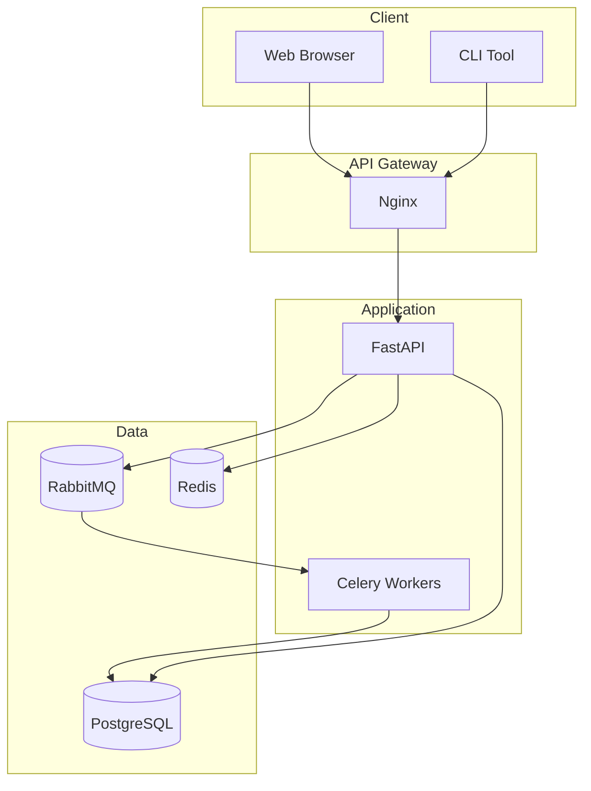
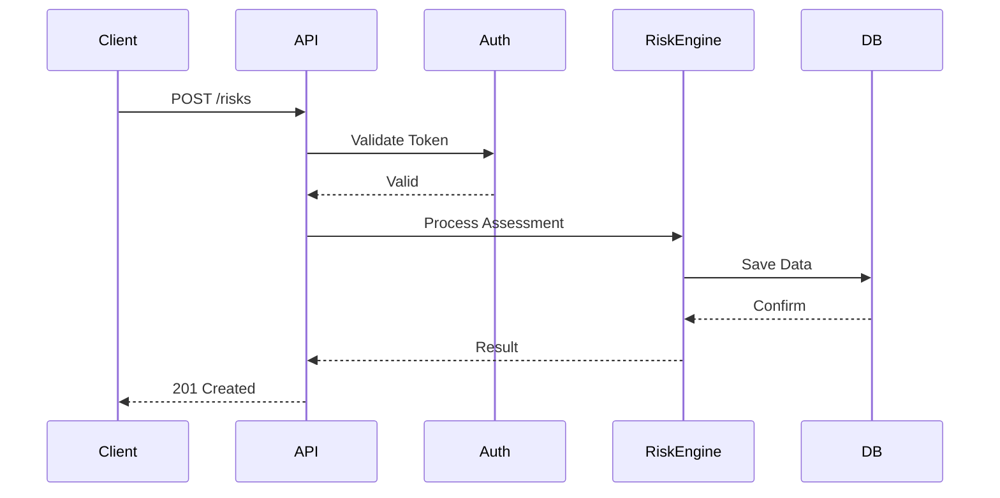

# ResilienceAI Documentation Automation Design

## Executive Summary

This document provides a comprehensive design for documentation automation for ResilienceAI, covering Sphinx/MkDocs setup, API documentation generation, code documentation, tutorial generation, changelog automation, versioned documentation, hosting, search functionality, diagram generation, and documentation testing.

---

## 1. Documentation Automation Architecture

### 1.1 High-Level Architecture

```
┌─────────────────────────────────────────────────────────────────────────────┐
│                        Documentation Automation Pipeline                     │
├─────────────────────────────────────────────────────────────────────────────┤
│                                                                              │
│  ┌──────────────┐  ┌──────────────┐  ┌──────────────┐  ┌──────────────┐    │
│  │   Source     │  │    API       │  │   Tutorial   │  │  Changelog   │    │
│  │   Code       │──│   Docs Gen   │──│   Generator  │──│  Automation  │    │
│  │              │  │              │  │              │  │              │    │
│  └──────────────┘  └──────────────┘  └──────────────┘  └──────────────┘    │
│         │                 │                 │                 │            │
│         └─────────────────┴─────────────────┴─────────────────┘            │
│                                    │                                         │
│                                    ▼                                         │
│  ┌──────────────────────────────────────────────────────────────┐         │
│  │                    Documentation Builder                      │         │
│  │              (Sphinx + MkDocs + Extensions)                   │         │
│  └──────────────────────────────────────────────────────────────┘         │
│                                    │                                         │
│                                    ▼                                         │
│  ┌──────────────────────────────────────────────────────────────┐         │
│  │                    Quality Assurance                          │         │
│  │     (Link Check + Spell Check + Code Testing + Validation)    │         │
│  └──────────────────────────────────────────────────────────────┘         │
│                                    │                                         │
│                                    ▼                                         │
│  ┌──────────────────────────────────────────────────────────────┐         │
│  │                    Versioned Documentation                    │         │
│  │              (Multi-version + Search Indexing)                │         │
│  └──────────────────────────────────────────────────────────────┘         │
│                                    │                                         │
│                                    ▼                                         │
│  ┌──────────────────────────────────────────────────────────────┐         │
│  │                    Hosting & Deployment                       │         │
│  │         (ReadTheDocs / GitHub Pages / Self-hosted)            │         │
│  └──────────────────────────────────────────────────────────────┘         │
│                                                                              │
└─────────────────────────────────────────────────────────────────────────────┘
```

### 1.2 Component Overview

| Component | Tool | Purpose |
|-----------|------|---------|
| Static Site Generator | Sphinx + MyST | Core documentation rendering |
| API Documentation | sphinx-autoapi + autodoc | Automatic API docs from docstrings |
| Tutorial Generation | Jupyter Book + nbsphinx | Interactive tutorials |
| Changelog | towncrier + git-cliff | Automated changelog generation |
| Versioning | mike + sphinx-multiversion | Multi-version documentation |
| Search | Sphinx native + Algolia | Full-text search |
| Diagrams | PlantUML + Mermaid + Graphviz | Architecture diagrams |
| Testing | pytest-doctest + linkchecker | Documentation quality |
| Hosting | ReadTheDocs + GitHub Pages | Documentation hosting |

---

## 2. Sphinx/MkDocs Setup

### 2.1 Project Structure

```
docs/
├── Makefile                    # Build automation
├── make.bat                    # Windows build
├── requirements.txt            # Documentation dependencies
├── requirements-dev.txt        # Development dependencies
│
├── source/                     # Sphinx source files
│   ├── conf.py                 # Sphinx configuration
│   ├── index.rst               # Main documentation entry
│   ├── _static/                # Static assets
│   │   ├── css/
│   │   │   └── custom.css
│   │   ├── js/
│   │   │   └── custom.js
│   │   └── images/
│   ├── _templates/             # Custom templates
│   │   ├── layout.html
│   │   └── custom-sidebar.html
│   │
│   ├── api/                    # API documentation
│   │   ├── index.rst
│   │   └── modules/
│   │
│   ├── user_guide/             # User documentation
│   │   ├── index.rst
│   │   ├── installation.rst
│   │   ├── quickstart.rst
│   │   └── configuration.rst
│   │
│   ├── developer_guide/        # Developer documentation
│   │   ├── index.rst
│   │   ├── contributing.rst
│   │   ├── architecture.rst
│   │   └── testing.rst
│   │
│   ├── tutorials/              # Tutorial content
│   │   ├── index.rst
│   │   └── *.ipynb
│   │
│   ├── reference/              # Reference documentation
│   │   ├── index.rst
│   │   ├── glossary.rst
│   │   └── faq.rst
│   │
│   └── changelog/              # Changelog
│       └── index.rst
│
├── build/                      # Build output (gitignored)
│
└── scripts/                    # Automation scripts
    ├── generate_api_docs.py
    ├── generate_diagrams.py
    └── test_documentation.py
```

### 2.2 Sphinx Configuration (conf.py)

```python
# docs/source/conf.py
"""
Sphinx configuration for ResilienceAI documentation.
"""

import os
import sys
from datetime import datetime
from pathlib import Path

# Add project root to path
project_root = Path(__file__).parent.parent.parent
sys.path.insert(0, str(project_root / "src"))

# -- Project Information ----------------------------------------------------
project = 'ResilienceAI'
copyright = f'{datetime.now().year}, ResilienceAI Team'
author = 'ResilienceAI Team'
version = '1.0.0'  # Short version
release = '1.0.0-alpha.1'  # Full version

# -- General Configuration --------------------------------------------------
extensions = [
    # Core Sphinx
    'sphinx.ext.autodoc',
    'sphinx.ext.autosummary',
    'sphinx.ext.doctest',
    'sphinx.ext.intersphinx',
    'sphinx.ext.todo',
    'sphinx.ext.coverage',
    'sphinx.ext.mathjax',
    'sphinx.ext.ifconfig',
    'sphinx.ext.viewcode',
    'sphinx.ext.githubpages',
    
    # Third-party
    'sphinx_rtd_theme',
    'sphinx_autodoc_typehints',
    'sphinxcontrib.autodoc_pydantic',
    'sphinxcontrib.plantuml',
    'sphinxcontrib.mermaid',
    'sphinx_copybutton',
    'sphinx_tabs.tabs',
    'sphinx_togglebutton',
    'sphinx_design',
    'myst_parser',
    'myst_nb',
    'nbsphinx',
    'autoapi.extension',
    'sphinx_gallery.gen_gallery',
    'sphinxcontrib.openapi',
    'sphinx_http_domain',
]

# -- Source Configuration ---------------------------------------------------
source_suffix = {
    '.rst': 'restructuredtext',
    '.md': 'markdown',
    '.ipynb': 'jupyter_notebook',
}

master_doc = 'index'
language = 'en'
exclude_patterns = ['_build', 'Thumbs.db', '.DS_Store', '**.ipynb_checkpoints']

# -- Theme Configuration ----------------------------------------------------
html_theme = 'sphinx_rtd_theme'
html_theme_options = {
    'canonical_url': 'https://resilienceai.readthedocs.io/',
    'analytics_id': 'UA-XXXXXXX-1',
    'logo_only': False,
    'display_version': True,
    'prev_next_buttons_location': 'bottom',
    'style_external_links': False,
    'vcs_pageview_mode': 'blob',
    'style_nav_header_background': '#2980B9',
    # Toc options
    'collapse_navigation': True,
    'sticky_navigation': True,
    'navigation_depth': 4,
    'includehidden': True,
    'titles_only': False,
}

html_static_path = ['_static']
html_css_files = ['css/custom.css']
html_js_files = ['js/custom.js']
html_logo = '_static/images/logo.png'
html_favicon = '_static/images/favicon.ico'

# -- Extension Configuration ------------------------------------------------

# autodoc
autodoc_default_options = {
    'members': True,
    'member-order': 'bysource',
    'special-members': '__init__',
    'undoc-members': True,
    'exclude-members': '__weakref__',
    'show-inheritance': True,
}
autodoc_typehints = 'description'
autodoc_typehints_description_target = 'documented'

# autoapi
autoapi_type = 'python'
autoapi_dirs = ['../../src/resilience_ai']
autoapi_options = [
    'members',
    'undoc-members',
    'show-inheritance',
    'show-module-summary',
    'special-members',
    'imported-members',
]
autoapi_root = 'api/autoapi'
autoapi_add_toctree_entry = False
autoapi_keep_files = True

# autosummary
autosummary_generate = True
autosummary_imported_members = True

# intersphinx
intersphinx_mapping = {
    'python': ('https://docs.python.org/3', None),
    'numpy': ('https://numpy.org/doc/stable/', None),
    'pandas': ('https://pandas.pydata.org/docs/', None),
    'scipy': ('https://docs.scipy.org/doc/scipy/', None),
    'sklearn': ('https://scikit-learn.org/stable/', None),
    'torch': ('https://pytorch.org/docs/stable/', None),
    'fastapi': ('https://fastapi.tiangolo.com/', None),
    'pydantic': ('https://docs.pydantic.dev/latest/', None),
}

# todo
todo_include_todos = True

# coverage
coverage_show_missing_items = True

# myst_parser
myst_enable_extensions = [
    'amsmath',
    'attrs_inline',
    'colon_fence',
    'deflist',
    'dollarmath',
    'fieldlist',
    'html_admonition',
    'html_image',
    'linkify',
    'replacements',
    'smartquotes',
    'strikethrough',
    'substitution',
    'tasklist',
]
myst_heading_anchors = 4

# nbsphinx
nbsphinx_execute = 'auto'
nbsphinx_allow_errors = False
nbsphinx_timeout = 300
nbsphinx_kernel_name = 'python3'

# plantuml
plantuml = 'java -jar /usr/share/plantuml/plantuml.jar'
plantuml_output_format = 'svg'

# mermaid
mermaid_params = ['--theme', 'default']

# sphinx_gallery
sphinx_gallery_conf = {
    'examples_dirs': '../examples',
    'gallery_dirs': 'auto_examples',
    'filename_pattern': '/example_',
    'plot_gallery': True,
}

# copybutton
copybutton_prompt_text = r'>>> |\.\.\. |\$ |In \[\d*\]: | {2,5}\.\.\.: | {5,8}: '
copybutton_prompt_is_regexp = True

# -- Custom Configuration ---------------------------------------------------
# Version switcher for multi-version docs
html_context = {
    'current_version': version,
    'version_urls': [
        ('latest', '/en/latest/'),
        ('stable', '/en/stable/'),
        ('1.0', '/en/1.0/'),
        ('0.9', '/en/0.9/'),
    ],
}

# Custom roles and directives
def setup(app):
    app.add_object_type(
        'confval',
        'confval',
        objname='configuration value',
        indextemplate='pair: %s; configuration value',
    )
```

### 2.3 Requirements Files

```txt
# docs/requirements.txt
# Core documentation
sphinx>=7.0.0
sphinx-rtd-theme>=1.3.0
sphinx-autodoc-typehints>=1.24.0

# Markdown support
myst-parser>=2.0.0
myst-nb>=1.0.0

# Jupyter notebooks
nbsphinx>=0.9.0
jupyter>=1.0.0
ipython>=8.0.0

# API documentation
sphinx-autoapi>=3.0.0
sphinxcontrib-autodoc-pydantic>=2.0.0

# Diagrams
sphinxcontrib-plantuml>=0.27
sphinxcontrib-mermaid>=0.9.0

# Extensions
sphinx-copybutton>=0.5.0
sphinx-tabs>=3.4.0
sphinx-togglebutton>=0.3.0
sphinx-design>=0.5.0
sphinx-gallery>=0.14.0
sphinxcontrib-openapi>=0.8.0
sphinx-http-domain>=0.9.0

# Link checking
sphinx-linkcheckbuilder>=0.3.0

# Search
readthedocs-sphinx-search>=0.3.0

# Build automation
sphinx-autobuild>=2021.3.14
```

```txt
# docs/requirements-dev.txt
-r requirements.txt

# Testing
pytest>=7.4.0
pytest-doctestplus>=1.0.0
pytest-sphinx>=0.5.0

# Code quality
doc8>=1.1.0
pydocstyle>=6.3.0
darglint>=1.8.0

# Spell checking
sphinxcontrib-spelling>=8.0.0
pyenchant>=3.2.0

# Link checking
linkchecker>=10.0.0

# Changelog
towncrier>=23.0.0
git-cliff>=1.0.0

# Version management
mike>=2.0.0
sphinx-multiversion>=0.2.0

# Pre-commit
pre-commit>=3.4.0

# Live reload
sphinx-autobuild>=2021.3.14
livereload>=2.6.0
```

### 2.4 Makefile

```makefile
# docs/Makefile
# Minimal makefile for Sphinx documentation

SPHINXOPTS    ?=
SPHINXBUILD   ?= sphinx-build
SOURCEDIR     = source
BUILDDIR      = build

.PHONY: help clean html dirhtml singlehtml pickle json htmlhelp qthelp devhelp epub latex latexpdf text man changes linkcheck doctest gettext livehtml

help:
	@$(SPHINXBUILD) -M help "$(SOURCEDIR)" "$(BUILDDIR)" $(SPHINXOPTS) $(O)

clean:
	rm -rf $(BUILDDIR)/*
	rm -rf source/api/autoapi

html:
	$(SPHINXBUILD) -b html "$(SOURCEDIR)" "$(BUILDDIR)/html" $(SPHINXOPTS) $(O)
	@echo
	@echo "Build finished. The HTML pages are in $(BUILDDIR)/html."

dirhtml:
	$(SPHINXBUILD) -b dirhtml "$(SOURCEDIR)" "$(BUILDDIR)/dirhtml" $(SPHINXOPTS) $(O)

singlehtml:
	$(SPHINXBUILD) -b singlehtml "$(SOURCEDIR)" "$(BUILDDIR)/singlehtml" $(SPHINXOPTS) $(O)

livehtml:
	sphinx-autobuild "$(SOURCEDIR)" "$(BUILDDIR)/html" $(SPHINXOPTS) $(O)

linkcheck:
	$(SPHINXBUILD) -b linkcheck "$(SOURCEDIR)" "$(BUILDDIR)/linkcheck" $(SPHINXOPTS) $(O)
	@echo
	@echo "Link check complete; look for any errors in the above output " \
	      "or in $(BUILDDIR)/linkcheck/output.txt."

doctest:
	$(SPHINXBUILD) -b doctest "$(SOURCEDIR)" "$(BUILDDIR)/doctest" $(SPHINXOPTS) $(O)
	@echo "Testing of doctests in the sources finished, look at the " \
	      "results in $(BUILDDIR)/doctest/output.txt."

coverage:
	$(SPHINXBUILD) -b coverage "$(SOURCEDIR)" "$(BUILDDIR)/coverage" $(SPHINXOPTS) $(O)

spellcheck:
	$(SPHINXBUILD) -b spelling "$(SOURCEDIR)" "$(BUILDDIR)/spelling" $(SPHINXOPTS) $(O)

apidocs:
	sphinx-apidoc -f -o source/api ../src/resilience_ai --private --module-first

testdocs:
	python scripts/test_documentation.py

# Versioned docs with mike
versioned-build:
	mike deploy $(VERSION) latest --push

versioned-serve:
	mike serve

# Catch-all target
%:
	$(SPHINXBUILD) -M $@ "$(SOURCEDIR)" "$(BUILDDIR)" $(SPHINXOPTS) $(O)
```

---

## 3. API Documentation Generation

### 3.1 AutoAPI Configuration

```python
# scripts/generate_api_docs.py
"""
Script to generate API documentation from source code.
"""

import os
import sys
from pathlib import Path
from typing import List, Optional
import ast
import importlib
import inspect


class APIDocGenerator:
    """Generate API documentation from Python source code."""
    
    def __init__(self, source_dir: str, output_dir: str):
        self.source_dir = Path(source_dir)
        self.output_dir = Path(output_dir)
        self.output_dir.mkdir(parents=True, exist_ok=True)
    
    def generate_module_docs(self, module_path: Path) -> str:
        """Generate RST documentation for a module."""
        module_name = module_path.stem
        relative_path = module_path.relative_to(self.source_dir)
        package_name = '.'.join(relative_path.parent.parts + (module_name,))
        
        rst_content = f"""{'=' * len(package_name)}
{package_name}
{'=' * len(package_name)}

.. automodule:: {package_name}
   :members:
   :undoc-members:
   :show-inheritance:
   :special-members: __init__, __call__
   :exclude-members: __weakref__, __dict__, __module__

"""
        
        # Add class documentation
        try:
            module = importlib.import_module(package_name)
            for name, obj in inspect.getmembers(module):
                if inspect.isclass(obj) and obj.__module__ == package_name:
                    rst_content += self._generate_class_doc(name, obj)
                elif inspect.isfunction(obj) and obj.__module__ == package_name:
                    rst_content += self._generate_function_doc(name, obj)
        except ImportError as e:
            rst_content += f"\n.. note:: Could not import module: {e}\n"
        
        return rst_content
    
    def _generate_class_doc(self, name: str, cls: type) -> str:
        """Generate documentation for a class."""
        return f"""
Class {name}
{'-' * (len(name) + 6)}

.. autoclass:: {cls.__module__}.{name}
   :members:
   :undoc-members:
   :show-inheritance:
   :special-members: __init__
   :exclude-members: __weakref__, __dict__, __module__

"""
    
    def _generate_function_doc(self, name: str, func: callable) -> str:
        """Generate documentation for a function."""
        return f"""
Function {name}
{'-' * (len(name) + 9)}

.. autofunction:: {func.__module__}.{name}

"""
    
    def generate_package_index(self, package_name: str, modules: List[str]) -> str:
        """Generate index file for a package."""
        index_content = f"""{'=' * len(package_name)}
{package_name}
{'=' * len(package_name)}

.. toctree::
   :maxdepth: 2
   :caption: Modules:

"""
        for module in sorted(modules):
            index_content += f"   {module}\n"
        
        index_content += f"""
Indices and tables
==================

* :ref:`genindex`
* :ref:`modindex`
* :ref:`search`
"""
        return index_content
    
    def run(self):
        """Run the documentation generation."""
        modules = []
        
        for py_file in self.source_dir.rglob('*.py'):
            if py_file.name.startswith('_') and py_file.name != '__init__.py':
                continue
            
            rst_content = self.generate_module_docs(py_file)
            relative_path = py_file.relative_to(self.source_dir)
            rst_path = self.output_dir / relative_path.with_suffix('.rst')
            rst_path.parent.mkdir(parents=True, exist_ok=True)
            rst_path.write_text(rst_content)
            modules.append(str(relative_path.with_suffix('')).replace(os.sep, '.'))
        
        # Generate main index
        index_content = self.generate_package_index('ResilienceAI API', modules)
        (self.output_dir / 'index.rst').write_text(index_content)
        
        print(f"Generated {len(modules)} module documentation files")


if __name__ == '__main__':
    generator = APIDocGenerator(
        source_dir='../src/resilience_ai',
        output_dir='../docs/source/api'
    )
    generator.run()
```

### 3.2 Pydantic Model Documentation

```python
# src/resilience_ai/models/base.py
"""
Base models for ResilienceAI.
"""

from pydantic import BaseModel, Field
from typing import Optional, List, Dict, Any
from datetime import datetime
from enum import Enum


class RiskLevel(str, Enum):
    """Risk level enumeration."""
    LOW = "low"
    MEDIUM = "medium"
    HIGH = "high"
    CRITICAL = "critical"


class RiskAssessment(BaseModel):
    """
    Risk assessment model for supply chain risks.
    
    This model represents a comprehensive risk assessment including
    probability, impact, and mitigation strategies.
    
    Attributes:
        id: Unique identifier for the assessment
        name: Human-readable name of the risk
        level: Risk level (low, medium, high, critical)
        probability: Probability of occurrence (0.0 - 1.0)
        impact: Impact score (0 - 100)
        description: Detailed description of the risk
        mitigation: List of mitigation strategies
        created_at: Timestamp when assessment was created
        updated_at: Timestamp when assessment was last updated
    
    Example:
        >>> assessment = RiskAssessment(
        ...     id="risk-001",
        ...     name="Supplier Delay Risk",
        ...     level=RiskLevel.HIGH,
        ...     probability=0.7,
        ...     impact=85,
        ...     description="Risk of supplier delivery delays",
        ...     mitigation=["Find alternative suppliers", "Increase safety stock"]
        ... )
    """
    
    id: str = Field(..., description="Unique identifier for the assessment")
    name: str = Field(..., min_length=1, max_length=200, description="Risk name")
    level: RiskLevel = Field(..., description="Risk severity level")
    probability: float = Field(
        ..., 
        ge=0.0, 
        le=1.0, 
        description="Probability of occurrence (0.0 - 1.0)"
    )
    impact: int = Field(
        ..., 
        ge=0, 
        le=100, 
        description="Impact score (0 - 100)"
    )
    description: Optional[str] = Field(
        None, 
        max_length=2000, 
        description="Detailed risk description"
    )
    mitigation: List[str] = Field(
        default_factory=list,
        description="List of mitigation strategies"
    )
    metadata: Dict[str, Any] = Field(
        default_factory=dict,
        description="Additional metadata"
    )
    created_at: datetime = Field(
        default_factory=datetime.utcnow,
        description="Creation timestamp"
    )
    updated_at: Optional[datetime] = Field(
        None,
        description="Last update timestamp"
    )
    
    class Config:
        """Pydantic configuration."""
        json_schema_extra = {
            "example": {
                "id": "risk-001",
                "name": "Supplier Delay Risk",
                "level": "high",
                "probability": 0.7,
                "impact": 85,
                "description": "Risk of supplier delivery delays",
                "mitigation": ["Find alternative suppliers"],
            }
        }
    
    def calculate_risk_score(self) -> float:
        """
        Calculate overall risk score.
        
        Returns:
            Risk score (0.0 - 100.0)
            
        Example:
            >>> assessment = RiskAssessment(
            ...     id="test", name="Test", level=RiskLevel.HIGH,
            ...     probability=0.5, impact=80
            ... )
            >>> assessment.calculate_risk_score()
            40.0
        """
        return self.probability * self.impact
    
    def is_critical(self) -> bool:
        """
        Check if risk is critical.
        
        Returns:
            True if risk level is CRITICAL
        """
        return self.level == RiskLevel.CRITICAL
```

### 3.3 FastAPI Endpoint Documentation

```python
# src/resilience_ai/api/routes.py
"""
API routes for ResilienceAI.
"""

from fastapi import APIRouter, HTTPException, Depends, Query
from typing import List, Optional
from datetime import datetime

from ..models.base import RiskAssessment, RiskLevel
from ..services.risk_service import RiskService
from ..dependencies import get_risk_service


router = APIRouter(prefix="/api/v1", tags=["risk-assessment"])


@router.get(
    "/risks",
    response_model=List[RiskAssessment],
    summary="List all risk assessments",
    description="Retrieve a paginated list of all risk assessments.",
    responses={
        200: {
            "description": "List of risk assessments",
            "content": {
                "application/json": {
                    "example": [
                        {
                            "id": "risk-001",
                            "name": "Supplier Delay Risk",
                            "level": "high",
                            "probability": 0.7,
                            "impact": 85,
                        }
                    ]
                }
            }
        },
        401: {"description": "Unauthorized"},
        500: {"description": "Internal server error"},
    },
)
async def list_risks(
    level: Optional[RiskLevel] = Query(None, description="Filter by risk level"),
    limit: int = Query(100, ge=1, le=1000, description="Maximum results"),
    offset: int = Query(0, ge=0, description="Offset for pagination"),
    service: RiskService = Depends(get_risk_service),
) -> List[RiskAssessment]:
    """
    List all risk assessments with optional filtering.
    
    Args:
        level: Optional risk level filter
        limit: Maximum number of results (1-1000)
        offset: Pagination offset
        service: Injected risk service
    
    Returns:
        List of risk assessments matching criteria
    
    Raises:
        HTTPException: If request is invalid
    """
    return await service.list_risks(level=level, limit=limit, offset=offset)


@router.post(
    "/risks",
    response_model=RiskAssessment,
    status_code=201,
    summary="Create new risk assessment",
    description="Create a new risk assessment in the system.",
)
async def create_risk(
    assessment: RiskAssessment,
    service: RiskService = Depends(get_risk_service),
) -> RiskAssessment:
    """
    Create a new risk assessment.
    
    Args:
        assessment: Risk assessment data
        service: Injected risk service
    
    Returns:
        Created risk assessment
    
    Raises:
        HTTPException: If validation fails
    """
    return await service.create_risk(assessment)


@router.get(
    "/risks/{risk_id}",
    response_model=RiskAssessment,
    summary="Get risk assessment by ID",
    description="Retrieve a specific risk assessment by its ID.",
    responses={
        200: {"description": "Risk assessment found"},
        404: {"description": "Risk assessment not found"},
    },
)
async def get_risk(
    risk_id: str,
    service: RiskService = Depends(get_risk_service),
) -> RiskAssessment:
    """
    Get a risk assessment by ID.
    
    Args:
        risk_id: Unique risk identifier
        service: Injected risk service
    
    Returns:
        Risk assessment if found
    
    Raises:
        HTTPException: 404 if not found
    """
    risk = await service.get_risk(risk_id)
    if not risk:
        raise HTTPException(status_code=404, detail=f"Risk {risk_id} not found")
    return risk
```

---

## 4. Tutorial Generation

### 4.1 Jupyter Book Configuration

```yaml
# docs/jupyter_book/_config.yml
# Jupyter Book configuration

title: ResilienceAI Tutorials
author: ResilienceAI Team
logo: logo.png

execute:
  execute_notebooks: auto
  timeout: 300
  run_in_temp: true
  allow_errors: false

parse:
  myst_enable_extensions:
    - amsmath
    - colon_fence
    - deflist
    - dollarmath
    - html_admonition
    - html_image
    - linkify
    - replacements
    - smartquotes
    - substitution

sphinx:
  config:
    html_theme: sphinx_book_theme
    html_theme_options:
      home_page_in_toc: true
      use_repository_button: true
      use_issues_button: true
      use_edit_page_button: true
      repository_url: https://github.com/resilienceai/resilience-ai
      repository_branch: main
    bibtex_reference_style: author_year
  extra_extensions:
    - sphinx.ext.intersphinx

launch_buttons:
  notebook_interface: jupyterlab
  binderhub_url: https://mybinder.org
  colab_url: https://colab.research.google.com

repository:
  url: https://github.com/resilienceai/resilience-ai
  path_to_book: docs/tutorials
  branch: main

html:
  use_issues_button: true
  use_repository_button: true
  extra_navbar: Powered by <a href="https://jupyterbook.org">Jupyter Book</a>
  extra_footer: |
    <div>
    <p>
    Copyright &copy; 2024 ResilienceAI Team
    </p>
    </div>
```

### 4.2 Tutorial Notebook Template

```python
# docs/tutorials/01_getting_started.ipynb
{
 "cells": [
  {
   "cell_type": "markdown",
   "metadata": {},
   "source": [
    "# Getting Started with ResilienceAI\n",
    "\n",
    "This tutorial will guide you through the basics of using ResilienceAI for supply chain risk assessment.\n",
    "\n",
    "## Learning Objectives\n",
    "\n",
    "After completing this tutorial, you will be able to:\n",
    "\n",
    "1. Install and configure ResilienceAI\n",
    "2. Create your first risk assessment\n",
    "3. Analyze risk patterns\n",
    "4. Generate risk reports\n",
    "\n",
    "## Prerequisites\n",
    "\n",
    "- Python 3.9 or higher\n",
    "- Basic understanding of supply chain concepts\n",
    "- Familiarity with Python programming"
   ]
  },
  {
   "cell_type": "markdown",
   "metadata": {},
   "source": [
    "## Installation\n",
    "\n",
    "First, let's install ResilienceAI and its dependencies:"
   ]
  },
  {
   "cell_type": "code",
   "execution_count": null,
   "metadata": {},
   "outputs": [],
   "source": [
    "# Install ResilienceAI\n",
    "%pip install resilience-ai\n",
    "\n",
    "# Verify installation\n",
    "import resilience_ai\n",
    "print(f\"ResilienceAI version: {resilience_ai.__version__}\")"
   ]
  },
  {
   "cell_type": "markdown",
   "metadata": {},
   "source": [
    "## Creating Your First Risk Assessment\n",
    "\n",
    "Let's create a simple risk assessment for a supplier delay scenario:"
   ]
  },
  {
   "cell_type": "code",
   "execution_count": null,
   "metadata": {},
   "outputs": [],
   "source": [
    "from resilience_ai.models import RiskAssessment, RiskLevel\n",
    "\n",
    "# Create a risk assessment\n",
    "assessment = RiskAssessment(\n",
    "    id=\"supplier-delay-001\",\n",
    "    name=\"Supplier Delivery Delay\",\n",
    "    level=RiskLevel.HIGH,\n",
    "    probability=0.7,\n",
    "    impact=85,\n",
    "    description=\"Risk of delays from primary supplier due to weather conditions\",\n",
    "    mitigation=[\n",
    "        \"Identify alternative suppliers\",\n",
    "        \"Increase safety stock levels\",\n",
    "        \"Implement weather monitoring\"\n",
    "    ]\n",
    ")\n",
    "\n",
    "print(f\"Risk Score: {assessment.calculate_risk_score():.1f}\")\n",
    "print(f\"Is Critical: {assessment.is_critical()}\")"
   ]
  },
  {
   "cell_type": "markdown",
   "metadata": {},
   "source": [
    "## Visualizing Risk Data\n",
    "\n",
    "ResilienceAI provides built-in visualization capabilities:"
   ]
  },
  {
   "cell_type": "code",
   "execution_count": null,
   "metadata": {},
   "outputs": [],
   "source": [
    "import matplotlib.pyplot as plt\n",
    "from resilience_ai.visualization import RiskVisualizer\n",
    "\n",
    "# Create visualizer\n",
    "viz = RiskVisualizer()\n",
    "\n",
    "# Plot risk matrix\n",
    "fig, ax = viz.plot_risk_matrix([assessment])\n",
    "plt.show()"
   ]
  },
  {
   "cell_type": "markdown",
   "metadata": {},
   "source": [
    "## Exercises\n",
    "\n",
    "### Exercise 1: Create Multiple Assessments\n",
    "\n",
    "Create risk assessments for at least three different scenarios.\n",
    "\n",
    "### Exercise 2: Calculate Aggregate Risk\n",
    "\n",
    "Write a function to calculate the average risk score across multiple assessments.\n",
    "\n",
    "### Exercise 3: Risk Prioritization\n",
    "\n",
    "Sort your assessments by risk score and identify the top 3 priorities."
   ]
  },
  {
   "cell_type": "markdown",
   "metadata": {},
   "source": [
    "## Summary\n",
    "\n",
    "In this tutorial, you learned how to:\n",
    "\n",
    "- Install ResilienceAI\n",
    "- Create risk assessments\n",
    "- Calculate risk scores\n",
    "- Visualize risk data\n",
    "\n",
    "## Next Steps\n",
    "\n",
    "- [Advanced Risk Modeling](02_advanced_modeling.ipynb)\n",
    "- [API Integration](03_api_integration.ipynb)\n",
    "- [Dashboard Creation](04_dashboards.ipynb)"
   ]
  }
 ],
 "metadata": {
  "kernelspec": {
   "display_name": "Python 3",
   "language": "python",
   "name": "python3"
  },
  "language_info": {
   "name": "python",
   "version": "3.9.0"
  }
 },
 "nbformat": 4,
 "nbformat_minor": 4
}
```

### 4.3 Tutorial Generator Script

```python
# scripts/generate_tutorials.py
"""
Script to generate and validate tutorial notebooks.
"""

import json
import re
from pathlib import Path
from typing import List, Dict, Any, Optional
import nbformat
from nbformat import NotebookNode
import subprocess


class TutorialGenerator:
    """Generate and manage tutorial notebooks."""
    
    def __init__(self, tutorials_dir: str):
        self.tutorials_dir = Path(tutorials_dir)
        self.tutorials_dir.mkdir(parents=True, exist_ok=True)
    
    def create_tutorial_template(
        self,
        title: str,
        filename: str,
        objectives: List[str],
        prerequisites: List[str],
    ) -> NotebookNode:
        """Create a new tutorial notebook from template."""
        
        cells = [
            # Title cell
            nbformat.v4.new_markdown_cell(f"# {title}\n\n"),
            
            # Learning objectives
            nbformat.v4.new_markdown_cell(
                "## Learning Objectives\n\n" +
                "\n".join(f"{i+1}. {obj}" for i, obj in enumerate(objectives))
            ),
            
            # Prerequisites
            nbformat.v4.new_markdown_cell(
                "## Prerequisites\n\n" +
                "\n".join(f"- {prereq}" for prereq in prerequisites)
            ),
            
            # Setup cell
            nbformat.v4.new_code_cell(
                "# Import required libraries\n"
                "import resilience_ai\n"
                "print(f\"ResilienceAI version: {resilience_ai.__version__}\")"
            ),
            
            # Exercise section
            nbformat.v4.new_markdown_cell(
                "## Exercises\n\n"
                "Complete the following exercises to reinforce your learning."
            ),
            
            # Summary section
            nbformat.v4.new_markdown_cell(
                "## Summary\n\n"
                "In this tutorial, you learned...\n\n"
                "## Next Steps\n\n"
                "- Continue to the next tutorial"
            ),
        ]
        
        notebook = nbformat.v4.new_notebook(cells=cells)
        notebook.metadata = {
            "kernelspec": {
                "display_name": "Python 3",
                "language": "python",
                "name": "python3"
            },
            "language_info": {
                "name": "python",
                "version": "3.9.0"
            }
        }
        
        return notebook
    
    def validate_notebook(self, notebook_path: Path) -> List[str]:
        """Validate a notebook for common issues."""
        issues = []
        
        try:
            with open(notebook_path) as f:
                notebook = nbformat.read(f, as_version=4)
        except Exception as e:
            return [f"Failed to parse notebook: {e}"]
        
        # Check for title
        first_cell = notebook.cells[0] if notebook.cells else None
        if not first_cell or not first_cell.source.startswith('# '):
            issues.append("Notebook should start with a title (# Title)")
        
        # Check for learning objectives
        has_objectives = any(
            'learning objective' in cell.source.lower() or
            'objectives' in cell.source.lower()
            for cell in notebook.cells
        )
        if not has_objectives:
            issues.append("Notebook should include learning objectives")
        
        # Check for empty code cells
        for i, cell in enumerate(notebook.cells):
            if cell.cell_type == 'code' and not cell.source.strip():
                issues.append(f"Empty code cell at index {i}")
        
        # Check for outputs in code cells
        for i, cell in enumerate(notebook.cells):
            if cell.cell_type == 'code':
                if cell.outputs and not cell.metadata.get('tags', []):
                    issues.append(
                        f"Code cell {i} has outputs - "
                        "consider clearing or tagging"
                    )
        
        return issues
    
    def execute_notebook(
        self,
        notebook_path: Path,
        timeout: int = 300,
    ) -> bool:
        """Execute a notebook and return success status."""
        try:
            result = subprocess.run(
                [
                    'jupyter', 'nbconvert',
                    '--to', 'notebook',
                    '--execute',
                    '--ExecutePreprocessor.timeout=' + str(timeout),
                    '--output', '/dev/null',
                    str(notebook_path)
                ],
                capture_output=True,
                text=True,
                check=True,
            )
            return True
        except subprocess.CalledProcessError as e:
            print(f"Execution failed: {e.stderr}")
            return False
    
    def generate_tutorial_index(self) -> str:
        """Generate index file for all tutorials."""
        tutorials = sorted(self.tutorials_dir.glob('*.ipynb'))
        
        content = "# ResilienceAI Tutorials\n\n"
        content += "Welcome to the ResilienceAI tutorial series.\n\n"
        content += "## Available Tutorials\n\n"
        
        for tutorial in tutorials:
            if tutorial.name == 'index.ipynb':
                continue
            
            # Extract title from notebook
            with open(tutorial) as f:
                nb = nbformat.read(f, as_version=4)
                title = nb.cells[0].source.lstrip('# ').strip() if nb.cells else tutorial.stem
            
            content += f"### [{title}]({tutorial.name})\n\n"
        
        return content
    
    def run(self):
        """Run the tutorial generator."""
        # Validate all notebooks
        for notebook in self.tutorials_dir.glob('*.ipynb'):
            print(f"Validating {notebook.name}...")
            issues = self.validate_notebook(notebook)
            if issues:
                print(f"  Issues found: {len(issues)}")
                for issue in issues:
                    print(f"    - {issue}")
            else:
                print("  Valid!")
        
        # Generate index
        index_content = self.generate_tutorial_index()
        (self.tutorials_dir / 'index.md').write_text(index_content)
        print("Generated tutorial index")


if __name__ == '__main__':
    generator = TutorialGenerator('docs/tutorials')
    generator.run()
```

---

## 5. Changelog Automation

### 5.1 Towncrier Configuration

```toml
# pyproject.toml
[tool.towncrier]
directory = "changes"
filename = "CHANGELOG.md"
start_string = "<!-- towncrier release notes start -->\n"
package = "resilience_ai"
package_dir = "src"
title_format = "## [{version}] - {project_date}"
issue_format = "([#{issue}](https://github.com/resilienceai/resilience-ai/issues/{issue}))"

[[tool.towncrier.type]]
directory = "feature"
name = "Features"
showcontent = true

[[tool.towncrier.type]]
directory = "bugfix"
name = "Bug Fixes"
showcontent = true

[[tool.towncrier.type]]
directory = "doc"
name = "Documentation"
showcontent = true

[[tool.towncrier.type]]
directory = "removal"
name = "Deprecations and Removals"
showcontent = true

[[tool.towncrier.type]]
directory = "misc"
name = "Miscellaneous"
showcontent = true
```

### 5.2 Changelog Generator Script

```python
# scripts/generate_changelog.py
"""
Script to generate changelog from git history and towncrier fragments.
"""

import re
import subprocess
from pathlib import Path
from datetime import datetime
from typing import List, Dict, Optional
from dataclasses import dataclass


@dataclass
class ChangeEntry:
    """Represents a single changelog entry."""
    category: str
    description: str
    issue: Optional[str] = None
    author: Optional[str] = None


class ChangelogGenerator:
    """Generate changelog from git history and towncrier fragments."""
    
    def __init__(self, project_root: str):
        self.project_root = Path(project_root)
        self.changes_dir = self.project_root / "changes"
        self.changelog_file = self.project_root / "CHANGELOG.md"
    
    def get_git_tags(self) -> List[str]:
        """Get all git tags sorted by version."""
        result = subprocess.run(
            ['git', 'tag', '--sort=-v:refname'],
            capture_output=True,
            text=True,
            cwd=self.project_root,
        )
        return result.stdout.strip().split('\n') if result.stdout else []
    
    def get_commits_between(
        self,
        start_tag: Optional[str],
        end_tag: str,
    ) -> List[Dict]:
        """Get commits between two tags."""
        range_spec = f"{start_tag}..{end_tag}" if start_tag else end_tag
        
        result = subprocess.run(
            [
                'git', 'log', range_spec,
                '--pretty=format:%H|%s|%an|%ad',
                '--date=short',
            ],
            capture_output=True,
            text=True,
            cwd=self.project_root,
        )
        
        commits = []
        for line in result.stdout.strip().split('\n'):
            if '|' in line:
                hash_, subject, author, date = line.split('|', 3)
                commits.append({
                    'hash': hash_,
                    'subject': subject,
                    'author': author,
                    'date': date,
                })
        
        return commits
    
    def parse_conventional_commit(self, message: str) -> Optional[Dict]:
        """Parse a conventional commit message."""
        # Pattern: type(scope): subject
        pattern = r'^(\w+)(?:\(([^)]+)\))?: (.+)$'
        match = re.match(pattern, message)
        
        if match:
            return {
                'type': match.group(1),
                'scope': match.group(2),
                'subject': match.group(3),
            }
        return None
    
    def categorize_commit(self, commit_type: str) -> str:
        """Map commit type to changelog category."""
        mapping = {
            'feat': 'Features',
            'fix': 'Bug Fixes',
            'docs': 'Documentation',
            'style': 'Style',
            'refactor': 'Refactoring',
            'perf': 'Performance',
            'test': 'Testing',
            'chore': 'Chores',
            'deprecate': 'Deprecations',
            'remove': 'Removals',
        }
        return mapping.get(commit_type, 'Miscellaneous')
    
    def read_towncrier_fragments(self) -> List[ChangeEntry]:
        """Read towncrier fragment files."""
        entries = []
        
        if not self.changes_dir.exists():
            return entries
        
        for fragment_file in self.changes_dir.iterdir():
            if fragment_file.is_file() and not fragment_file.name.startswith('.'):
                # Parse filename: <issue>.<category>.md or <category>.<name>.md
                parts = fragment_file.stem.split('.')
                
                if len(parts) >= 2:
                    category = parts[-1] if parts[-1] in [
                        'feature', 'bugfix', 'doc', 'removal', 'misc'
                    ] else 'misc'
                    
                    content = fragment_file.read_text().strip()
                    issue = parts[0] if parts[0].isdigit() else None
                    
                    entries.append(ChangeEntry(
                        category=category,
                        description=content,
                        issue=issue,
                    ))
        
        return entries
    
    def generate_changelog_section(
        self,
        version: str,
        date: str,
        entries: List[ChangeEntry],
    ) -> str:
        """Generate a changelog section for a version."""
        section = f"## [{version}] - {date}\n\n"
        
        # Group entries by category
        categories: Dict[str, List[ChangeEntry]] = {}
        for entry in entries:
            cat = entry.category.capitalize()
            if cat not in categories:
                categories[cat] = []
            categories[cat].append(entry)
        
        # Sort categories
        category_order = [
            'Features', 'Bug Fixes', 'Documentation',
            'Performance', 'Refactoring', 'Testing',
            'Deprecations', 'Removals', 'Miscellaneous'
        ]
        
        for category in category_order:
            if category in categories:
                section += f"### {category}\n\n"
                for entry in categories[category]:
                    issue_link = f" ([#{entry.issue}](https://github.com/resilienceai/resilience-ai/issues/{entry.issue}))" if entry.issue else ""
                    section += f"- {entry.description}{issue_link}\n"
                section += "\n"
        
        return section
    
    def generate_full_changelog(self) -> str:
        """Generate the complete changelog."""
        header = """# Changelog

All notable changes to ResilienceAI will be documented in this file.

The format is based on [Keep a Changelog](https://keepachangelog.com/en/1.0.0/),
and this project adheres to [Semantic Versioning](https://semver.org/spec/v2.0.0.html).

<!-- towncrier release notes start -->

"""
        
        # Get unreleased changes
        unreleased_entries = self.read_towncrier_fragments()
        
        changelog = header
        
        if unreleased_entries:
            today = datetime.now().strftime('%Y-%m-%d')
            changelog += self.generate_changelog_section(
                'Unreleased', today, unreleased_entries
            )
        
        # Get released versions
        tags = self.get_git_tags()
        for i, tag in enumerate(tags):
            prev_tag = tags[i + 1] if i + 1 < len(tags) else None
            commits = self.get_commits_between(prev_tag, tag)
            
            if commits:
                # Get tag date
                tag_date = subprocess.run(
                    ['git', 'log', '-1', '--format=%ai', tag],
                    capture_output=True,
                    text=True,
                    cwd=self.project_root,
                ).stdout.strip()[:10]
                
                entries = []
                for commit in commits:
                    parsed = self.parse_conventional_commit(commit['subject'])
                    if parsed:
                        entries.append(ChangeEntry(
                            category=self.categorize_commit(parsed['type']),
                            description=parsed['subject'],
                        ))
                
                if entries:
                    changelog += self.generate_changelog_section(
                        tag, tag_date, entries
                    )
        
        return changelog
    
    def run(self):
        """Generate and save the changelog."""
        changelog = self.generate_full_changelog()
        self.changelog_file.write_text(changelog)
        print(f"Generated changelog at {self.changelog_file}")


if __name__ == '__main__':
    generator = ChangelogGenerator('.')
    generator.run()
```

### 5.3 GitHub Actions Workflow for Changelog

```yaml
# .github/workflows/changelog.yml
name: Changelog

on:
  push:
    branches: [main]
  pull_request:
    branches: [main]

jobs:
  check-fragments:
    runs-on: ubuntu-latest
    steps:
      - uses: actions/checkout@v4
        with:
          fetch-depth: 0

      - name: Set up Python
        uses: actions/setup-python@v5
        with:
          python-version: '3.11'

      - name: Install towncrier
        run: pip install towncrier

      - name: Check for changelog fragments
        run: |
          if [ -d "changes" ]; then
            echo "Checking changelog fragments..."
            towncrier check
          else
            echo "No changes directory found"
          fi

  generate-changelog:
    runs-on: ubuntu-latest
    if: github.event_name == 'push' && github.ref == 'refs/heads/main'
    steps:
      - uses: actions/checkout@v4
        with:
          fetch-depth: 0
          token: ${{ secrets.GITHUB_TOKEN }}

      - name: Set up Python
        uses: actions/setup-python@v5
        with:
          python-version: '3.11'

      - name: Install dependencies
        run: |
          pip install towncrier
          pip install -e .

      - name: Generate changelog
        run: |
          python scripts/generate_changelog.py
          towncrier build --yes

      - name: Commit changes
        run: |
          git config --local user.email "action@github.com"
          git config --local user.name "GitHub Action"
          git add CHANGELOG.md
          git add changes/
          git diff --staged --quiet || git commit -m "Update changelog [skip ci]"
          git push
```

---

## 6. Versioned Documentation

### 6.1 Mike Configuration for Versioning

```yaml
# .github/workflows/docs-version.yml
name: Versioned Documentation

on:
  push:
    tags:
      - 'v*'
  workflow_dispatch:
    inputs:
      version:
        description: 'Version to deploy'
        required: true
        default: 'latest'

jobs:
  deploy-version:
    runs-on: ubuntu-latest
    steps:
      - uses: actions/checkout@v4
        with:
          fetch-depth: 0

      - name: Set up Python
        uses: actions/setup-python@v5
        with:
          python-version: '3.11'

      - name: Install dependencies
        run: |
          pip install -r docs/requirements.txt
          pip install mike

      - name: Configure Git
        run: |
          git config --local user.email "action@github.com"
          git config --local user.name "GitHub Action"

      - name: Determine version
        id: version
        run: |
          if [ "${{ github.event_name }}" = "push" ]; then
            VERSION=${GITHUB_REF#refs/tags/v}
          else
            VERSION=${{ github.event.inputs.version }}
          fi
          echo "version=$VERSION" >> $GITHUB_OUTPUT

      - name: Deploy version
        run: |
          cd docs
          mike deploy --push --update-aliases ${{ steps.version.outputs.version }} latest
          mike set-default --push latest

      - name: List versions
        run: |
          cd docs
          mike list
```

### 6.2 Version Switcher Configuration

```python
# docs/source/_static/js/version-switcher.js
/**
 * Version switcher for ResilienceAI documentation.
 */

document.addEventListener('DOMContentLoaded', function() {
    // Version configuration
    const versions = [
        { name: 'latest', url: '/en/latest/' },
        { name: 'stable', url: '/en/stable/' },
        { name: '1.0', url: '/en/1.0/' },
        { name: '0.9', url: '/en/0.9/' },
    ];
    
    // Get current version from URL
    function getCurrentVersion() {
        const path = window.location.pathname;
        const match = path.match(/\/en\/([^/]+)/);
        return match ? match[1] : 'latest';
    }
    
    // Create version selector
    function createVersionSelector() {
        const currentVersion = getCurrentVersion();
        
        const selector = document.createElement('div');
        selector.className = 'version-selector';
        selector.innerHTML = `
            <label for="version-select">Version:</label>
            <select id="version-select">
                ${versions.map(v => `
                    <option value="${v.url}" ${v.name === currentVersion ? 'selected' : ''}>
                        ${v.name}
                    </option>
                `).join('')}
            </select>
        `;
        
        // Add change handler
        selector.querySelector('select').addEventListener('change', function(e) {
            const newUrl = new URL(e.target.value, window.location.origin);
            // Preserve the rest of the path
            const currentPath = window.location.pathname.replace(/\/en\/[^/]+/, '');
            newUrl.pathname += currentPath.replace(/^\//, '');
            newUrl.search = window.location.search;
            window.location.href = newUrl.toString();
        });
        
        return selector;
    }
    
    // Insert version selector into sidebar
    const sidebar = document.querySelector('.wy-side-nav-search');
    if (sidebar) {
        const selector = createVersionSelector();
        sidebar.appendChild(selector);
    }
});
```

```css
/* docs/source/_static/css/version-switcher.css */
.version-selector {
    margin-top: 1em;
    padding: 0.5em;
    background: rgba(255, 255, 255, 0.1);
    border-radius: 4px;
}

.version-selector label {
    color: #fff;
    margin-right: 0.5em;
    font-size: 0.9em;
}

.version-selector select {
    background: #fff;
    border: none;
    border-radius: 3px;
    padding: 0.3em 0.5em;
    font-size: 0.9em;
    cursor: pointer;
}

.version-selector select:hover {
    background: #f0f0f0;
}

/* Version badge */
.version-badge {
    display: inline-block;
    padding: 0.2em 0.6em;
    border-radius: 3px;
    font-size: 0.8em;
    font-weight: bold;
    margin-left: 0.5em;
}

.version-badge.stable {
    background: #27ae60;
    color: white;
}

.version-badge.latest {
    background: #3498db;
    color: white;
}

.version-badge.dev {
    background: #e74c3c;
    color: white;
}
```

---

## 7. Hosting Configuration

### 7.1 ReadTheDocs Configuration

```yaml
# .readthedocs.yaml
# Read the Docs configuration file
# See https://docs.readthedocs.io/en/stable/config-file/v2.html

version: 2

build:
  os: ubuntu-22.04
  tools:
    python: "3.11"
  apt_packages:
    - graphviz
    - plantuml
  jobs:
    pre_build:
      # Generate API documentation
      - python docs/scripts/generate_api_docs.py
      # Generate diagrams
      - python docs/scripts/generate_diagrams.py

sphinx:
  configuration: docs/source/conf.py
  fail_on_warning: true

formats:
  - pdf
  - epub

python:
  install:
    - requirements: docs/requirements.txt
    - method: pip
      path: .
      extra_requirements:
        - docs

search:
  ranking:
    api/*: -5
    tutorials/*: 5
    user_guide/*: 3
  ignore:
    - search.html
    - 404.html

# Submodules (if needed)
submodules:
  include: all
  recursive: true
```

### 7.2 GitHub Pages Deployment

```yaml
# .github/workflows/docs-deploy.yml
name: Deploy Documentation

on:
  push:
    branches: [main]
  pull_request:
    branches: [main]

jobs:
  build:
    runs-on: ubuntu-latest
    steps:
      - uses: actions/checkout@v4
        with:
          fetch-depth: 0

      - name: Set up Python
        uses: actions/setup-python@v5
        with:
          python-version: '3.11'

      - name: Install dependencies
        run: |
          pip install -r docs/requirements.txt
          pip install -e .

      - name: Generate API docs
        run: python docs/scripts/generate_api_docs.py

      - name: Build documentation
        run: |
          cd docs
          make html

      - name: Upload artifact
        uses: actions/upload-pages-artifact@v2
        with:
          path: docs/build/html

  deploy:
    needs: build
    if: github.ref == 'refs/heads/main'
    runs-on: ubuntu-latest
    permissions:
      pages: write
      id-token: write
    environment:
      name: github-pages
      url: ${{ steps.deployment.outputs.page_url }}
    steps:
      - name: Deploy to GitHub Pages
        id: deployment
        uses: actions/deploy-pages@v2
```

---

## 8. Search Functionality

### 8.1 Sphinx Search Configuration

```python
# docs/source/conf.py (additional search configuration)

# -- Search Configuration ---------------------------------------------------

# Enable search in documentation
html_search_language = 'en'
html_search_options = {
    'type': 'default',
    'short_words': ['api', 'cli', 'ui'],
}

# Custom search scorer
html_search_scorer = '_static/js/search-scorer.js'

# Search index options
html_search_index = True
html_search_results_per_page = 20
```

### 8.2 Algolia DocSearch Integration

```html
<!-- docs/source/_templates/searchbox.html -->
<div class="algolia-search-wrapper">
  <input 
    type="text" 
    id="algolia-search-input" 
    placeholder="Search documentation..."
    aria-label="Search"
  >
  <div id="algolia-search-results"></div>
</div>

<script src="https://cdn.jsdelivr.net/npm/docsearch.js@2/dist/cdn/docsearch.min.js"></script>
<script>
document.addEventListener('DOMContentLoaded', function() {
  docsearch({
    apiKey: '{{ algolia_api_key }}',
    indexName: 'resilienceai',
    inputSelector: '#algolia-search-input',
    debug: false,
    algoliaOptions: {
      hitsPerPage: 10,
      facetFilters: ['version:{{ version }}'],
    },
    transformData: function(hits) {
      // Customize search results
      return hits.map(function(hit) {
        hit.url = hit.url.replace('#__', '#');
        return hit;
      });
    },
  });
});
</script>
```

```python
# docs/source/conf.py (Algolia configuration)

# Algolia DocSearch configuration
algolia_api_key = os.environ.get('ALGOLIA_API_KEY', '')
algolia_app_id = os.environ.get('ALGOLIA_APP_ID', '')

html_context.update({
    'algolia_api_key': algolia_api_key,
    'algolia_app_id': algolia_app_id,
})
```

### 8.3 Custom Search Index Generator

```python
# scripts/generate_search_index.py
"""
Generate custom search index for documentation.
"""

import json
from pathlib import Path
from typing import List, Dict
import re


class SearchIndexGenerator:
    """Generate search index for documentation."""
    
    def __init__(self, docs_dir: str, output_file: str):
        self.docs_dir = Path(docs_dir)
        self.output_file = Path(output_file)
    
    def extract_text_from_rst(self, file_path: Path) -> str:
        """Extract searchable text from RST file."""
        content = file_path.read_text()
        
        # Remove directives
        content = re.sub(r'\.\.[\s\S]*?::[\s\S]*?(?=\n\S|\Z)', '', content)
        
        # Remove roles
        content = re.sub(r':[a-z]+:`([^`]+)`', r'\1', content)
        
        # Remove links
        content = re.sub(r'`([^<]+)<[^>]+>`_', r'\1', content)
        
        # Remove emphasis markers
        content = re.sub(r'\*\*([^*]+)\*\*', r'\1', content)
        content = re.sub(r'\*([^*]+)\*', r'\1', content)
        
        # Remove code blocks
        content = re.sub(r'::\s*\n\s+[^\n]+', '', content)
        
        return content.strip()
    
    def extract_text_from_md(self, file_path: Path) -> str:
        """Extract searchable text from Markdown file."""
        content = file_path.read_text()
        
        # Remove code blocks
        content = re.sub(r'```[\s\S]*?```', '', content)
        content = re.sub(r'`[^`]+`', '', content)
        
        # Remove links
        content = re.sub(r'\[([^\]]+)\]\([^)]+\)', r'\1', content)
        
        # Remove emphasis
        content = re.sub(r'\*\*([^*]+)\*\*', r'\1', content)
        content = re.sub(r'\*([^*]+)\*', r'\1', content)
        
        # Remove HTML
        content = re.sub(r'<[^>]+>', '', content)
        
        return content.strip()
    
    def generate_index(self) -> List[Dict]:
        """Generate search index from all documentation files."""
        index = []
        
        for file_path in self.docs_dir.rglob('*'):
            if file_path.is_file():
                doc_entry = {
                    'title': '',
                    'text': '',
                    'url': str(file_path.relative_to(self.docs_dir)),
                    'type': 'page',
                }
                
                if file_path.suffix == '.rst':
                    doc_entry['text'] = self.extract_text_from_rst(file_path)
                    # Extract title from first line
                    content = file_path.read_text()
                    title_match = re.search(r'^=+\n(.+)\n=+', content)
                    if title_match:
                        doc_entry['title'] = title_match.group(1)
                
                elif file_path.suffix == '.md':
                    doc_entry['text'] = self.extract_text_from_md(file_path)
                    # Extract title from first heading
                    content = file_path.read_text()
                    title_match = re.search(r'^#\s+(.+)', content)
                    if title_match:
                        doc_entry['title'] = title_match.group(1)
                
                else:
                    continue
                
                if doc_entry['text']:
                    index.append(doc_entry)
        
        return index
    
    def save_index(self):
        """Save search index to file."""
        index = self.generate_index()
        self.output_file.write_text(json.dumps(index, indent=2))
        print(f"Generated search index with {len(index)} entries")


if __name__ == '__main__':
    generator = SearchIndexGenerator(
        docs_dir='docs/source',
        output_file='docs/build/html/searchindex.json'
    )
    generator.save_index()
```

---

## 9. Diagram Generation

### 9.1 PlantUML Configuration

```python
# scripts/generate_diagrams.py
"""
Generate architecture diagrams using PlantUML.
"""

from pathlib import Path
from typing import Dict, List
import subprocess


class DiagramGenerator:
    """Generate documentation diagrams."""
    
    def __init__(self, output_dir: str):
        self.output_dir = Path(output_dir)
        self.output_dir.mkdir(parents=True, exist_ok=True)
    
    def generate_architecture_diagram(self) -> str:
        """Generate system architecture diagram."""
        plantuml_code = '''
@startuml ResilienceAI Architecture
!theme cerulean-outline

skinparam componentStyle rectangle
skinparam linetype ortho

title ResilienceAI System Architecture

package "Frontend" {
    [Web UI] as WebUI
    [CLI Tool] as CLI
    [API Client] as APIClient
}

package "API Layer" {
    [FastAPI Server] as API
    [Authentication] as Auth
    [Rate Limiter] as RateLimit
}

package "Core Services" {
    [Risk Engine] as RiskEngine
    [ML Pipeline] as ML
    [Data Processor] as DataProc
    [Notification Service] as Notify
}

package "Data Layer" {
    database "PostgreSQL" as Postgres
    database "Redis" as Redis
    storage "Object Storage" as S3
}

package "External" {
    [Third-party APIs] as ExternalAPIs
    [Monitoring] as Monitoring
}

WebUI --> API : HTTP/REST
CLI --> API : HTTP/REST
APIClient --> API : HTTP/REST

API --> Auth
API --> RateLimit
API --> RiskEngine
API --> ML
API --> DataProc

RiskEngine --> Postgres
ML --> Postgres
DataProc --> Postgres
DataProc --> Redis
Notify --> Redis

ML --> S3
DataProc --> S3

RiskEngine --> ExternalAPIs
ML --> ExternalAPIs
API --> Monitoring

@enduml
'''
        return self._render_plantuml(plantuml_code, 'architecture')
    
    def generate_data_flow_diagram(self) -> str:
        """Generate data flow diagram."""
        plantuml_code = '''
@startuml Data Flow
!theme cerulean-outline

start

:Receive Risk Data;

if (Valid Input?) then (yes)
  :Validate & Sanitize;
  :Process Data;
  
  fork
    :Run Risk Analysis;
  fork again
    :Update ML Models;
  fork again
    :Store Metrics;
  end fork
  
  :Generate Report;
  
  if (Risk Detected?) then (yes)
    :Trigger Alerts;
    :Notify Stakeholders;
  else (no)
    :Log Normal Status;
  endif
  
  :Return Results;
else (no)
  :Return Error;
endif

stop

@enduml
'''
        return self._render_plantuml(plantuml_code, 'data_flow')
    
    def generate_class_diagram(self) -> str:
        """Generate class hierarchy diagram."""
        plantuml_code = '''
@startuml Class Diagram
!theme cerulean-outline

skinparam classAttributeIconSize 0

class RiskAssessment {
  +id: str
  +name: str
  +level: RiskLevel
  +probability: float
  +impact: int
  +calculate_risk_score(): float
  +is_critical(): bool
}

class RiskEngine {
  -_assessments: List[RiskAssessment]
  +add_assessment(assessment: RiskAssessment)
  +get_assessment(id: str): RiskAssessment
  +analyze_risks(): RiskReport
}

class RiskReport {
  +total_risks: int
  +critical_count: int
  +risk_scores: List[float]
  +generate_summary(): str
}

enum RiskLevel {
  LOW
  MEDIUM
  HIGH
  CRITICAL
}

RiskEngine --> RiskAssessment : manages
RiskAssessment --> RiskLevel : uses
RiskEngine ..> RiskReport : creates

@enduml
'''
        return self._render_plantuml(plantuml_code, 'class_diagram')
    
    def _render_plantuml(self, code: str, name: str) -> str:
        """Render PlantUML code to SVG."""
        input_file = self.output_dir / f'{name}.puml'
        output_file = self.output_dir / f'{name}.svg'
        
        input_file.write_text(code)
        
        try:
            subprocess.run(
                ['plantuml', '-tsvg', str(input_file)],
                check=True,
                capture_output=True,
            )
            print(f"Generated {output_file}")
            return str(output_file)
        except subprocess.CalledProcessError as e:
            print(f"Failed to generate {name}: {e}")
            return ''
    
    def generate_mermaid_diagrams(self) -> Dict[str, str]:
        """Generate Mermaid diagrams for markdown."""
        diagrams = {
            'deployment': '''

''',
            'sequence': '''

''',
        }
        
        for name, content in diagrams.items():
            output_file = self.output_dir / f'{name}.md'
            output_file.write_text(content)
            print(f"Generated {output_file}")
        
        return diagrams
    
    def run(self):
        """Generate all diagrams."""
        print("Generating PlantUML diagrams...")
        self.generate_architecture_diagram()
        self.generate_data_flow_diagram()
        self.generate_class_diagram()
        
        print("\nGenerating Mermaid diagrams...")
        self.generate_mermaid_diagrams()
        
        print("\nDiagram generation complete!")


if __name__ == '__main__':
    generator = DiagramGenerator('docs/source/_static/diagrams')
    generator.run()
```

---

## 10. Documentation Testing

### 10.1 Link Checker Configuration

```python
# scripts/test_documentation.py
"""
Test documentation for common issues.
"""

import re
import subprocess
from pathlib import Path
from typing import List, Dict, Tuple
import json


class DocumentationTester:
    """Test documentation quality."""
    
    def __init__(self, docs_dir: str):
        self.docs_dir = Path(docs_dir)
        self.issues: List[Dict] = []
    
    def check_broken_links(self) -> List[Dict]:
        """Check for broken internal and external links."""
        print("Checking for broken links...")
        
        try:
            result = subprocess.run(
                ['sphinx-build', '-b', 'linkcheck', 
                 str(self.docs_dir), '/tmp/linkcheck'],
                capture_output=True,
                text=True,
            )
            
            # Parse linkcheck output
            output_file = Path('/tmp/linkcheck/output.txt')
            if output_file.exists():
                for line in output_file.read_text().split('\n'):
                    if 'broken' in line.lower():
                        self.issues.append({
                            'type': 'broken_link',
                            'message': line,
                        })
        except Exception as e:
            print(f"Link check failed: {e}")
        
        return self.issues
    
    def check_code_examples(self) -> List[Dict]:
        """Check that code examples are valid."""
        print("Checking code examples...")
        
        for rst_file in self.docs_dir.rglob('*.rst'):
            content = rst_file.read_text()
            
            # Find code blocks
            code_blocks = re.findall(
                r'\.\. code-block:: python\s*\n\n((?:\s+[^\n]*\n)+)',
                content
            )
            
            for i, code in enumerate(code_blocks):
                # Check for syntax errors
                try:
                    compile(code, f'<{rst_file.name}:{i}>', 'exec')
                except SyntaxError as e:
                    self.issues.append({
                        'type': 'syntax_error',
                        'file': str(rst_file),
                        'line': e.lineno,
                        'message': str(e),
                    })
        
        return self.issues
    
    def check_spelling(self) -> List[Dict]:
        """Check spelling in documentation."""
        print("Checking spelling...")
        
        try:
            result = subprocess.run(
                ['sphinx-build', '-b', 'spelling',
                 str(self.docs_dir), '/tmp/spelling'],
                capture_output=True,
                text=True,
            )
            
            # Parse spelling output
            output_file = Path('/tmp/spelling/output.txt')
            if output_file.exists():
                for line in output_file.read_text().split('\n'):
                    if 'Spelling' in line:
                        self.issues.append({
                            'type': 'spelling',
                            'message': line,
                        })
        except Exception as e:
            print(f"Spelling check failed: {e}")
        
        return self.issues
    
    def check_doctests(self) -> List[Dict]:
        """Run doctests in documentation."""
        print("Running doctests...")
        
        try:
            result = subprocess.run(
                ['sphinx-build', '-b', 'doctest',
                 str(self.docs_dir), '/tmp/doctest'],
                capture_output=True,
                text=True,
            )
            
            if result.returncode != 0:
                self.issues.append({
                    'type': 'doctest_failure',
                    'message': result.stdout,
                })
        except Exception as e:
            print(f"Doctest failed: {e}")
        
        return self.issues
    
    def check_coverage(self) -> Dict:
        """Check documentation coverage."""
        print("Checking documentation coverage...")
        
        try:
            result = subprocess.run(
                ['sphinx-build', '-b', 'coverage',
                 str(self.docs_dir), '/tmp/coverage'],
                capture_output=True,
                text=True,
            )
            
            # Parse coverage output
            coverage_file = Path('/tmp/coverage/python.txt')
            if coverage_file.exists():
                content = coverage_file.read_text()
                
                # Extract statistics
                total_match = re.search(r'Total:\s+(\d+)', content)
                missing_match = re.search(r'Missing:\s+(\d+)', content)
                
                if total_match and missing_match:
                    total = int(total_match.group(1))
                    missing = int(missing_match.group(1))
                    coverage = (total - missing) / total * 100 if total > 0 else 0
                    
                    return {
                        'total': total,
                        'missing': missing,
                        'coverage': coverage,
                    }
        except Exception as e:
            print(f"Coverage check failed: {e}")
        
        return {}
    
    def generate_report(self) -> str:
        """Generate test report."""
        report = "# Documentation Test Report\n\n"
        
        # Summary
        report += "## Summary\n\n"
        report += f"- Total issues: {len(self.issues)}\n"
        
        issue_types = {}
        for issue in self.issues:
            issue_type = issue.get('type', 'unknown')
            issue_types[issue_type] = issue_types.get(issue_type, 0) + 1
        
        for issue_type, count in issue_types.items():
            report += f"- {issue_type}: {count}\n"
        
        # Detailed issues
        if self.issues:
            report += "\n## Issues\n\n"
            for issue in self.issues:
                report += f"### {issue.get('type', 'Unknown')}\n\n"
                report += f"{issue.get('message', 'No details')}\n\n"
        
        return report
    
    def run(self):
        """Run all documentation tests."""
        print("=" * 60)
        print("Running Documentation Tests")
        print("=" * 60)
        
        self.check_broken_links()
        self.check_code_examples()
        self.check_spelling()
        self.check_doctests()
        coverage = self.check_coverage()
        
        # Generate report
        report = self.generate_report()
        
        if coverage:
            report += f"\n## Coverage\n\n"
            report += f"- Total items: {coverage['total']}\n"
            report += f"- Missing documentation: {coverage['missing']}\n"
            report += f"- Coverage: {coverage['coverage']:.1f}%\n"
        
        # Save report
        report_file = Path('docs_test_report.md')
        report_file.write_text(report)
        print(f"\nReport saved to {report_file}")
        
        # Print summary
        print("\n" + "=" * 60)
        print(f"Tests complete: {len(self.issues)} issues found")
        print("=" * 60)
        
        return len(self.issues) == 0


if __name__ == '__main__':
    tester = DocumentationTester('docs/source')
    success = tester.run()
    exit(0 if success else 1)
```

### 10.2 pytest Configuration for Doctests

```ini
# pytest.ini
[pytest]
testpaths = tests docs/source
python_files = test_*.py
python_classes = Test*
python_functions = test_*
addopts = 
    -v
    --tb=short
    --doctest-modules
    --doctest-glob="*.rst"
    --ignore=docs/source/conf.py

doctest_optionflags = 
    ELLIPSIS
    NORMALIZE_WHITESPACE
    IGNORE_EXCEPTION_DETAIL
```

```python
# conftest.py (in docs/source)
"""
pytest configuration for documentation tests.
"""

import sys
from pathlib import Path

# Add source to path
sys.path.insert(0, str(Path(__file__).parent.parent.parent / 'src'))

# Fixtures for doctests
import pytest

@pytest.fixture(autouse=True)
def doctest_setup(doctest_namespace):
    """Setup for doctests."""
    import numpy as np
    import pandas as pd
    
    doctest_namespace['np'] = np
    doctest_namespace['pd'] = pd
```

---

## 11. Integration Approach

### 11.1 Complete CI/CD Pipeline

```yaml
# .github/workflows/documentation.yml
name: Documentation Pipeline

on:
  push:
    branches: [main, develop]
    paths:
      - 'docs/**'
      - 'src/**/*.py'
      - '.github/workflows/documentation.yml'
  pull_request:
    branches: [main]
    paths:
      - 'docs/**'
      - 'src/**/*.py'

jobs:
  # Job 1: Generate API Documentation
  generate-api-docs:
    runs-on: ubuntu-latest
    steps:
      - uses: actions/checkout@v4
      
      - name: Set up Python
        uses: actions/setup-python@v5
        with:
          python-version: '3.11'
      
      - name: Install dependencies
        run: |
          pip install -e .
          pip install sphinx-autoapi
      
      - name: Generate API docs
        run: python docs/scripts/generate_api_docs.py
      
      - name: Upload API docs
        uses: actions/upload-artifact@v3
        with:
          name: api-docs
          path: docs/source/api/

  # Job 2: Generate Diagrams
  generate-diagrams:
    runs-on: ubuntu-latest
    steps:
      - uses: actions/checkout@v4
      
      - name: Install PlantUML
        run: sudo apt-get install -y plantuml graphviz
      
      - name: Generate diagrams
        run: python docs/scripts/generate_diagrams.py
      
      - name: Upload diagrams
        uses: actions/upload-artifact@v3
        with:
          name: diagrams
          path: docs/source/_static/diagrams/

  # Job 3: Test Documentation
  test-docs:
    runs-on: ubuntu-latest
    needs: [generate-api-docs, generate-diagrams]
    steps:
      - uses: actions/checkout@v4
      
      - name: Download artifacts
        uses: actions/download-artifact@v3
      
      - name: Set up Python
        uses: actions/setup-python@v5
        with:
          python-version: '3.11'
      
      - name: Install dependencies
        run: |
          pip install -r docs/requirements.txt
          pip install -e .
      
      - name: Run documentation tests
        run: python docs/scripts/test_documentation.py
      
      - name: Run doctests
        run: |
          cd docs
          make doctest
      
      - name: Check links
        run: |
          cd docs
          make linkcheck

  # Job 4: Build Documentation
  build-docs:
    runs-on: ubuntu-latest
    needs: test-docs
    steps:
      - uses: actions/checkout@v4
      
      - name: Download artifacts
        uses: actions/download-artifact@v3
      
      - name: Set up Python
        uses: actions/setup-python@v5
        with:
          python-version: '3.11'
      
      - name: Install dependencies
        run: |
          pip install -r docs/requirements.txt
          pip install -e .
      
      - name: Build HTML documentation
        run: |
          cd docs
          make html
      
      - name: Build PDF documentation
        run: |
          cd docs
          make latexpdf || true
      
      - name: Upload build artifacts
        uses: actions/upload-artifact@v3
        with:
          name: docs-build
          path: docs/build/

  # Job 5: Deploy to ReadTheDocs
  deploy-rtd:
    runs-on: ubuntu-latest
    needs: build-docs
    if: github.ref == 'refs/heads/main'
    steps:
      - name: Trigger ReadTheDocs build
        run: |
          curl -X POST \
            -H "Authorization: Token ${{ secrets.RTD_TOKEN }}" \
            https://readthedocs.org/api/v3/projects/resilienceai/versions/latest/builds/

  # Job 6: Deploy to GitHub Pages
  deploy-ghp:
    runs-on: ubuntu-latest
    needs: build-docs
    if: github.ref == 'refs/heads/main'
    permissions:
      pages: write
      id-token: write
    environment:
      name: github-pages
      url: ${{ steps.deployment.outputs.page_url }}
    steps:
      - name: Download build artifacts
        uses: actions/download-artifact@v3
        with:
          name: docs-build
          path: docs/build/
      
      - name: Deploy to GitHub Pages
        id: deployment
        uses: actions/deploy-pages@v2
        with:
          path: docs/build/html

  # Job 7: Update Search Index
  update-search:
    runs-on: ubuntu-latest
    needs: deploy-ghp
    steps:
      - uses: actions/checkout@v4
      
      - name: Set up Python
        uses: actions/setup-python@v5
        with:
          python-version: '3.11'
      
      - name: Generate search index
        run: python docs/scripts/generate_search_index.py
      
      - name: Upload to Algolia
        env:
          ALGOLIA_API_KEY: ${{ secrets.ALGOLIA_API_KEY }}
          ALGOLIA_APP_ID: ${{ secrets.ALGOLIA_APP_ID }}
        run: |
          # Upload search index to Algolia
          python -c "
          from algoliasearch.search_client import SearchClient
          import json
          
          client = SearchClient.create(
              '${{ secrets.ALGOLIA_APP_ID }}',
              '${{ secrets.ALGOLIA_API_KEY }}'
          )
          index = client.init_index('resilienceai')
          
          with open('docs/build/html/searchindex.json') as f:
              records = json.load(f)
          
          index.save_objects(records, {'autoGenerateObjectIDIfNotExist': True})
          print(f'Uploaded {len(records)} records to Algolia')
          "
```

---

## 12. Implementation Priority Order

### Phase 1: Foundation (Week 1-2)
| Priority | Task | Effort | Impact |
|----------|------|--------|--------|
| 1 | Set up Sphinx with RTD theme | 2 days | High |
| 2 | Configure basic API documentation | 2 days | High |
| 3 | Set up ReadTheDocs hosting | 1 day | High |
| 4 | Create initial project structure | 1 day | Medium |

### Phase 2: Content Generation (Week 3-4)
| Priority | Task | Effort | Impact |
|----------|------|--------|--------|
| 5 | Implement autoapi generation | 3 days | High |
| 6 | Set up tutorial notebooks | 2 days | Medium |
| 7 | Create user guide structure | 3 days | Medium |
| 8 | Generate initial diagrams | 2 days | Low |

### Phase 3: Automation (Week 5-6)
| Priority | Task | Effort | Impact |
|----------|------|--------|--------|
| 9 | Implement changelog automation | 2 days | Medium |
| 10 | Set up versioned docs with mike | 2 days | Medium |
| 11 | Configure CI/CD pipeline | 3 days | High |
| 12 | Add link checking | 1 day | Medium |

### Phase 4: Enhancement (Week 7-8)
| Priority | Task | Effort | Impact |
|----------|------|--------|--------|
| 13 | Implement search functionality | 2 days | Medium |
| 14 | Add documentation testing | 2 days | High |
| 15 | Set up Algolia DocSearch | 1 day | Low |
| 16 | Create advanced diagrams | 2 days | Low |

---

## 13. Summary

This comprehensive documentation automation design for ResilienceAI provides:

1. **Sphinx/MkDocs Setup**: Complete configuration with RTD theme, extensions, and build automation
2. **API Documentation**: Auto-generation from docstrings with Pydantic and FastAPI support
3. **Tutorial Generation**: Jupyter Book integration with notebook templates and validation
4. **Changelog Automation**: Towncrier-based fragment management with CI/CD integration
5. **Versioned Documentation**: Multi-version support using mike with version switcher
6. **Hosting**: ReadTheDocs and GitHub Pages deployment with automated builds
7. **Search**: Sphinx native search with Algolia DocSearch integration
8. **Diagrams**: PlantUML and Mermaid diagram generation scripts
9. **Testing**: Comprehensive documentation testing including link checking, doctests, and coverage

The implementation follows a phased approach prioritizing foundational setup, content generation, automation, and finally enhancements. This ensures a working documentation system early while continuously improving capabilities.

---

## 14. File Reference

All configuration files and scripts referenced in this document should be created at the following locations:

```
resilience-ai/
├── docs/
│   ├── Makefile
│   ├── requirements.txt
│   ├── requirements-dev.txt
│   ├── jupyter_book/
│   │   └── _config.yml
│   ├── source/
│   │   ├── conf.py
│   │   ├── index.rst
│   │   ├── _static/
│   │   │   ├── css/
│   │   │   │   ├── custom.css
│   │   │   │   └── version-switcher.css
│   │   │   ├── js/
│   │   │   │   ├── custom.js
│   │   │   │   └── version-switcher.js
│   │   │   └── images/
│   │   ├── _templates/
│   │   │   └── searchbox.html
│   │   └── ...
│   └── scripts/
│       ├── generate_api_docs.py
│       ├── generate_diagrams.py
│       ├── generate_search_index.py
│       ├── generate_tutorials.py
│       └── test_documentation.py
├── .readthedocs.yaml
├── .github/
│   └── workflows/
│       ├── documentation.yml
│       ├── docs-deploy.yml
│       ├── docs-version.yml
│       └── changelog.yml
├── pyproject.toml (towncrier config)
├── pytest.ini
└── conftest.py
```
