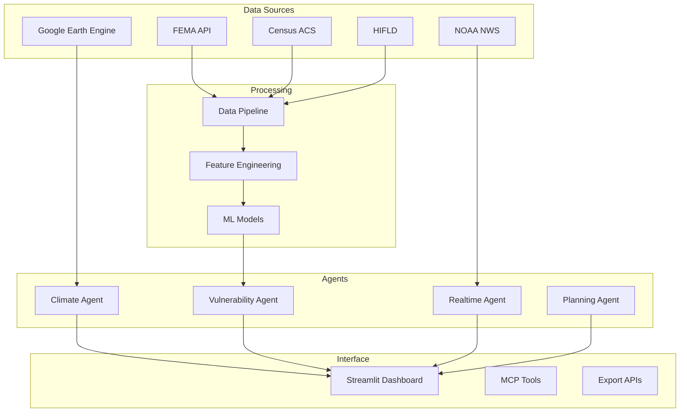

# ResilienceAI Documentation

<figure markdown="span">
  { width="300" }
  <figcaption>AI-powered disaster vulnerability intelligence</figcaption>
</figure>

## Overview

ResilienceAI is an MCP-based agentic platform that combines **FEMA disaster declarations**, **Census demographics**, **HIFLD infrastructure data**, and **real-time NOAA weather feeds** to assess county-level vulnerability, predict disaster risk trajectories, and support clinical and emergency decision-making.

<div class="grid cards" markdown>

-   :material-rocket-launch:{ .lg .middle } __Getting Started__

    ---

    Install ResilienceAI and run your first analysis in under 5 minutes

    [:octicons-arrow-right-24: Installation](getting-started/installation.md)

-   :material-book-open:{ .lg .middle } __User Guide__

    ---

    Learn to navigate the dashboard and interpret vulnerability metrics

    [:octicons-arrow-right-24: Dashboard Guide](user-guide/dashboard-walkthrough.md)

-   :material-api:{ .lg .middle } __API Reference__

    ---

    Explore 45+ MCP tools for querying, analysis, and export

    [:octicons-arrow-right-24: MCP Tools](api-reference/mcp-tools/index.md)

-   :material-code-braces:{ .lg .middle } __Developer Guide__

    ---

    Understand the architecture and contribute to the project

    [:octicons-arrow-right-24: Architecture](developer-guide/architecture.md)

</div>

## Features at a Glance

| Feature | Description | Documentation |
|---------|-------------|---------------|
| **45 MCP Tools** | Composable analysis tools for vulnerability assessment | [API Reference](api-reference/mcp-tools/index.md) |
| **66 Features** | County-level vulnerability metrics from federal data | [Data Dictionary](data/data-dictionary.md) |
| **Real-time Alerts** | NOAA NWS weather alert integration | [Weather Client](api-reference/external-apis.md) |
| **Predictive Models** | Prophet/ARIMA risk trajectory forecasting | [Predictive Modeling](models/predictive-modeling.md) |
| **Interactive Dashboard** | 16-tab Streamlit interface with maps and analytics | [Dashboard Guide](user-guide/dashboard-walkthrough.md) |
| **Multi-Agent System** | 4 specialist agents for climate, vulnerability, real-time, and planning | [Architecture](developer-guide/architecture.md) |
| **Export Formats** | FHIR R4, GeoJSON, PDF, PPTX briefings | [Export Formats](user-guide/export-formats.md) |

## Quick Start

```bash
# Clone the repository
git clone https://github.com/GDogMcCoy/ResilienceAI.git
cd ResilienceAI

# Install dependencies
pip install -r requirements.txt

# Launch the dashboard
python run_dashboard.py
```

The dashboard opens automatically at [http://localhost:8501](http://localhost:8501).

## System Architecture



## Data Sources

ResilienceAI integrates data from 11 federal sources:

| Source | Records | Update Frequency | Coverage |
|--------|---------|------------------|----------|
| FEMA Disaster Declarations | 69,615 | Daily | All US counties |
| Census ACS 5-Year | 3,222 counties | Annual | All US counties |
| HIFLD Infrastructure | 81,305 facilities | Quarterly | Healthcare, emergency |
| CMS Nursing Homes | 14,713 | Monthly | Medicare-certified |
| NOAA Weather Alerts | Real-time | Live | US territories |
| USDA NASS Crop Data | On-demand | Annual | Agricultural counties |
| RCC-ACIS Climate | 4km grid | Daily | CONUS |
| USGS NWIS | Gauge sites | Hourly | Streamflow |
| FEMA NRI | County | Annual | 18 hazard types |
| Google Earth Engine | 30m-4km | Varies | Satellite imagery |
| US Drought Monitor | County | Weekly | D0-D4 classification |

## Version Information

- **Current Version**: 2.0.0 "Claw"
- **Release Date**: February 17, 2026
- **Python Version**: 3.10+
- **License**: MIT
- **Repository**: [github.com/GDogMcCoy/ResilienceAI](https://github.com/GDogMcCoy/ResilienceAI)

## Support

<div class="grid cards" markdown>

-   :material-github:{ .lg .middle } __GitHub Issues__

    ---

    Report bugs and request features

    [:octicons-arrow-right-24: Open Issue](https://github.com/GDogMcCoy/ResilienceAI/issues)

-   :material-forum:{ .lg .middle } __Discussions__

    ---

    Ask questions and share ideas

    [:octicons-arrow-right-24: Join Discussion](https://github.com/GDogMcCoy/ResilienceAI/discussions)

-   :material-email:{ .lg .middle } __Email__

    ---

    Contact the development team

    [:octicons-arrow-right-24: Send Email](mailto:support@resilienceai.dev)

</div>

## Contributing

We welcome contributions! Please see our [Contributing Guide](developer-guide/contributing.md) for details on:

- Code of Conduct
- Development setup
- Pull request process
- Documentation standards

## Citation

If you use ResilienceAI in your research, please cite:

```bibtex
@software{resilienceai2026,
  title = {ResilienceAI: AI-powered Disaster Vulnerability Assessment},
  author = {McCoy, G. Dog and ResilienceAI Team},
  year = {2026},
  url = {https://github.com/GDogMcCoy/ResilienceAI},
  version = {2.0.0}
}
```

---

*Last updated: February 17, 2026*  
*Documentation version: 1.0.0*
